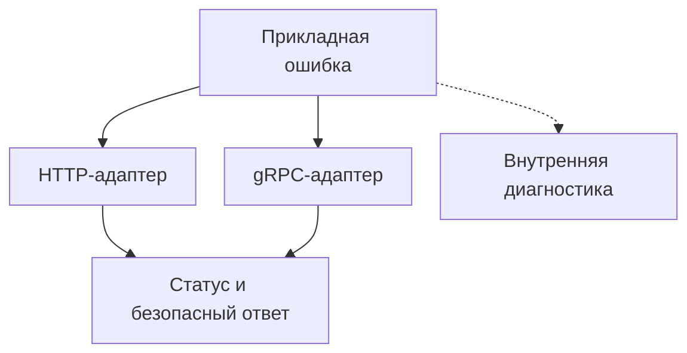

# Как подготовить gRPC-сервер на Python к продакшену {#production-python-grpc-server}

Для первого gRPC-вызова достаточно зарегистрировать обработчики сервиса и открыть порт. Перед запуском в продакшене нужно определить и остальное поведение: какие ошибки увидит клиент, когда сервер будет готов принимать запросы и что произойдёт с активными RPC при остановке.

Эти правила удобно реализовать в транспортном слое и коде управления жизненным циклом. Тогда новые методы получат общую обработку ошибок, ограничения, метрики и трассировку.

<!-- more -->

## Входящий вызов и границы ответственности {#pipeline}

На входе сервер проверяет доступ, устанавливает контекст запроса и передаёт управление обработчику. Вокруг выполнения нужны измерение длительности, учёт итогового статуса и обработка исключений. При этом авторизация конкретного действия может оставаться в прикладном коде: наличия корректного токена недостаточно, чтобы разрешить доступ к любому заказу.

Порядок перехватчиков влияет на результат. Если исключение уже обработано через gRPC abort, внешний перехватчик не должен считать его новой неожиданной ошибкой или менять выбранный статус. Отмена запроса тоже требует отдельной обработки: нужно освободить ресурсы и передать сигнал отмены дальше.

Проверять цепочку стоит на реальном RPC. Тест отдельной функции преобразования ошибок не покажет, какой статус получил клиент и что записалось в метрики.

## Ошибка должна описывать причину {#errors}

Прикладной код может выбросить `OrderNotFound` или `OrderAlreadyPaid`, не импортируя `grpc` и не выбирая HTTP-статус. Транспортный адаптер преобразует исключение в ответ, предусмотренный API.

| Ситуация | Возможный gRPC-статус | Что учесть |
|---|---|---|
| Некорректные поля запроса | `INVALID_ARGUMENT` | Нужна правка запроса |
| Объект не найден | `NOT_FOUND` | Проверьте, допустимо ли раскрывать его существование |
| Состояние не позволяет действие | `FAILED_PRECONDITION` | Перед повтором должно измениться состояние |
| Временная недоступность | `UNAVAILABLE` | Повтор требует безопасной операции и бюджета |
| Неожиданное внутреннее исключение | `INTERNAL` | Публичное сообщение без внутренних деталей |

Это примеры решений для конкретного API, а не универсальная таблица соответствий исключениям Python. `ValueError` может означать ошибку разработчика, а `TimeoutError` — таймаут внутреннего вызова, хотя дедлайн входящего RPC ещё не истёк. Статус `RESOURCE_EXHAUSTED` тоже не всегда означает временный сбой: причиной может быть квота, которую короткая пауза не восстановит.

Для HTTP и gRPC удобно использовать общие коды прикладных ошибок, а преобразование в ответы описать отдельно для каждого транспорта. Не стоит сводить любой конфликт к `ALREADY_EXISTS`: попытка создать дубликат и недопустимый переход состояния — разные ситуации. Значения статусов описаны в [руководстве gRPC](https://grpc.io/docs/guides/error/).

## Статус ошибки и её описание выбираются отдельно {#details}

Даже известный тип исключения не гарантирует, что его текст можно показать клиенту. Сообщение может содержать персональные данные или строку подключения к БД. API должен явно определять, какие поля ошибки разрешено возвращать; для остальных случаев нужен нейтральный ответ.

Полезно возвращать стабильный код ошибки и разрешённые параметры. Клиент использует их для обработки, а текст — для диагностики. Перевод сообщения для пользователя остаётся задачей интерфейса. Расширенные сведения об ошибке можно передавать через структурированные gRPC details, если клиент поддерживает этот формат.

Внутреннюю запись об ошибке связывают с запросом через trace ID или correlation ID. Но это не повод записывать в лог полное содержимое любого исключения и запроса: секреты и чувствительные данные нужно отфильтровывать и там.

<!-- diagram:concept -->
<figure class="bdr-diagram" markdown="1">
<figcaption>ИДЕЯ В СХЕМЕ<strong>Как прикладная ошибка превращается в ответ</strong></figcaption>

Прикладной код сообщает причину отказа. Адаптер выбирает статус и сведения, которые можно вернуть клиенту. Подробности для диагностики остаются внутри сервиса.

</figure>
<!-- /diagram:concept -->

## Готовность, ограничения и остановка {#operations}

Сервис проверки состояния (health service) сообщает, готов ли сервер обслуживать нужный gRPC-сервис. Reflection позволяет инструментам получить описание API. Доступность этих функций определяется окружением. Успешная проверка состояния сама по себе не подтверждает, что бизнес-операция выполнится.

Серверу нужны ограничения размера сообщений и числа одновременных вызовов, а обработчикам — соблюдение дедлайнов и отмены. Дочерняя задача, которая продолжает работу после отмены RPC, всё ещё расходует ресурсы и может изменять данные.

При остановке сервер прекращает принимать новые запросы, даёт активным вызовам ограниченное время на завершение и затем останавливает оставшиеся. Общие пулы закрываются после завершения обработки вызовов. Вся остановка должна уложиться в лимит, выделенный процессу; подробнее — в [статье о жизненном цикле сервиса](2026-09-13-python-service-lifecycle.md).

## Что проверить перед выпуском {#verification}

Минимальный набор интеграционных проверок: успешный вызов, отказ авторизации, известная прикладная ошибка, неожиданное исключение, отмена, истечение дедлайна и остановка во время RPC. В каждом сценарии проверяйте статус на клиенте, отсутствие внутренних сведений в ответе, метрики и освобождение ресурсов.

Потоковые RPC требуют дополнительных проверок: ошибка может возникнуть при чтении очередного сообщения уже после возврата из обработчика. Этому посвящена [статья о перехватчиках потоковых RPC](2026-09-07-why-grpc-interceptors-break-on-streaming-rpcs.md).

[grpc-server-kit](https://bedrock-python.github.io/grpc-server-kit/) и [servicewright](https://bedrock-python.github.io/servicewright/) предоставляют средства для транспортного слоя и управления жизненным циклом. Какие прикладные ошибки возвращать и как проверять их обработку, определяет сам сервис.

## Примеры и лабораторные работы {#labs}

Запускаемые примеры и инструкции к ним:

- [Практикум: устройство продакшен-сервера gRPC](../lab/2026-09-07-production-grpc-server/README.md)
- [Практикум: из исключений Python в коды статуса gRPC](../lab/2026-09-07-python-exceptions-to-grpc-status-codes/README.md)
- [Практикум: одна доменная ошибка, два транспорта](../lab/2026-09-07-transport-independent-errors/README.md)
