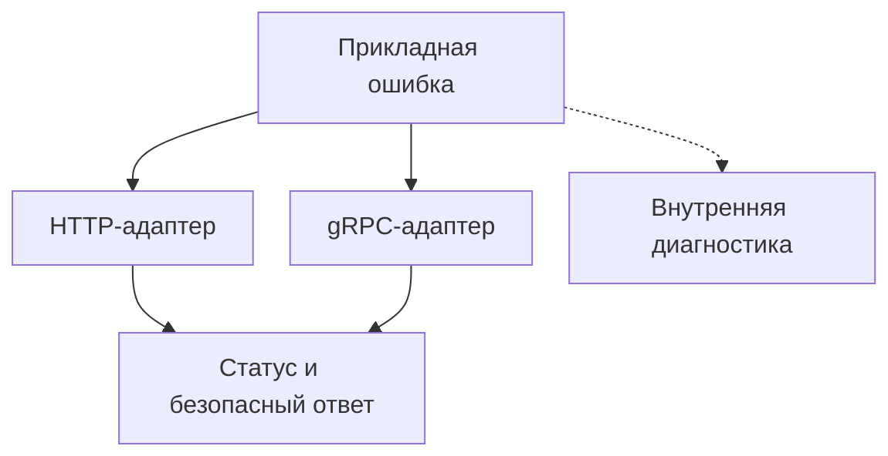

# Как подготовить Python gRPC-сервер к продакшену {#production-python-grpc-server}

Зарегистрировать servicer и открыть порт достаточно для первого gRPC-вызова. Для эксплуатации нужно определить поведение сервера вокруг обработчика: какие ошибки увидит клиент, когда сервис готов принимать запросы и что произойдёт с активными RPC при остановке.

Эти правила удобно держать в транспортном слое и runtime. Тогда новый метод получает тот же контракт ошибок, ограничения и наблюдаемость, что и существующие.

<!-- more -->

## Входящий вызов и границы ответственности {#pipeline}

На входе сервер проверяет доступ, устанавливает контекст запроса и передаёт управление обработчику. Вокруг выполнения нужны измерение длительности, учёт итогового статуса и обработка исключений. При этом авторизация конкретного действия может оставаться в прикладном коде: наличия корректного токена недостаточно, чтобы разрешить доступ к любому заказу.

Порядок interceptor'ов влияет на результат. Если исключение уже преобразовано в штатный gRPC abort, внешний слой не должен регистрировать его как новую неожиданную ошибку или менять выбранный статус. Отмена запроса также требует отдельного поведения: освобождения ресурсов и сохранения сигнала отмены.

Проверять цепочку стоит на реальном RPC. Тест отдельной функции преобразования ошибок не покажет, какой статус получил клиент и что записалось в метрики.

## Ошибка должна описывать причину {#errors}

Прикладной код может сообщить `OrderNotFound` или `OrderAlreadyPaid`, не импортируя `grpc` и не выбирая HTTP-статус. Транспортный адаптер переводит этот результат в публичный контракт.

| Ситуация | Возможный gRPC-статус | Что учесть |
|---|---|---|
| Некорректные поля запроса | `INVALID_ARGUMENT` | Нужна правка запроса |
| Объект не найден | `NOT_FOUND` | Проверьте, допустимо ли раскрывать его существование |
| Состояние не позволяет действие | `FAILED_PRECONDITION` | Перед повтором должно измениться состояние |
| Временная недоступность | `UNAVAILABLE` | Повтор требует безопасной операции и бюджета |
| Неожиданное внутреннее исключение | `INTERNAL` | Публичное сообщение без внутренних деталей |

Это решения API, а не универсальное соответствие встроенным Python-исключениям. `ValueError` может возникнуть из-за ошибки разработчика, а `TimeoutError` — из-за внутренней зависимости, когда deadline входящего RPC ещё не истёк. Аналогично `RESOURCE_EXHAUSTED` бывает связано с квотой, которую короткий backoff не восстановит.

Для HTTP и gRPC полезен общий код прикладной ошибки и отдельные таблицы представления. Не нужно сводить любой конфликт к `ALREADY_EXISTS`: дубликат создаваемого объекта и запрещённый переход состояния различаются. Семантика статусов описана в [руководстве gRPC](https://grpc.io/docs/guides/error/).

## Статус и публичные детали — отдельные решения {#details}

Узнаваемый тип ошибки не делает любое её сообщение безопасным. Даже собственное исключение может содержать персональные данные или строку подключения. Публичные поля должны иметь явный контракт; для остальных случаев нужен нейтральный ответ.

Полезно возвращать стабильный машинный код и разрешённые параметры. Клиент принимает решения по ним, а текст использует для диагностики. Локализация сообщения для пользователя остаётся на уровне интерфейса. Для расширенных gRPC-ошибок можно использовать структурированные details, если клиентская сторона поддерживает этот формат.

Внутренний отчёт связывается с запросом через trace или correlation ID. Это не разрешение безусловно писать все исключения и payload в лог: секреты и чувствительные данные требуют фильтрации и там.

<!-- diagram:concept -->
<figure class="bdr-diagram" markdown="1">
<figcaption>ИДЕЯ В СХЕМЕ<strong>Ошибка получает представление на границе транспорта</strong></figcaption>

Прикладной код сообщает о причине отказа. Адаптер выбирает статус и разрешённые публичные детали, а внутренний отчёт помогает диагностировать сбой.

</figure>
<!-- /diagram:concept -->

## Готовность, ограничения и остановка {#operations}

Health service сообщает, готов ли сервер обслуживать нужный сервис, а reflection помогает инструментам узнать описание API. Их включение и доступность определяются окружением. Успешный ответ health не заменяет проверку бизнес-сценария.

Серверу нужны ограничения размера сообщений и параллелизма, а обработчикам — соблюдение deadline и отмены. Дочерняя задача, которая продолжает работу после отменённого RPC, всё ещё потребляет ресурсы и может создавать эффекты.

При остановке сервер перестаёт принимать новую работу, даёт активным вызовам ограниченное время и затем завершает оставшиеся. Общие пулы закрываются после обработки вызовов. Бюджет остановки должен помещаться в лимит процесса; подробнее — в [статье о lifecycle](2026-09-13-python-service-lifecycle.md).

## Что проверить перед выпуском {#verification}

Минимальный набор интеграционных сценариев: успешный вызов, отказ авторизации, известная прикладная ошибка, неожиданное исключение, отмена, истечение deadline и остановка во время RPC. Проверяйте одновременно статус на клиенте, отсутствие утечки деталей, метрики и освобождение ресурсов.

Streaming RPC требуют дополнительных сценариев: ошибка может возникнуть при чтении очередного сообщения уже после возврата обработчика. Этому посвящена [отдельная статья об interceptor'ах и streaming](2026-09-07-why-grpc-interceptors-break-on-streaming-rpcs.md).

[grpc-server-kit](https://bedrock-python.github.io/grpc-server-kit/) и [servicewright](https://bedrock-python.github.io/servicewright/) предоставляют средства для транспортного слоя и lifecycle. Прикладной контракт ошибок и проверки его поведения остаются частью сервиса.

## Примеры и лабораторные работы {#labs}

Полные стенды и условия воспроизведения вынесены в отдельные материалы:

- [Практикум: устройство продакшен-сервера gRPC](../lab/2026-09-07-production-grpc-server/README.md)
- [Практикум: из исключений Python в коды статуса gRPC](../lab/2026-09-07-python-exceptions-to-grpc-status-codes/README.md)
- [Практикум: одна доменная ошибка, два транспорта](../lab/2026-09-07-transport-independent-errors/README.md)
