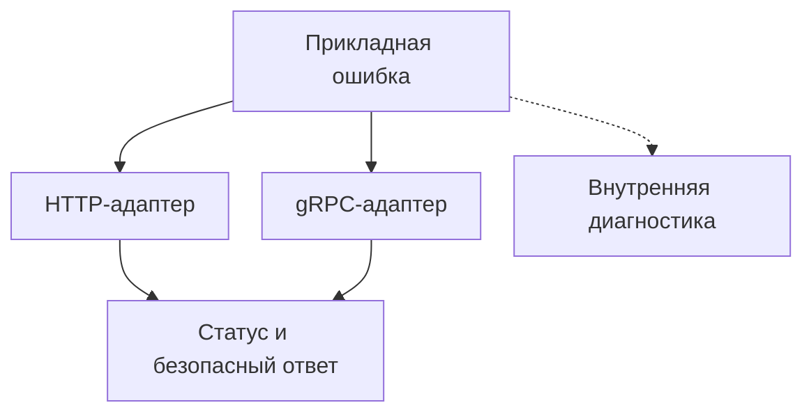

# Как подготовить gRPC-сервер на Python к продакшену {#production-python-grpc-server}

<div class="bdr-post__hero" data-bdr-post="2026-09-13-production-python-grpc-server" role="img" aria-label="Сервер из шести строк и набор компонентов для реальной эксплуатации" markdown="0"></div>

Представим сервис заказов с методом `GetInvoice`: покупатель запрашивает счёт по оплаченному заказу. На локальном запуске всё работает. Затем приходит запрос к чужому заказу, хранилище перестаёт отвечать, а во время обновления сервиса нужно завершить уже начатые RPC.

Разберём эти ситуации на одном примере: определим ошибки, соберём сервер, проверим ограничения, health checks и остановку. Код проверен с **grpc-server-kit 0.2.0**, **servicewright 0.13.1** и **grpcio 1.84.0** на Python **3.13**.

<!-- more -->

<div id="the-anatomy-of-a-production-python-grpc-server" data-search-exclude></div>
<div id="the-handler-that-raises" data-search-exclude></div>
<div id="where-the-reporting-interceptor-goes" data-search-exclude></div>
<div id="message-size" data-search-exclude></div>
<div id="shutdown" data-search-exclude></div>
<div id="health" data-search-exclude></div>
<div id="tls-and-the-file-permissions" data-search-exclude></div>
<div id="reflection-and-the-rest-of-the-list" data-search-exclude></div>
<div id="the-order" data-search-exclude></div>
<div id="the-pieces" data-search-exclude></div>

## Начнём с операции получения счёта {#pipeline}

В нашем магазине счёт доступен после оплаты. Для запроса нужны идентификатор заказа и покупатель из проверенного контекста авторизации. Хранилище открывает контекст чтения, а прикладная функция проверяет доступ и состояние заказа.

Общие типы ошибок возьмём из `servicewright`: `ServiceError` описывает причину отказа, а `ErrorKind` задаёт её категорию. Они не требуют HTTP- или gRPC-объектов. Позже эти же ошибки будут обслуживать оба транспорта.

```python
from servicewright import ErrorKind, ServiceError


class OrderNotFound(ServiceError):
    kind = ErrorKind.NOT_FOUND
    code = "order_not_found"


class InvoiceNotReady(ServiceError):
    kind = ErrorKind.PRECONDITION_FAILED
    code = "invoice_not_ready"


class InvoiceAccessDenied(ServiceError):
    kind = ErrorKind.FORBIDDEN
    code = "invoice_access_denied"


class InvoiceStoreUnavailable(ServiceError):
    kind = ErrorKind.UNAVAILABLE
    code = "invoice_store_unavailable"
```

```python
async def get_invoice(store, order_id: str, buyer_id: str) -> dict:
    async with store.read(order_id) as order:
        if order is None:
            raise OrderNotFound("Order not found")
        if order["buyer_id"] != buyer_id:
            raise InvoiceAccessDenied("Access denied")
        if not order["paid"]:
            raise InvoiceNotReady("The order has not been paid")
        return {"invoice_id": order["invoice_id"], "amount": order["amount"]}
```

`store.read()` освобождает ресурс при выходе из контекста, в том числе при исключении или отмене. В практикуме это хранилище в памяти со счётчиком активных чтений. gRPC-обработчик вызывает `get_invoice` и сериализует результат.

Чтобы сосредоточиться на поведении сервера, практикум регистрирует метод через `register_invoice_service` и передаёт байты без генерации protobuf-классов. Личность покупателя в нём фиксирована как тестовые данные. В приложении её должен устанавливать слой аутентификации; проверка владельца заказа остаётся в прикладной функции.

<div id="mapping-python-exceptions-to-grpc-status-codes-without-leaking-internals" data-search-exclude></div>
<div id="what-happens-with-no-map-at-all" data-search-exclude></div>
<div id="the-default-map" data-search-exclude></div>
<div id="the-map-is-a-client-contract-not-a-formatting-decision" data-search-exclude></div>
<div id="details-the-two-tier-rule" data-search-exclude></div>
<div id="what-belongs-where" data-search-exclude></div>

## Заказ не оплачен: какой ответ получит клиент {#errors}

Для `InvoiceNotReady` выбираем `FAILED_PRECONDITION`: повтор без изменения состояния заказа не поможет. Для остальных ошибок используем `NOT_FOUND` (заказ не найден), `PERMISSION_DENIED` (нет доступа) и `UNAVAILABLE` (временный сбой хранилища). Значения статусов описаны в [руководстве gRPC](https://grpc.io/docs/guides/status-codes/).

Зададим соответствия в `AsyncExceptionHandlerInterceptor` из `grpc-server-kit`:

```python
import grpc
from grpc_server_kit.aio.interceptors import AsyncExceptionHandlerInterceptor


SERVICE = "orders.Invoices"

ERROR_STATUS = {
    OrderNotFound: grpc.StatusCode.NOT_FOUND,
    InvoiceNotReady: grpc.StatusCode.FAILED_PRECONDITION,
    InvoiceAccessDenied: grpc.StatusCode.PERMISSION_DENIED,
    InvoiceStoreUnavailable: grpc.StatusCode.UNAVAILABLE,
}


def public_details(error, status):
    if isinstance(error, tuple(ERROR_STATUS)) and error.public:
        return error.code
    return "internal_error"


def exception_handler():
    return AsyncExceptionHandlerInterceptor(
        error_status_map=ERROR_STATUS,
        detail_factory=public_details,
        merge_defaults=False,
    )
```

`merge_defaults=False` оставляет только нашу таблицу. Это существенно: в стандартной таблице библиотеки `ValueError` означает `INVALID_ARGUMENT`. Если такой `ValueError` возник из-за бага в серверном коде, клиент не должен получать обвинение в неверном запросе.

Практикум вызывает один и тот же сбой через настоящий RPC:

| Сборка сервера | Статус для внутреннего `ValueError` | Что видит клиент |
|---|---|---|
| Без перехватчика ошибок | `UNKNOWN` | Текст исключения с внутренними данными |
| Стандартный перехватчик | `INVALID_ARGUMENT` | Безопасное, но неверно классифицированное сообщение |
| Наша таблица | `INTERNAL` | `internal_error` |

Явный `await context.abort(...)` проходит через перехватчик с исходным статусом. Его не нужно повторно преобразовывать во внутреннюю ошибку.

<div id="transport-independent-errors-one-domain-error-http-and-grpc-responses" data-search-exclude></div>
<div id="the-domain-raises-and-does-not-format" data-search-exclude></div>
<div id="the-same-seven-calls-two-transports" data-search-exclude></div>
<div id="what-each-layer-is-allowed-to-know" data-search-exclude></div>
<div id="testing-it-once" data-search-exclude></div>
<div id="what-this-does-not-solve" data-search-exclude></div>

## Какие подробности можно вернуть наружу {#details}

`public_details` возвращает стабильный код известной публичной ошибки. Текст исключения в ответ не копируется. Для неизвестной ошибки или `public=False` клиент получает `internal_error`, даже если внутри есть строка подключения или сведения о повреждённых данных.

Так клиент может отличить `invoice_not_ready` от `order_not_found` без разбора текста сообщения. Внутренняя диагностика хранится отдельно и связывается с запросом. Фильтрацию секретов в логах и системе сбора ошибок настраиваем на стороне этих систем: безопасный ответ клиенту не очищает логи автоматически.

<!-- diagram:concept -->
<figure class="bdr-diagram" markdown="1">
<figcaption><span class="bdr-diagram__eyebrow">ИДЕЯ В СХЕМЕ</span><strong>Как прикладная ошибка превращается в ответ</strong></figcaption>
<div class="bdr-diagram__viewport" markdown="1" data-search-exclude>


```mermaid
---
config:
  theme: default
  look: classic
  flowchart:
    useMaxWidth: false
    wrappingWidth: 150
    padding: 12
    nodeSpacing: 24
    rankSpacing: 32
---
flowchart TD
    accTitle: Как прикладная ошибка превращается в ответ
    accDescr: Прикладной код сообщает причину отказа. Адаптер выбирает статус и сведения, которые можно вернуть клиенту. Подробности для диагностики остаются внутри сервиса.
    A["Прикладная ошибка"]
    B["HTTP-адаптер"]
    C["gRPC-адаптер"]
    D["Статус и безопасный ответ"]
    E["Внутренняя диагностика"]
    A --> B --> D
    A --> C --> D
    A -.-> E
```

</div>
<p class="bdr-diagram__caption">Прикладной код сообщает причину отказа. Адаптер выбирает статус и сведения, которые можно вернуть клиенту. Подробности для диагностики остаются внутри сервиса.</p>
</figure>
<!-- /diagram:concept -->

## Ограничим размер сообщений и число вызовов {#operations}

Для нашего небольшого ответа выделим 64 КиБ на сообщение и до 32 активных RPC. Порт `0` нужен практикуму: свободный порт назначает ОС, а клиент читает его через `app.bound_port`.

```python
from grpc_server_kit import GrpcApp, GrpcServerConfig


def server_config():
    return GrpcServerConfig(
        host="127.0.0.1", port=0,
        max_receive_message_length=64 * 1024,
        max_send_message_length=64 * 1024,
        max_concurrent_rpcs=32,
        grace_period=1.0,
    )
```

Практикум снижает лимит до одного RPC и удерживает первый запрос внутри чтения:

| Следующий запрос | Результат |
|---|---|
| На том же HTTP/2-соединении | Ждёт свободного потока и может истечь по дедлайну |
| Через отдельное соединение | Получает `RESOURCE_EXHAUSTED` из-за общего лимита RPC |
| С телом 65 КиБ при лимите 64 КиБ | Получает `RESOURCE_EXHAUSTED` до обращения к хранилищу |

В версии 0.2.0 `max_concurrent_rpcs` задаёт и общий лимит RPC, и `grpc.max_concurrent_streams` для соединения. Поэтому нельзя обещать клиенту немедленный отказ при любой перегрузке: время ожидания всё равно ограничиваем дедлайном.

## Сохраняем статус для метрик и исходную ошибку для диагностики {#interceptors}

Соберём цепочку. В `metrics` передаём приёмник измерений с методом `record_request`, в `reporter` передаём приёмник ошибок. В практикуме оба сохраняют результаты в списки. `AsyncSentryInterceptor` работает через интерфейс приёмника, поэтому подключение к Sentry для запуска примера не требуется.

```python
from grpc_server_kit.aio.interceptors import (
    AsyncMetricsInterceptor, AsyncSentryInterceptor,
)
from grpc_server_kit.aio.interceptors.exception_handler import find_mapped_status


def build_app(store, metrics, reporter, *, config=None):
    app = GrpcApp(config or server_config(), interceptors=[
        AsyncMetricsInterceptor(metrics, service_name=SERVICE),
        exception_handler(),
        AsyncSentryInterceptor(reporter, capture_filter=lambda error:
            find_mapped_status(type(error), ERROR_STATUS) in {
                grpc.StatusCode.INTERNAL, grpc.StatusCode.UNAVAILABLE,
            }),
    ])
    app.register(lambda server: register_invoice_service(server, store))
    return app
```

В списке перехватчики идут от внешнего к внутреннему. При ошибке управление идёт обратно: приёмник диагностики видит исходный `RuntimeError`, обработчик ошибок выбирает `INTERNAL`, метрики записывают итоговый статус. Ожидаемые отказы вроде `InvoiceNotReady` отфильтровываются из отчётов о серверных сбоях.

Практикум проверяет и неверный порядок: если поставить приёмник диагностики снаружи обработчика ошибок, он увидит уже выполненный gRPC abort и пропустит исходное исключение.

## Health check сообщает о готовности {#readiness}

Добавим проверку хранилища. Она имеет собственный таймаут; кеширование в примере отключено, чтобы результат сразу отражал изменение состояния.

```python
class InvoiceStoreHealth:
    name = "invoice-store"

    def __init__(self, store):
        self.store = store

    async def check(self) -> bool:
        return await self.store.ping()


def enable_readiness(app, store):
    app.enable_health(
        checkers=[InvoiceStoreHealth(store)],
        service_names=[SERVICE],
        cache_ttl=0,
        check_timeout=0.2,
    )
```

Вызываем `enable_readiness(app, store)` до сборки или запуска сервера. В практикуме проверка возвращает `SERVING`, затем `NOT_SERVING`, затем снова `SERVING`. Зависшая проверка тоже заканчивается `NOT_SERVING` по таймауту.

При этом прямой вызов `GetInvoice` продолжает доходить до обработчика. [Health service](https://grpc.io/docs/guides/health-checking/) сообщает состояние клиенту или балансировщику; само наличие этого сервиса не запрещает RPC. Стандартные health-методы библиотека исключает из метрик запросов по умолчанию.

## Клиент ушёл, а затем остановился сервер {#shutdown-example}

При отмене запроса освобождаем ресурсы через контекстные менеджеры и `finally`. Не перехватываем `CancelledError` как обычную прикладную ошибку. В нашем практикуме и явная отмена, и клиентский дедлайн завершают чтение и возвращают число активных ресурсов к нулю.

У дедлайна есть полезная тонкость: клиент получает `DEADLINE_EXCEEDED`, а серверная метрика записывает `CANCELLED`, потому что обработчик был отменён. Это разные наблюдения одного завершения.

Для остановки сервиса дождёмся выхода из `GrpcApp` и только затем закроем общее хранилище:

```python
async def serve_invoices(app, store, stop):
    try:
        async with app:
            await stop.wait()
    finally:
        await store.close()
```

Здесь `app` уже собран через `build_app`. Событие остановки `stop` устанавливает внешний управляющий код. Контекст `GrpcApp` прекращает приём новых RPC и ждёт активные в пределах `grace_period`.

Практикум проверяет оба исхода: короткий запрос успевает вернуть ответ, зависший отменяется после grace period. Хранилище закрывается после освобождения ресурса обработчиком. Если процессом управляет `servicewright`, остановку точек входа и общих ресурсов поручаем ему, как в [статье о жизненном цикле](2026-09-13-python-service-lifecycle.md).

## Подключим TLS и проверим клиента {#tls-example}

Для TLS нужны сертификат сервера и закрытый ключ. Если дополнительно передан CA, наш пример требует клиентский сертификат и включает mTLS.

```python
from dataclasses import replace


def tls_config(cert_file, key_file, ca_file=None):
    return replace(
        server_config(),
        ssl_enabled=True,
        ssl_cert_file=str(cert_file),
        ssl_key_file=str(key_file),
        ssl_ca_file=str(ca_file) if ca_file else None,
        ssl_client_auth=ca_file is not None,
    )
```

Передаём результат в `build_app(..., config=tls_config(...))`. Практикум создаёт временные сертификаты и проверяет реальные соединения: обычный TLS-клиент проходит при TLS, при mTLS требуется клиентский сертификат, незашифрованное соединение отклоняется в обоих случаях.

Неверный PEM-файл обнаруживается до обслуживания запросов. Проверка Unix-прав закрытого ключа в библиотеке не применяется на Windows; там доступ к файлу задаётся ACL. Reflection включайте отдельно, когда инструментам нужно получать описание API.

## Один прикладной код для HTTP и gRPC {#two-transports}

Добавим HTTP-метод получения того же счёта. `servicewright` создаст обе точки входа и преобразует наши `ServiceError`. `Container` в практикуме управляет общим хранилищем и закрывает его при завершении приложения.

```python
from fastapi import APIRouter
from servicewright import AppSpec, Service
from servicewright.adapters.fastapi import FastApiEntrypoint, HttpConfig
from servicewright.adapters.grpc import GrpcConfig, GrpcEntrypoint


def build_service(store):
    router = APIRouter()

    @router.get("/orders/{order_id}/invoice")
    async def invoice(order_id: str):
        return await get_invoice(store, order_id, buyer_id="buyer-7")

    http = FastApiEntrypoint(
        config=HttpConfig(host="127.0.0.1", port=0), routers=(router,),
    )
    grpc_entry = GrpcEntrypoint(
        config=GrpcConfig(host="127.0.0.1", port=0, grace_period=1),
        servicers=lambda server, ctx: register_invoice_service(server, store),
    )
    spec = AppSpec(
        service_name="invoices", create_container=lambda settings: Container(store),
    )
    return Service(spec, entrypoints=[http, grpc_entry]), http, grpc_entry
```

Запуск выполняется через `service.run(Settings(), stop=stop)`. Таблица ниже проверяется запросами к обоим локальным серверам:

| Причина | HTTP | gRPC | Общий код ошибки |
|---|---|---|---|
| Заказ не найден | 404 | `NOT_FOUND` | `order_not_found` |
| Заказ не оплачен | 412 | `FAILED_PRECONDITION` | `invoice_not_ready` |
| Чужой заказ | 403 | `PERMISSION_DENIED` | `invoice_access_denied` |
| Хранилище временно недоступно | 503 | `UNAVAILABLE` | `invoice_store_unavailable` |
| Внутренняя ошибка | 500 | `INTERNAL` | `internal_error` |

HTTP возвращает код в problem JSON, а gRPC передаёт его в trailing metadata `x-error-code`. Соответствие 412 ↔ `FAILED_PRECONDITION` задано категорией `PRECONDITION_FAILED`. Категория `CONFLICT` в этой версии дала бы 409 ↔ `ALREADY_EXISTS`, поэтому для неоплаченного заказа мы её не используем.

## Что проверено запуском {#verification}

Три практикума проверяют через `assert` успешный ответ, прикладные и неожиданные ошибки, отсутствие внутренних данных в ответах, порядок перехватчиков, метрики, ограничения, health checks, отмену, дедлайн, остановку, TLS и mTLS. gRPC и HTTP работают по настоящим локальным соединениям; хранилище и приёмники диагностики заменены управляемыми имитаторами.

Здесь разобраны одиночные запросы и ответы. Ошибки во время чтения потока требуют дополнительных проверок, описанных в [статье о перехватчиках потоковых RPC](2026-09-07-why-grpc-interceptors-break-on-streaming-rpcs.md).

## Что взять в свой сервис {#conclusion}

Мы рассмотрели получение счёта при ошибках, перегрузке, отмене и остановке сервера, а затем подключили тот же прикладной код к HTTP. Начинайте с понятных ошибок операции и проверяйте, какой ответ действительно приходит клиенту.

Используйте наш [grpc-server-kit](https://bedrock-python.github.io/grpc-server-kit/) для сборки gRPC-сервера, перехватчиков, ограничений, health checks и TLS. Когда HTTP, gRPC и общие ресурсы должны запускаться и останавливаться вместе, подключайте [servicewright](https://bedrock-python.github.io/servicewright/). Практикумы ниже можно взять за основу проверок своего сервиса.

## Примеры и лабораторные работы {#labs}

- [Практикум: устройство продакшен-сервера gRPC](../lab/2026-09-07-production-grpc-server/README.md)
- [Практикум: из исключений Python в коды статуса gRPC](../lab/2026-09-07-python-exceptions-to-grpc-status-codes/README.md)
- [Практикум: одна доменная ошибка, два транспорта](../lab/2026-09-07-transport-independent-errors/README.md)
