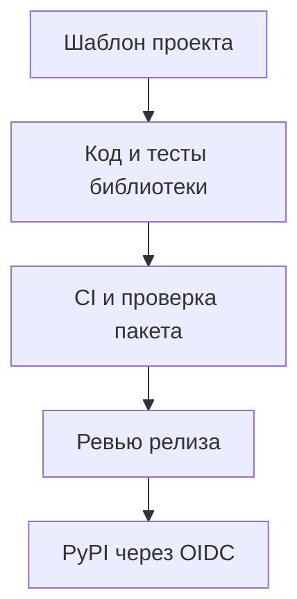

# Python-библиотека от шаблона до релиза {#python-library-from-template-to-release}

При работе с несколькими Python-библиотеками повторяется не только код. В каждом репозитории нужны сборка, тесты, правила форматирования, документация и выпуск на PyPI. Если настраивать их вручную, исправление общей ошибки приходится переносить по одному проекту.

В Bedrock Python эти решения собраны в шаблон и настройки репозитория. Библиотеки сохраняют собственные версии и график релизов, а повторяющаяся работа получает один описанный процесс.

<!-- more -->

## Что стоит закрепить в шаблоне {#template}

Шаблон полезен там, где ответ не зависит от назначения библиотеки: структура пакета, объявление поддерживаемых версий Python, конфигурация Ruff и mypy, разделение тестов, сборка wheel и sdist, каркас документации.

Проверки должны запускаться сразу после генерации проекта. Это устанавливает рабочую исходную точку, но зелёный CI пустого пакета ещё ничего не говорит о будущем API. Высокое покрытие одной функции с версией тоже не является свидетельством качества библиотеки.

[python-library-template](https://github.com/bedrock-python/python-library-template) хранит эти соглашения для Bedrock Python. Обновление шаблона не меняет уже созданные репозитории автоматически: изменения нужно перенести и проверить в каждом потребителе, учитывая его отличия.

## Проверять обещания конфигурации {#checks}

Список инструментов мало говорит о строгости проверки. Семейство правил линтера можно выбрать и одновременно исключить; итоговый CI job может стать зелёным, не проверив результат пропущенного тестового задания.

Полезны короткие проверки самого шаблона: сгенерировать проект, запустить его команды, внести заведомую ошибку нужного типа и убедиться, что проверка её обнаруживает. Например, если проект запрещает datetime без timezone, соответствующий пример обязан завершить lint с ошибкой.

| Уровень | Что он подтверждает |
|---|---|
| Lint и типы | Соблюдение выбранных правил и согласованность аннотаций |
| Unit-тесты | Поведение кода в заданных сценариях |
| Интеграционные тесты | Совместимость с реальной базой, брокером или транспортом |
| Установка собранного пакета | Корректность артефакта, включая модули и необходимые файлы |
| Пробное использование в сервисе | Пригодность API и модели владения ресурсами |

Единственный обязательный итоговый статус удобен для branch protection, если он действительно учитывает все нужные задания, включая ошибки и нежелательные пропуски.

## Настройки репозитория тоже входят в процесс {#repositories}

Часть стандарта находится за пределами Git: защита ветки, права Actions, окружение публикации и разрешённые источники релиза. Их стоит описать и проверять так же, как файлы CI. Скрипт настройки должен показывать изменения и учитывать ограничения конкретного репозитория.

Общий шаблон не требует одновременного выпуска всех библиотек. Каждая меняет версию после собственных проверок. Соглашения о зависимостях и совместимости помогают обновлять их отдельно; копирование одного workflow ещё не обеспечивает такую совместимость.

## От изменения к проверенному артефакту {#release}

Автоматизация релиза может собрать changelog и предложить новую версию из сообщений коммитов. Ревью релизного PR остаётся местом проверки публичных изменений: корректно ли обозначена несовместимость, обновлена ли документация, совпадает ли версия пакета с тегом.

Сборка должна происходить из определённого проверенного commit. Wheel и sdist устанавливают в чистое окружение и проверяют необходимые импорты, package data и метаданные. Повторный запуск публикации не должен молча принимать несовпадение уже опубликованного артефакта с новым файлом того же имени.

<!-- diagram:concept -->
<figure class="bdr-diagram" markdown="1">
<figcaption>ИДЕЯ В СХЕМЕ<strong>Общий процесс, независимые релизы</strong></figcaption>

Шаблон задаёт структуру и проверки. Каждый проект проверяет свой код, собирает артефакт и публикует собственную версию через разрешённый workflow.

</figure>
<!-- /diagram:concept -->

## Публикация без долгоживущего токена {#publishing}

[PyPI Trusted Publishing](https://docs.pypi.org/trusted-publishers/) позволяет обменять OIDC-идентичность CI на короткоживущие полномочия публикации. Для GitHub Actions доверие привязывается к владельцу, репозиторию, workflow и, при настройке, environment. Право `id-token: write` нужно job, который выполняет обмен.

Это убирает постоянный PyPI-токен из секретов CI, но не отменяет защиту workflow. Изменение разрешённого процесса публикации, скомпрометированный action или запуск непроверенного кода с нужными полномочиями всё ещё опасны. Build и publish полезно разделять по правам, а environment — ограничивать разрешёнными источниками и правилами доступа.

Первый выпуск проверяет весь путь: от настроек проекта до устанавливаемого пакета. Его стоит пройти на небольшой полезной версии, чтобы ошибки публикации не обнаружились в момент срочного исправления.

## Что остаётся за автором библиотеки {#verification}

Шаблон не выбирает хороший API и не доказывает, что пакет вообще нужен. Для этого нужны конкретный сценарий, тесты его поведения и реальный потребитель.

Документация должна объяснять установку, ограничения и владение ресурсами. Компактная [страница для AI-агентов](2026-09-07-documentation-for-ai-coding-agents.md) может дополнять руководство, сохраняя проверенные примеры и публичные имена. Общий процесс освобождает время для этой работы, но не заменяет её.

## Примеры и лабораторные работы {#labs}

Полные стенды и условия воспроизведения вынесены в отдельные материалы:

- [Практикум: двенадцать библиотек, один стандарт](../lab/2026-09-07-twelve-libraries-one-standard/README.md)
