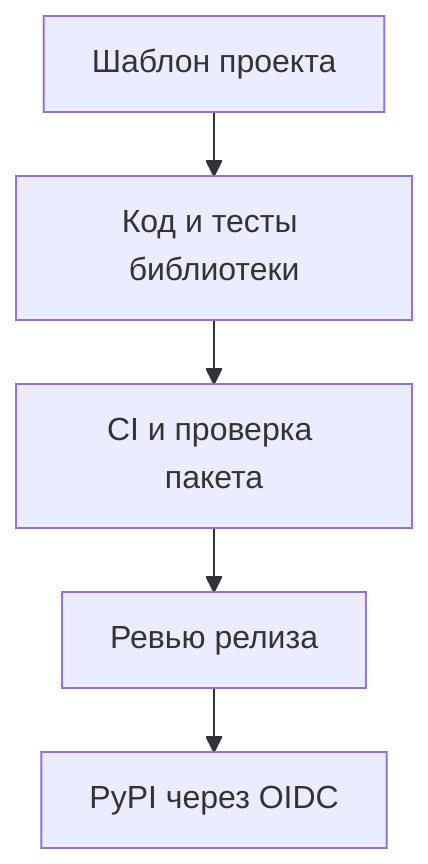

# Python-библиотека от шаблона до релиза {#python-library-from-template-to-release}

При работе с несколькими Python-библиотеками повторяется не только код. В каждом репозитории нужны сборка, тесты, правила форматирования, документация и публикация на PyPI. Если настраивать всё вручную, каждое общее исправление приходится отдельно переносить в каждый проект.

В Bedrock Python эти настройки собраны в шаблон проекта и общие правила настройки репозитория. У библиотек остаются собственные версии и график релизов, а сборка, проверки и публикация следуют одному процессу.

<!-- more -->

## Что стоит закрепить в шаблоне {#template}

Шаблон полезен там, где ответ не зависит от назначения библиотеки: структура пакета, объявление поддерживаемых версий Python, конфигурация Ruff и mypy, разделение тестов, сборка wheel и sdist, каркас документации.

Проверки должны работать сразу после генерации проекта — так можно убедиться, что начальная настройка исправна. Но зелёный CI пустого пакета ещё ничего не говорит о будущем API. Как и высокое покрытие, если весь пакет пока состоит из функции, возвращающей версию.

[python-library-template](https://github.com/bedrock-python/python-library-template) хранит эти соглашения для Bedrock Python. Обновление шаблона не меняет уже созданные репозитории: исправления нужно перенести и проверить в каждом проекте с учётом его особенностей.

## Проверяем, что настройки действительно работают {#checks}

Само наличие линтера и тестов мало о чём говорит. Группу правил линтера можно включить, а затем случайно исключить другой настройкой. Итоговое задание CI может завершиться успешно, хотя нужные тесты вообще не запускались.

Полезно проверять сам шаблон: сгенерировать проект, запустить его команды, внести заведомую ошибку и убедиться, что проверка её обнаруживает. Например, если запрещён `datetime` без часового пояса, линтер должен отклонить код с таким значением.

| Уровень | Что он подтверждает |
|---|---|
| Lint и типы | Соблюдение выбранных правил и согласованность аннотаций |
| Unit-тесты | Поведение кода в заданных сценариях |
| Интеграционные тесты | Совместимость с реальной базой, брокером или транспортом |
| Установка собранного пакета | Что в пакет попали нужные модули, данные и метаданные |
| Пробное использование в сервисе | Удобство API и правил создания и закрытия ресурсов |

Для защиты ветки удобно требовать один итоговый статус CI. Но он должен учитывать все обязательные задания, в том числе завершившиеся с ошибкой или пропущенные без допустимой причины.

## Настройки репозитория тоже входят в процесс {#repositories}

Часть настроек хранится вне Git: защита ветки, права GitHub Actions, окружение публикации и правила, определяющие, откуда разрешён выпуск. Их стоит описать и проверять так же, как конфигурацию CI. Скрипт настройки должен показывать планируемые изменения и учитывать ограничения репозитория.

Общий шаблон не требует одновременного выпуска всех библиотек. Каждая меняет версию после собственных проверок. Соглашения о зависимостях и совместимости помогают обновлять их отдельно; копирование одного workflow ещё не обеспечивает такую совместимость.

## От коммита до проверенного пакета {#release}

Автоматизация может составить список изменений и предложить новую версию по сообщениям коммитов. На ревью релизного PR нужно проверить публичные изменения: отмечена ли несовместимость, обновлена ли документация и совпадает ли версия пакета с тегом.

Пакет нужно собирать из конкретного проверенного коммита. Wheel и sdist устанавливают в чистое окружение и проверяют импорты, файлы данных и метаданные. Если при повторной публикации файл отличается от уже выпущенного файла с тем же именем, процесс должен явно сообщить об этом.

<!-- diagram:concept -->
<figure class="bdr-diagram" markdown="1">
<figcaption>ИДЕЯ В СХЕМЕ<strong>Общий процесс, независимые релизы</strong></figcaption>

Шаблон задаёт структуру проекта и проверки. Каждая библиотека проходит CI, собирается в пакет и публикуется под собственной версией через разрешённый workflow.

</figure>
<!-- /diagram:concept -->

## Публикация без долгоживущего токена {#publishing}

[PyPI Trusted Publishing](https://docs.pypi.org/trusted-publishers/) позволяет процессу CI подтвердить свою подлинность через OIDC и получить краткосрочное разрешение на публикацию. Для GitHub Actions доверие привязывается к владельцу, репозиторию, workflow и, при соответствующей настройке, окружению (environment). Заданию, которое выполняет обмен, нужно право `id-token: write`.

Постоянный PyPI-токен больше не нужен, но сам процесс публикации всё равно нужно защищать. Изменённый workflow, скомпрометированный action или непроверенный код с правом публикации остаются угрозой. Этапам сборки и публикации стоит выдавать разные права, а для окружения публикации ограничить допустимые ветки, теги и доступ.

Первый выпуск проверяет весь путь: от настроек проекта до устанавливаемого пакета. Его стоит пройти на небольшой полезной версии, чтобы ошибки публикации не обнаружились в момент срочного исправления.

## Что остаётся за автором библиотеки {#verification}

Шаблон не выбирает API за автора и не подтверждает, что библиотека нужна. Это проверяют на конкретной задаче, с тестами и реальным проектом, который использует пакет.

Документация должна объяснять установку, ограничения и правила работы с ресурсами. Компактная [страница для ИИ-агентов](2026-09-07-documentation-for-ai-coding-agents.md) может дополнять руководство точными именами API и проверенными примерами. Общий процесс сборки и выпуска освобождает время для этой работы.

## Примеры и лабораторные работы {#labs}

Запускаемые примеры и инструкции к ним:

- [Практикум: двенадцать библиотек, один стандарт](../lab/2026-09-07-twelve-libraries-one-standard/README.md)
