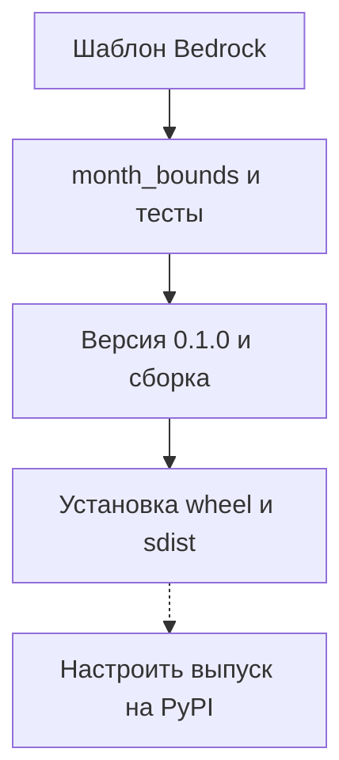

# Python-библиотека от шаблона до релиза {#python-library-from-template-to-release}

<div class="bdr-post__hero" data-bdr-post="2026-09-13-python-library-from-template-to-release" role="img" aria-label="Библиотека отчётных периодов проходит путь от генерации проекта через тесты до установки пакета" markdown="0"></div>

Представим сервис отчётов и воркер выгрузок. Оба вычисляют начало и конец месяца в UTC, но каждый своей функцией. В одной из них забыли про переход года. Вынесем общую логику в небольшую библиотеку `report-periods` с одной публичной функцией `month_bounds()`.

Создадим проект из шаблона Bedrock, добавим функцию и тесты, соберём версию `0.1.0` и установим оба формата пакета в чистые окружения. Так мы проверим результат ещё до настройки первого релиза на PyPI.

<!-- more -->

<div id="how-i-start-a-production-grade-python-library-in-2026" data-search-exclude></div>
<div id="one-command" data-search-exclude></div>
<div id="what-is-in-the-forty-one" data-search-exclude></div>
<div id="the-gate-has-to-run-what-it-claims" data-search-exclude></div>
<div id="the-things-a-template-cannot-give-you" data-search-exclude></div>
<div id="the-order-i-actually-work-in" data-search-exclude></div>
<div id="the-pieces" data-search-exclude></div>

## Создаём проект для библиотеки отчётных периодов {#template}

В примере используем [python-library-template на коммите `a1a1e7d`](https://github.com/bedrock-python/python-library-template/tree/a1a1e7d5eafdcac08aeed7c1a0daaff31c67ac8c), Copier `9.18.2` и расширение `jinja2-time` версии `0.2.0`. Пакет устанавливается под именем `report-periods`, а импортируется как `report_periods`. Он требует Python `3.11` или новее.

Чтобы повторить весь пример, запустите команду из репозитория этого сайта. Нужны Git, uv и доступ к сети. Каталог для результата должен быть **новым**:

```bash
uv run --no-project --python 3.13 --with-requirements docs/blog/lab/2026-09-07-twelve-libraries-one-standard/requirements.txt python docs/blog/lab/2026-09-07-twelve-libraries-one-standard/generate_and_check.py --output build/report-periods-lab
```

Практикум создаст проект, добавит показанные ниже файлы и выполнит все локальные проверки. В каталоге останутся исходники, `uv.lock`, собранные пакеты, логи команд и `report.json` с версиями инструментов. Репозиторий на GitHub и публикацию пакета скрипт не создаёт.

Copier запускается с разрешением доверять шаблону: в этой версии есть расширение Jinja и задача после генерации. Эта задача только печатает дальнейшие шаги. Перед использованием другой версии [проверьте исполняемые части шаблона](https://copier.readthedocs.io/en/stable/configuring/#unsafe).

Сразу после генерации в `report_periods/` лежат версия, `__init__.py` и маркер `py.typed`. Из каталога созданного проекта запускаем исходные проверки:

```bash
uv sync --python 3.13 --group dev
uv run ruff check .
uv run ruff format --check .
uv run mypy report_periods
uv run pytest --cov=report_periods --cov-fail-under=90
```

Проверки проходят. Единственный тест проверяет экспортируемую версию и даёт 100% покрытия заготовки. Команда `pytest -m integration` не находит тестов и возвращает код `5`; CI шаблона явно разрешает такой результат. Поведение будущей библиотеки пока никто не проверял.

## Добавляем поведение, которое нужно сервису {#checks}

Договоримся о результате: `start <= timestamp < end`. Начало входит в интервал, конец исключён. Обе границы приходятся на полночь в UTC. Входное время сначала переводим в UTC; значение без смещения отклоняем. Это отчётные месяцы по UTC, а не по местному времени клиента.

- `2026-12-31T23:59:59+00:00` попадает в декабрь: `[2026-12-01, 2027-01-01)` по UTC.
- `2026-10-01T00:30:00+03:00`: по UTC ещё сентябрь, `[2026-09-01, 2026-10-01)`.

Добавляем `report_periods/periods.py`:

```python
"""UTC month boundaries for reports."""

from datetime import UTC, datetime


def month_bounds(value: datetime) -> tuple[datetime, datetime]:
    """Return the inclusive start and exclusive end of the containing UTC month."""
    if value.utcoffset() is None:
        raise ValueError("An explicit UTC offset is required")
    value = value.astimezone(UTC)
    start = value.replace(day=1, hour=0, minute=0, second=0, microsecond=0)
    end = start.replace(year=start.year + 1, month=1) if start.month == 12 else start.replace(month=start.month + 1)
    return start, end
```

Экспортируем функцию из `report_periods/__init__.py`, чтобы потребитель мог написать `from report_periods import month_bounds`:

```python
"""UTC month boundaries for reports."""

from .__version__ import __version__
from .periods import month_bounds

__all__ = ["__version__", "month_bounds"]
```

В `tests/unit/test_periods.py` проверяем обычный месяц, декабрь, февраль високосного года, переход между месяцами при положительном и отрицательном смещении и отсутствие смещения:

```python
"""Behavior tests copied into the generated package's unit suite."""

from datetime import UTC, datetime

import pytest

from report_periods import month_bounds

pytestmark = pytest.mark.unit


@pytest.mark.parametrize(
    ("value", "expected_start", "expected_end"),
    [
        ("2026-09-15T12:00:00+00:00", "2026-09-01", "2026-10-01"),
        ("2026-12-31T23:59:59+00:00", "2026-12-01", "2027-01-01"),
        ("2024-02-29T12:00:00+00:00", "2024-02-01", "2024-03-01"),
        ("2026-10-01T00:30:00+03:00", "2026-09-01", "2026-10-01"),
        ("2026-09-30T23:30:00-03:00", "2026-10-01", "2026-11-01"),
    ],
)
def test__month_bounds__aware_input__returns_utc_range(value: str, expected_start: str, expected_end: str) -> None:
    start, end = month_bounds(datetime.fromisoformat(value))
    assert start == datetime.fromisoformat(expected_start).replace(tzinfo=UTC)
    assert end == datetime.fromisoformat(expected_end).replace(tzinfo=UTC)
    assert start.tzinfo is UTC and end.tzinfo is UTC
    assert start <= datetime.fromisoformat(value) < end


def test__month_bounds__missing_offset__raises() -> None:
    value = datetime(2026, 9, 1, tzinfo=UTC).replace(tzinfo=None)
    with pytest.raises(ValueError, match="explicit UTC offset"):
        month_bounds(value)
```

Вместе с тестом версии из шаблона получаем семь проходящих тестов на Python `3.11`, `3.12` и `3.13`. Ruff, проверка форматирования, mypy и порог покрытия тоже проходят. Затем практикум убирает прибавление года в декабре и убеждается, что соответствующий тест падает. Отдельно добавляет `datetime.now()` без часового пояса и проверяет, что Ruff сообщает об ошибке `DTZ005`.

Эти намеренные поломки показывают, что настроенные проверки действительно замечают нужные нам ошибки.

<div id="twelve-libraries-one-engineering-standard-no-monorepo" data-search-exclude></div>
<div id="what-one-standard-means-in-practice" data-search-exclude></div>
<div id="the-template" data-search-exclude></div>
<div id="the-script" data-search-exclude></div>
<div id="releases-without-a-human-typing-a-version" data-search-exclude></div>
<div id="the-three-things-i-got-wrong" data-search-exclude></div>
<div id="why-not-a-monorepo" data-search-exclude></div>

## Делаем итоговый статус CI достоверным {#repositories}

Допустим, GitHub разрешает слияние только со статусом `All checks passed`. В зафиксированной версии шаблона это задание отклоняет `failure` и `cancelled`, но допускает `skipped`. Поэтому пропущенные unit-тесты могут оставить итоговый статус зелёным.

В нашем проекте все три обязательных задания должны завершиться успешно. Заменяем `jobs.all-checks-passed` в `.github/workflows/ci.yml` на этот блок, добавив отступ внутри `jobs`:

```yaml
# Replace jobs.all-checks-passed in the generated ci.yml with this job.
all-checks-passed:
  name: All checks passed
  if: always()
  needs: [lint, test-unit, test-integration]
  runs-on: ubuntu-latest
  steps:
    - name: Require every declared job to succeed
      env:
        NEEDS_JSON: ${{ toJSON(needs) }}
      shell: python
      run: |
        import json
        import os
        import sys

        jobs = json.loads(os.environ["NEEDS_JSON"])
        required = {"lint", "test-unit", "test-integration"}
        valid = set(jobs) == required and all(
            job["result"] == "success" for job in jobs.values()
        )
        print({name: job["result"] for name, job in jobs.items()})
        sys.exit(0 if valid else 1)
```

Практикум исполняет Python-код из этого YAML для всех 64 сочетаний четырёх статусов и отдельно для случая отсутствующих заданий. Проходит только сочетание из трёх `success`. Исходное условие дополнительно пропускает семь сочетаний с `skipped`. Это исправление из практикума; в зафиксированной версии самого шаблона его ещё нет.

Здесь проверяются **результаты заданий**. Если интеграционное задание считает отсутствие тестов успехом, оно по-прежнему пройдёт. Наша библиотека дат не обращается к внешним системам. Библиотеке для работы с БД понадобятся настоящие тесты с базой и другое правило для пустого набора тестов.

Защита ветки и окружения настраиваются отдельно от этих файлов. В репозитории шаблона есть помощник [`scripts/setup_repo.py`](https://github.com/bedrock-python/python-library-template/blob/a1a1e7d5eafdcac08aeed7c1a0daaff31c67ac8c/scripts/setup_repo.py). Он не копируется в созданный проект, меняет настройки GitHub через `gh` и не имеет режима dry-run. Запускайте его из копии репозитория шаблона после проверки его действий и первого результата CI. Локальный практикум его не вызывает.

## Готовим версию 0.1.0 и собираем пакет {#release}

Созданный проект начинает с версии `0.0.0`. В рабочем репозитории Release Please анализирует сообщения коммитов и предлагает релизный PR с версией и списком изменений. В локальном примере практикум записывает соответствующие значения `0.1.0` в `report_periods/__version__.py`, `.release-please-manifest.json` и `CHANGELOG.md`, не создавая релиз или тег.

Перед сборкой проверим, что предполагаемый тег совпадает с версией пакета. Для стабильной версии из трёх чисел пример допускает оба формата тегов из шаблона:

```python
"""Reject a tag/version mismatch instead of rewriting the package to fit a tag."""
import re


def require_release_tag(tag: str, package_version: str) -> None:
    match = re.fullmatch(r"(?:report-periods-)?v(\d+\.\d+\.\d+)", tag)
    if match is None or match[1] != package_version:
        raise ValueError("Release tag and package version must agree")
```

Для версии `0.1.0` подходят `v0.1.0` и `report-periods-v0.1.0`. Другая версия, префикс чужого пакета, лишний суффикс и `main` отклоняются. Для предварительных версий это правило потребуется расширить.

Теперь собираем пакет из каталога созданного проекта:

```bash
uv build --no-sources
```

Получаем `dist/report_periods-0.1.0-py3-none-any.whl` и `dist/report_periods-0.1.0.tar.gz`. С флагом [`--no-sources`](https://docs.astral.sh/uv/guides/package/) сборка не опирается на переопределения из `tool.uv.sources`. Практикум сравнивает модули в обоих архивах и проверяет метаданные: имя, версию, Python `>=3.11`, отсутствие зависимостей для работы пакета и наличие маркера `py.typed`.

<!-- diagram:concept -->
<figure class="bdr-diagram" markdown="1">
<figcaption><span class="bdr-diagram__eyebrow">ИДЕЯ В СХЕМЕ</span><strong>От полезной функции до установленного пакета</strong></figcaption>
<div class="bdr-diagram__viewport" markdown="1" data-search-exclude>


```mermaid
---
config:
  theme: default
  look: classic
  flowchart:
    useMaxWidth: false
    wrappingWidth: 150
    padding: 12
    nodeSpacing: 24
    rankSpacing: 32
---
flowchart TD
    accTitle: От полезной функции до установленного пакета
    accDescr: Локальный практикум проходит путь от шаблона до установки wheel и sdist. Публикация на PyPI требует отдельной настройки GitHub и PyPI.
    A["Шаблон Bedrock"]
    B["month_bounds и тесты"]
    C["Версия 0.1.0 и сборка"]
    D["Установка wheel и sdist"]
    E["Настроить выпуск на PyPI"]
    A --> B --> C --> D
    D -.-> E
```

</div>
<p class="bdr-diagram__caption">Локальный практикум проходит путь от шаблона до установки wheel и sdist. Публикация на PyPI требует отдельной настройки GitHub и PyPI.</p>
</figure>
<!-- /diagram:concept -->

## Устанавливаем пакет как потребитель {#verification}

Успешный импорт из каталога проекта может скрыть ошибку сборки: Python найдёт исходники. Практикум создаёт отдельные окружения Python `3.11` для wheel и sdist, устанавливает каждый через `uv pip install --no-deps`, переходит в каталог потребителя и запускает этот скрипт с `python -I`:

```python
"""Run with the isolated interpreter of each clean installation."""
from datetime import UTC, datetime
from importlib.metadata import version
from importlib.resources import files
from pathlib import Path
import sys

import report_periods

assert report_periods.__version__ == version("report-periods") == "0.1.0"
assert Path(report_periods.__file__).resolve().is_relative_to(Path(sys.prefix).resolve())
assert files("report_periods").joinpath("py.typed").is_file()
assert report_periods.month_bounds(datetime.fromisoformat("2026-10-01T00:30:00+03:00")) == (
    datetime(2026, 9, 1, tzinfo=UTC), datetime(2026, 10, 1, tzinfo=UTC),
)
print("PASS installed artifact: version, public API, UTC result, py.typed, import from the clean environment")
```

Проверка пути подтверждает, что модуль загружен из чистого окружения. Остальные проверки обращаются к публичному API и метаданным установленного пакета. Установка sdist заодно подтверждает, что потребитель может собрать пакет из исходного архива. Обе установки проходят независимо друг от друга.

<div id="publishing-to-pypi-without-api-tokens-trusted-publishing-end-to-end" data-search-exclude></div>
<div id="what-replaces-the-token" data-search-exclude></div>
<div id="the-environment-is-the-gate" data-search-exclude></div>
<div id="from-a-merged-pull-request-to-a-tag" data-search-exclude></div>
<div id="the-publish-trigger-and-why-it-is-a-workflow_run" data-search-exclude></div>
<div id="the-day-something-goes-wrong" data-search-exclude></div>
<div id="what-this-buys-concretely" data-search-exclude></div>

## Подключаем проверенный проект к PyPI {#publishing}

Локальный пример заканчивается на устанавливаемом пакете. Для настоящего релиза нужно дополнительно настроить GitHub и PyPI. При [Trusted Publishing](https://docs.pypi.org/trusted-publishers/adding-a-publisher/) PyPI узнаёт workflow по его OIDC-идентичности и выдаёт краткосрочные права на публикацию. Для нашего вымышленного проекта настройки издателя выглядели бы так:

| Поле издателя на PyPI | Значение в примере |
|---|---|
| Владелец репозитория | `example-org` |
| Имя репозитория | `report-periods` |
| Имя файла workflow | `publish.yml` |
| Имя окружения | `pypi` |

Укажите своего владельца и свободное имя проекта. Задание публикации должно использовать `environment: pypi`, а [для обмена через OIDC нужны](https://docs.pypi.org/trusted-publishers/using-a-publisher/) такие права:

```yaml
permissions:
  contents: read
  id-token: write
```

Одно лишь имя окружения не требует подтверждения ревьюером. Допустимые источники релиза и, если нужно, обязательное подтверждение настраиваются в GitHub отдельно.

Зафиксированная версия шаблона запускает публикацию после завершения `Release Please`:

```yaml
on:
  workflow_run:
    workflows: ["Release Please"]
    types: [completed]
```

Событие [`workflow_run`](https://docs.github.com/en/actions/reference/workflows-and-actions/events-that-trigger-workflows#workflow_run) позволяет workflow публикации отреагировать на это завершение. Затем шаблон проверяет результат Release Please, ищет релизный тег и получает исходники по тегу. Это **не проверка успешного CI для коммита под тегом**. Кроме того, перед сборкой шаблон перезаписывает версию значением из тега. Для настоящего релиза потребуйте успешный CI именно этого коммита и добавьте проверку совпадения тега с версией до перезаписи либо замените ею перезапись.

Есть ещё деталь первого релиза: [PR, созданный стандартным `GITHUB_TOKEN`, не запускает обычные PR-workflow](https://github.com/googleapis/release-please-action#other-actions-on-release-please-prs). Заранее определите, как релизный PR получит обязательные проверки: например, настройте для Release Please токен GitHub App. Локальный практикум не проверяет эти настройки репозитория, OIDC и загрузку на PyPI.

## Что получилось {#conclusion}

У `report-periods` теперь есть функция расчёта границ месяца, тесты граничных случаев и проверка установки из wheel и sdist. Намеренные поломки помогли проверить, что CI замечает ошибки, а чистые окружения подтвердили работу собранного пакета.

Используйте Bedrock [python-library-template](https://github.com/bedrock-python/python-library-template), чтобы переиспользовать настройки сборки, тестов и релизов в своих библиотеках. Добавляйте к каждому проекту реальный сценарий потребителя и проверку установки, затем настраивайте и проверяйте публикацию. У каждой библиотеки могут оставаться своя версия и свой график релизов.

## Как повторить пример {#labs}

В [README практикума](../lab/2026-09-07-twelve-libraries-one-standard/README.md) перечислены требования, исходные файлы и сохраняемые результаты. Исполняемые примеры выше взяты из этого практикума; публикация остаётся отдельным шагом.
