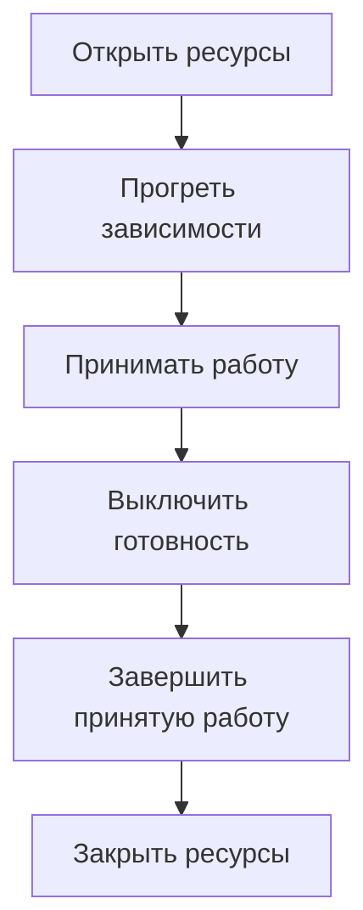

# Жизненный цикл Python-сервиса: запуск, health checks и остановка {#python-service-lifecycle}

У HTTP API, Kafka consumer и фоновой задачи могут быть общие настройки, пул БД и внешние клиенты. Если каждый процесс отдельно решает, как их открыть и закрыть, порядок действий постепенно расходится. Корректная остановка одного обработчика ещё не означает корректную остановку приложения.

Жизненный цикл стоит описать на уровне сервиса: кто владеет ресурсами, когда можно принимать работу и что должно завершиться перед выходом.

<!-- more -->

## Разделить приложение и точки входа {#ownership}

FastAPI lifespan удобно использовать для ресурсов конкретного HTTP-приложения. Но настройки, контейнер зависимостей, пул БД и политика остановки нужны также worker и CLI. Их владелец должен существовать независимо от веб-фреймворка.

Точка входа отвечает за способ получения работы: запрос, сообщение, расписание. Она использует уже подготовленные ресурсы и умеет прекратить получение новой работы. Такое разделение позволяет запускать HTTP и worker вместе или отдельными процессами с одинаковыми правилами инициализации.

## Запускать в порядке зависимостей {#startup}

Сначала проверяются настройки, затем открываются ресурсы и выполняется обязательная инициализация. Готовность принимать запросы включается только после неё. Если запуск прервался посередине, уже созданные ресурсы тоже нужно закрыть.

Для владения несколькими асинхронными ресурсами подходит `AsyncExitStack`: он регистрирует закрытие по мере открытия и выполняет его в обратном порядке. Критическую фоновую задачу следует наблюдать: её аварийное завершение не должно оставлять внешне здоровый процесс с неработающей частью сервиса.

Прогрев нужен там, где первая рабочая операция иначе получает неожиданную задержку или ошибку. Бесконечно ждать необязательный кеш при старте не стоит; условия готовности должны отражать реальную возможность обслуживать запросы.

## Проверки здоровья отвечают на разные вопросы {#health}

| Проверка | Вопрос | Что включать |
|---|---|---|
| Startup | Завершилась ли начальная подготовка? | Обязательную инициализацию |
| Readiness | Можно ли направлять сюда работу? | Состояние приложения и необходимые для неё зависимости |
| Liveness | Нужен ли перезапуск процесса? | Признаки внутренней неисправности процесса |

В Kubernetes неуспешная readiness исключает pod из обычной маршрутизации сервиса, а liveness может привести к перезапуску контейнера. Сбой общей БД сам по себе обычно не исправляется перезапуском всех приложений. Значение probes и их действия описаны в [документации Kubernetes](https://kubernetes.io/docs/concepts/workloads/pods/pod-lifecycle/).

Для необязательной зависимости допустима деградация. Например, решение о readiness при сбое Redis зависит от того, используется ли он как кеш или как необходимое хранилище состояния.

<!-- diagram:concept -->
<figure class="bdr-diagram" markdown="1">
<figcaption>ИДЕЯ В СХЕМЕ<strong>Один владелец всех этапов</strong></figcaption>

Готовность включается после инициализации. При остановке ресурсы закрываются после завершения принятой работы.

</figure>
<!-- /diagram:concept -->

## Остановка начинается до закрытия соединений {#shutdown}

При завершении pod изменение маршрутизации и остановка процесса происходят не как одна атомарная операция. Часть клиентов некоторое время может продолжать направлять запросы по прежнему адресу. Поэтому прекращение готовности и закрытие слушающего сокета нужно согласовать с инфраструктурой.

Далее приложение прекращает брать новую работу и завершает уже принятую в пределах бюджета. Для HTTP это запросы в обработке; для consumer — текущая порция сообщений и фиксация обработанного прогресса. Только после этого закрываются клиенты, пул БД и остальные ресурсы.

Весь путь должен помещаться в `terminationGracePeriodSeconds`: задержка распространения маршрутизации, drain и cleanup. Время `preStop` тоже входит в этот бюджет. Значения выбирают по длительности реальной работы и устройству кластера, а не копируют из чужого манифеста.

## Проверять переходы, а не только запуск {#verification}

Полезный интеграционный тест запускает долгую операцию, отправляет процессу сигнал остановки и проверяет, что операция завершилась до закрытия её ресурсов. Второй сценарий — ошибка во время запуска: процесс должен освободить всё, что успел создать.

Отдельно проверьте медленную зависимость, аварийное завершение worker и превышение drain-бюджета. В каждом случае должно быть понятно, кто перестаёт принимать работу и что происходит с незавершёнными действиями.

В [servicewright](https://bedrock-python.github.io/servicewright/) эта граница выражена через общий runtime и точки входа. Существенен сам порядок: подготовить ресурсы, принять работу, завершить её, освободить ресурсы.

## Примеры и лабораторные работы {#labs}

Полные стенды и условия воспроизведения вынесены в отдельные материалы:

- [Практикум: почему жизненный цикл приложения не должен принадлежать FastAPI](../lab/2026-09-07-lifecycle-not-fastapi/README.md)
- [Практикум: единый жизненный цикл для HTTP, планировщика и воркера](../lab/2026-09-07-one-lifecycle/README.md)
- [Практикум: прогрев, готовность и жизнеспособность](../lab/2026-09-07-warmup-readiness-liveness/README.md)
- [Практикум: корректное завершение — это протокол](../lab/2026-09-07-graceful-shutdown/README.md)
