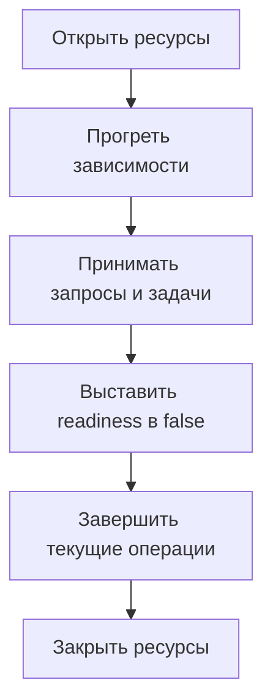

# Жизненный цикл Python-сервиса: запуск, проверки состояния и остановка {#python-service-lifecycle}

HTTP API, обработчик сообщений Kafka и фоновые задачи могут использовать общие настройки, пул БД и внешние клиенты. Если каждая точка входа по-своему создаёт и закрывает эти ресурсы, порядок действий постепенно расходится. Правильной остановки одного обработчика недостаточно для завершения всего приложения.

Жизненный цикл стоит описать на уровне сервиса: кто создаёт и закрывает ресурсы, когда можно принимать запросы и какие операции должны завершиться перед выходом.

<!-- more -->

## Отделяем ресурсы приложения от точек входа {#ownership}

Lifespan в FastAPI удобно использовать для ресурсов HTTP-приложения. Но настройки, контейнер зависимостей, пул БД и правила остановки нужны также воркерам и командам CLI. Код управления этими ресурсами должен работать независимо от веб-фреймворка.

Точка входа определяет, откуда поступают задачи: из HTTP-запросов, сообщений или расписания. Она использует подготовленные ресурсы и умеет прекращать приём новых задач. Это позволяет запускать HTTP API и воркер как вместе, так и отдельными процессами, сохраняя одинаковые правила инициализации.

## Соблюдаем порядок запуска {#startup}

Сначала проверяются настройки, затем открываются ресурсы и выполняется обязательная инициализация. Только после этого сервис сообщает, что готов принимать запросы. Если запуск прервался, уже созданные ресурсы нужно закрыть.

Для управления несколькими асинхронными ресурсами подходит `AsyncExitStack`: при открытии каждого ресурса он запоминает, как его закрыть, а при выходе закрывает их в обратном порядке. За критическими фоновыми задачами тоже нужно следить: их аварийное завершение не должно оставлять внешне исправный процесс с неработающей частью сервиса.

Прогрев нужен, если без него первый рабочий запрос получит неожиданную задержку или ошибку. При этом запуск не должен бесконечно ждать необязательный кеш. Условия готовности должны отражать реальную возможность обслуживать запросы.

## Что проверяют startup, readiness и liveness {#health}

| Проверка | Вопрос | Что включать |
|---|---|---|
| Startup | Завершилась ли начальная подготовка? | Обязательную инициализацию |
| Readiness | Можно ли направлять сюда запросы или задачи? | Состояние приложения и необходимых ему зависимостей |
| Liveness | Нужен ли перезапуск процесса? | Признаки внутренней неисправности процесса |

В Kubernetes неуспешная readiness-проверка исключает pod из обычной маршрутизации сервиса, а liveness-проверка может привести к перезапуску контейнера. Сбой общей БД обычно не исправить перезапуском всех приложений. Назначение проверок и их последствия описаны в [документации Kubernetes](https://kubernetes.io/docs/concepts/workloads/pods/pod-lifecycle/).

При сбое необязательной зависимости сервис может продолжить работу с ограниченными возможностями. Например, решение о readiness при недоступном Redis зависит от его роли: кеш это или необходимое хранилище состояния.

<!-- diagram:concept -->
<figure class="bdr-diagram" markdown="1">
<figcaption>ИДЕЯ В СХЕМЕ<strong>Единый порядок запуска и остановки</strong></figcaption>

Сервис сообщает о готовности после инициализации. При остановке сначала завершаются текущие операции, затем закрываются ресурсы.

</figure>
<!-- /diagram:concept -->

## Остановка начинается до закрытия соединений {#shutdown}

При завершении pod маршрутизация меняется не одновременно с остановкой процесса. Часть клиентов ещё некоторое время отправляет запросы по прежнему адресу. Поэтому нужно учитывать поведение инфраструктуры: когда сервис сообщает, что больше не готов принимать запросы, и когда закрывает слушающий сокет.

Далее приложение прекращает принимать новые задачи и завершает текущие за отведённое время. Для HTTP это активные запросы, для Kafka consumer — текущая порция сообщений и фиксация позиции обработки. После этого можно закрывать клиентов, пул БД и остальные ресурсы.

В лимит `terminationGracePeriodSeconds` должны уложиться обновление маршрутизации, завершение текущих операций и освобождение ресурсов. Время выполнения `preStop` тоже входит в этот лимит. Значения выбирают с учётом длительности операций и устройства кластера.

## Проверяем весь жизненный цикл {#verification}

Полезный интеграционный тест запускает долгую операцию, отправляет процессу сигнал остановки и проверяет, что операция завершилась до закрытия её ресурсов. Второй сценарий — ошибка во время запуска: процесс должен освободить всё, что успел создать.

Отдельно проверьте медленную зависимость, аварийное завершение воркера и превышение времени на завершение текущих операций. Для каждого случая должно быть ясно, кто прекращает принимать новые задачи и что происходит с незавершёнными.

В [servicewright](https://bedrock-python.github.io/servicewright/) ресурсами управляет общий runtime, а точки входа отвечают за приём задач. Порядок остаётся единым: подготовить ресурсы, принять задачи, завершить их, освободить ресурсы.

## Примеры и лабораторные работы {#labs}

Запускаемые примеры и инструкции к ним:

- [Практикум: почему жизненный цикл приложения не должен принадлежать FastAPI](../lab/2026-09-07-lifecycle-not-fastapi/README.md)
- [Практикум: единый жизненный цикл для HTTP, планировщика и воркера](../lab/2026-09-07-one-lifecycle/README.md)
- [Практикум: прогрев и проверки startup, readiness, liveness](../lab/2026-09-07-warmup-readiness-liveness/README.md)
- [Практикум: корректное завершение — это протокол](../lab/2026-09-07-graceful-shutdown/README.md)
