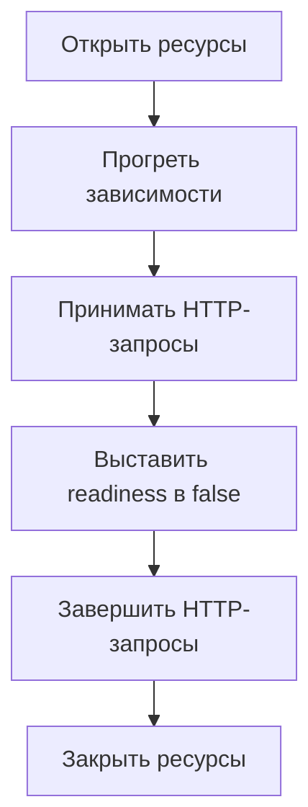

# Жизненный цикл Python-сервиса: запуск, проверки состояния и остановка {#python-service-lifecycle}

<div class="bdr-post__hero" data-bdr-post="2026-09-13-python-service-lifecycle" role="img" aria-label="Сначала вывести из маршрутизации, затем дождаться текущей работы, очистить ресурсы и выйти" markdown="0"></div>

Представим сервис отчётов. По запросу `GET /reports` он строит отчёт для пользователя, а воркер периодически формирует такой же отчёт в фоне. Обоим нужно подключение к базе. При выкладке новой версии начатый HTTP-запрос должен завершиться до того, как это подключение закроется.

Настроим общий запуск для двух точек входа, вызовем ошибку при старте, отключим зависимость и остановим сервис посреди запроса. Для каждого случая есть запускаемый пример и конкретный результат, который можно проверить.

<!-- more -->

<div id="why-application-lifecycle-should-not-belong-to-fastapi" data-search-exclude></div>
<div id="the-api-as-usually-written" data-search-exclude></div>
<div id="the-worker-as-usually-written" data-search-exclude></div>
<div id="the-framework-is-an-entrypoint" data-search-exclude></div>
<div id="what-fastapis-lifespan-is-still-for" data-search-exclude></div>

## Открываем ресурс один раз для HTTP и воркера {#ownership}

В приложении только с HTTP пул соединений можно открыть в FastAPI lifespan и закрыть после завершения запросов средствами Uvicorn. Когда то же подключение требуется отдельному воркеру, настройку приходится повторять. В [исходном примере](../lab/2026-09-07-lifecycle-not-fastapi/README.md) работают обе версии, включая закрытие ресурса при ошибке запуска.

Чтобы задать общие правила запуска и остановки, подключим [servicewright](https://bedrock-python.github.io/servicewright/). `AppSpec` описывает приложение, `Service` запускает его, а точки входа принимают работу. FastAPI отвечает за HTTP-маршруты.

В практикуме вместо базы используем учебное хранилище `ReportStore`, которое держит данные в памяти. Метод `report()` делает паузу, имитируя запрос, и возвращает `{"rows": 42}`. Контекстный менеджер `open_store()` записывает открытие и закрытие ресурса. Обращение к закрытому хранилищу или его закрытие во время отчёта вызывает ошибку проверки. Код есть в [практикуме с общим жизненным циклом](../lab/2026-09-07-one-lifecycle/README.md). HTTP и servicewright здесь настоящие; драйвер базы данных этот пример не проверяет.

Контейнер реализует два вида областей зависимостей servicewright. Область приложения открывает хранилище, а область запроса или воркера даёт доступ к уже открытому ресурсу:

```python
from contextlib import asynccontextmanager
from report_store import ReportStore, open_store


class Scope:
    def __init__(self, store):
        self.store = store

    async def get(self, key):
        if key is ReportStore:
            return self.store
        raise KeyError(key)


class Container:
    def __init__(self, store):
        self.store = store

    @asynccontextmanager
    async def app_scope(self):
        async with open_store(self.store):
            yield Scope(self.store)

    @asynccontextmanager
    async def unit_scope(self, context=None):
        yield Scope(self.store)
```

`unit_scope()` создаёт небольшой объект для поиска зависимостей, а не ещё одно хранилище. В рабочем сервисе DI-контейнер может выдавать здесь отдельную сессию на запрос, сохраняя общий пул на всё приложение. Учебная реализация показывает именно это различие.

<div id="one-lifecycle-for-http-grpc-workers-and-cron-jobs" data-search-exclude></div>
<div id="host-and-entrypoints" data-search-exclude></div>
<div id="one-process" data-search-exclude></div>
<div id="two-processes" data-search-exclude></div>
<div id="what-the-entrypoints-look-like" data-search-exclude></div>
<div id="the-one-thing-to-get-right" data-search-exclude></div>

## Проверяем хранилище, затем запускаем HTTP и воркер {#startup}

Созданный объект клиента ещё не означает, что зависимость доступна. Перед приёмом работы выполняем прогрев с ограничением по времени:

```python
import asyncio
from servicewright import AsyncWarmer


class StoreWarmer(AsyncWarmer):
    def __init__(self, store):
        super().__init__()
        self.store = store

    async def warmup(self):
        async with asyncio.timeout(2):
            await self.store.ping()
```

Если `ping()` выдаст ошибку, запуск завершится ошибкой. Если он зависнет, сработает лимит в две секунды. В обоих случаях область приложения закроет хранилище; HTTP-порт к этому моменту ещё не открыт. Практикум проверяет ошибку прогрева и остановку, запрошенную во время прогрева.

HTTP-обработчик получает подготовленное хранилище через `UnitScopeDep`:

```python
from fastapi import APIRouter
from servicewright.adapters.fastapi import UnitScopeDep

router = APIRouter()


@router.get('/reports')
async def report(unit: UnitScopeDep) -> dict[str, int]:
    store = await unit.get(ReportStore)
    return await store.report('http')
```

Воркер использует то же хранилище. Через полсекунды после завершения отчёта он начинает следующий. Перед новой работой проверяет событие остановки, а на текущий отчёт отводит не больше секунды:

```python
async def periodic_report(scope, stop: asyncio.Event):
    store = await scope.get(ReportStore)
    while not stop.is_set():
        try:
            await asyncio.wait_for(stop.wait(), timeout=0.5)
            return
        except TimeoutError:
            pass
        if stop.is_set():
            return
        async with asyncio.timeout(1):
            await store.report('worker')
```

Остаётся описать общий жизненный цикл и выбрать режим процесса:

```python
from servicewright import AppSpec


def make_spec(container):
    return AppSpec(
        service_name='reports',
        create_container=lambda settings: container,
        warmers=[StoreWarmer(container.store)],
        drain_delay_seconds=0.5,
        drain_grace_seconds=3,
        cleanup_timeout_seconds=2,
    )
```

```python
from servicewright import DaemonEntrypoint, Service
from servicewright.adapters.fastapi import FastApiEntrypoint, HttpConfig


def build_service(role, *, port=8080, store=None):
    container = Container(store if store is not None else ReportStore())
    api = FastApiEntrypoint(
        config=HttpConfig(host='127.0.0.1', port=port, graceful_timeout=1),
        routers=(router,),
    )
    worker = DaemonEntrypoint(periodic_report)
    roles = {'api': [api], 'worker': [worker], 'all': [api, worker]}
    service = Service(make_spec(container), entrypoints=roles[role])
    return service, api, container
```

При `build_service('all')` HTTP и воркер используют одно хранилище в одном процессе. Если развернуть `api` и `worker` отдельно, у каждого процесса будет своё хранилище с одинаковыми правилами запуска. Скрипт вызывает `run_sync(service, Settings())`; небольшой адаптер настроек тоже есть в практикуме.

У примера с воркером есть существенная деталь: `DaemonEntrypoint` запускает переданную функцию, а Host ждёт её возврата перед началом остановки. Поэтому время одного отчёта ограничивает сама функция. В режиме `all` readiness может оставаться положительной, пока воркер заканчивает текущий отчёт. Если обработчику очереди нужны отдельные этапы прекращения приёма и завершения работы, используйте собственную точку входа; см. [пример остановки Kafka consumer](2026-09-13-kafka-in-python-services.md#shutdown).

<div id="warmup-readiness-and-liveness-are-three-different-things" data-search-exclude></div>
<div id="the-whole-life-of-a-pod-in-six-transitions" data-search-exclude></div>
<div id="warmup-is-not-readiness-and-neither-is-it-liveness" data-search-exclude></div>
<div id="liveness-is-about-the-process-not-the-dependencies" data-search-exclude></div>
<div id="readiness-has-to-go-false-before-the-pod-stops-serving" data-search-exclude></div>
<div id="the-three-in-one-table" data-search-exclude></div>
<div id="the-pieces" data-search-exclude></div>

## Отключаем зависимость и смотрим, какая проба сработает {#health}

Допустим, сервис также хранит в Redis состояние фоновых заданий. Для этого варианта развёртывания потеря состояния означает, что pod нельзя использовать для новой работы. Добавим проверку в `HealthRegistry`, который отвечает за readiness:

```python
from redis.exceptions import RedisError
from servicewright import HealthRegistry


class RedisReady:
    def __init__(self, redis):
        self.redis = redis

    async def check(self) -> bool:
        try:
            async with asyncio.timeout(0.25):
                return bool(await self.redis.ping())
        except (RedisError, TimeoutError):
            return False


def redis_health(redis):
    health = HealthRegistry()
    health.add_check('job-state', RedisReady(redis))
    return health
```

[Практикум с проверками состояния](../lab/2026-09-07-warmup-readiness-liveness/README.md) создаёт Redis-клиент, задаёт `health=redis_health(client)` в спецификации и закрывает клиент вместе с областью приложения. На проверку отводится 250 мс суммарно, включая возможные повторы внутри клиента. В liveness эта зависимость не участвует.

Драйвер приостанавливает настоящий контейнер Redis и проверяет ответы по HTTP на localhost:

| Ситуация | `/system/health/livez` | `/system/health/readyz` | Прямой запрос `/reports` |
| --- | --- | --- | --- |
| Идёт прогрев | Порт ещё не открыт | Порт ещё не открыт | Порт ещё не открыт |
| Запуск завершён | 200 | 200 | 200 |
| Redis приостановлен | 200 | 503 | 200 |
| Redis снова доступен | 200 | 200 | 200 |
| Запрошена остановка, идёт пауза для обновления маршрутизации | 200 | 503 | 200 |

Учебный обработчик `/reports` не обращается к Redis, поэтому прямой запрос продолжает работать во время сбоя. Readiness сообщает, можно ли направлять сюда трафик; сама по себе она не блокирует обработчик. Если бы Redis был лишь необязательным кешем и сервис мог выдавать отчёты без него, мы не включали бы его в обязательные проверки readiness.

В servicewright 0.13.1 адаптер FastAPI открывает порт после прогрева. Startup probe даёт инициализации время завершиться до начала проверок liveness. Для Kubernetes замените учебный `HttpConfig.host='127.0.0.1'` на `0.0.0.0`, чтобы пробы могли обращаться по IP pod. Такой фрагмент настроек контейнера отводит на запуск примерно 30 секунд:

```yaml
# Fragment of spec.containers[0]; the container listens on port 8080.
startupProbe:
  httpGet: {path: /system/health/livez, port: 8080}
  periodSeconds: 1
  failureThreshold: 30
readinessProbe:
  httpGet: {path: /system/health/readyz, port: 8080}
  periodSeconds: 2
livenessProbe:
  httpGet: {path: /system/health/livez, port: 8080}
  periodSeconds: 10
  failureThreshold: 3
```

Для startup здесь используется `livez`: этот HTTP-сервер начинает отвечать только после прогрева. Readiness определяет, должен ли pod получать трафик Kubernetes Service; повторяющиеся ошибки liveness могут привести к перезапуску контейнера. Встроенная `livez` подтверждает, что HTTP-сервер и цикл событий отвечают, а не проверяет базу. Поведение проб описано в [документации Kubernetes](https://kubernetes.io/docs/tasks/configure-pod-container/configure-liveness-readiness-startup-probes/).

<div id="graceful-shutdown-in-kubernetes-is-a-protocol-not-a-signal-handler" data-search-exclude></div>
<div id="what-kubernetes-actually-does" data-search-exclude></div>
<div id="the-measurement" data-search-exclude></div>
<div id="the-protocol" data-search-exclude></div>
<div id="the-same-measurement-with-the-protocol" data-search-exclude></div>
<div id="sizing-the-numbers" data-search-exclude></div>
<div id="not-only-http" data-search-exclude></div>
<div id="what-changed-in-the-code" data-search-exclude></div>

## Завершаем принятый отчёт, затем закрываем хранилище {#shutdown}

Возьмём режим `api`. Запрос уже начал строить отчёт длительностью 0,8 секунды, когда сервис получил команду остановки. С настройками выше произойдёт следующее:

1. Readiness станет отрицательной: проба начнёт возвращать 503.
2. HTTP-сервер продолжит принимать запросы ещё 0,5 секунды, пока длится заданная пауза для обновления маршрутизации.
3. Адаптер попросит Uvicorn прекратить приём соединений и завершить активные запросы. Наш отчёт вернёт 200.
4. Адаптер остановится, после чего область приложения закроет хранилище.

<!-- diagram:concept -->
<figure class="bdr-diagram" markdown="1">
<figcaption><span class="bdr-diagram__eyebrow">ИДЕЯ В СХЕМЕ</span><strong>Порядок остановки HTTP-сервера</strong></figcaption>
<div class="bdr-diagram__viewport" markdown="1" data-search-exclude>


```mermaid
---
config:
  theme: default
  look: classic
  flowchart:
    useMaxWidth: false
    wrappingWidth: 150
    padding: 12
    nodeSpacing: 24
    rankSpacing: 32
---
flowchart TD
    accTitle: Порядок остановки HTTP-сервера
    accDescr: HTTP-запросам даётся время завершиться до закрытия ресурсов. Запросы, не уложившиеся в лимит, отменяются.
    A["Открыть ресурсы"]
    B["Прогреть зависимости"]
    C["Принимать HTTP-запросы"]
    D["Выставить readiness в false"]
    E["Завершить HTTP-запросы"]
    F["Закрыть ресурсы"]
    A --> B --> C --> D --> E --> F
```

</div>
<p class="bdr-diagram__caption">HTTP-запросам даётся время завершиться до закрытия ресурсов. Запросы, не уложившиеся в лимит, отменяются.</p>
</figure>
<!-- /diagram:concept -->

Параметры ограничивают разные части этой последовательности:

| Параметр примера | За что отвечает |
| --- | --- |
| `drain_delay_seconds=0.5` | Пауза после снятия readiness, перед началом завершения работы |
| `HttpConfig.graceful_timeout=1` | Сколько Uvicorn ждёт активные запросы при остановке |
| `drain_grace_seconds=3` | Время завершения, передаваемое каждой точке входа; здесь оно оставляет Uvicorn время закончить остановку |
| `cleanup_timeout_seconds=2` | Лимит отдельных шагов освобождения ресурсов в runtime; это не общее время остановки |

Закрытие ресурсов приложения тоже нужно ограничивать. `cleanup_timeout_seconds` не оборачивает весь выход из `app_scope()`. Учебное хранилище закрывается сразу; у настоящего пула или клиента должен быть свой лимит на закрытие.

В [практикуме с остановкой](../lab/2026-09-07-graceful-shutdown/README.md) есть и отчёт на 30 секунд. Он не укладывается в секундный лимит Uvicorn и отменяется до закрытия хранилища. Для этого обработчика, который ещё не начал отправлять ответ, зафиксированные версии возвращают 500. Если часть потокового ответа уже отправлена, результат может быть другим. Ограниченное время остановки не гарантирует успех каждого принятого запроса.

Пауза в 0,5 секунды выбрана для локального примера. При удалении pod Kubernetes обновляет маршрутизацию параллельно с остановкой контейнера на узле; клиенты не узнают об этом одновременно. В `terminationGracePeriodSeconds` должна помещаться вся последовательность: возможный `preStop`, завершение воркера, пауза для маршрутизации, завершение запросов и закрытие ресурсов. Эти времена нужно измерить в своём окружении. См. [порядок остановки pod](https://kubernetes.io/docs/concepts/workloads/pods/pod-lifecycle/#pod-termination-flow).

## Проверяем порядок событий на начатом HTTP-запросе {#verification}

Так выглядит проверка успешной остановки из практикума. `running()` запускает настоящий сервер и возвращает событие остановки, задачу сервиса и HTTPX-клиент. При выходе из контекста он ждёт остановки. `wait_until()` ограничивает ожидание по времени и выдаёт ошибку, если сервис завершился раньше:

```python
from lab_support import running, wait_until


async def check_graceful_shutdown():
    store = ReportStore(duration=0.8)
    service, api, _ = build_service('api', port=0, store=store)
    async with running(service, api) as (stop, task, client):
        request = asyncio.create_task(client.get('/reports'))
        try:
            await asyncio.wait_for(store.started.wait(), timeout=2)
            stop.set()
            await wait_until(lambda: not service.spec.health.ready, task)
            assert (await client.get('/system/health/readyz')).status_code == 503
            assert (await request).status_code == 200
        finally:
            await asyncio.gather(request, return_exceptions=True)
    assert store.events.index('http:done') < store.events.index('store:close')
```

Главная проверка сравнивает события: отчёт завершился раньше, чем закрылось хранилище. В остальных примерах проверяются ошибка прогрева, остановка во время прогрева, три режима процесса, сбой и восстановление Redis, ошибка обязательного воркера и отмена запроса после исчерпания времени на завершение.

Код проверен на Python 3.13 с `servicewright==0.13.1`, `fastapi==0.141.1`, `uvicorn==0.53.0` и `httpx==0.28.1`; версии закреплены в зависимостях практикумов. Драйверы вызывают `Service.run(..., stop=event)`: в этом режиме обработчики сигналов ОС не устанавливаются. Эти запуски проверяют поведение приложения и настоящее взаимодействие по HTTP и с Redis, но не доставку SIGTERM и не выкладку в Kubernetes.

## Что взять в свой сервис {#conclusion}

HTTP и воркер используют общее хранилище. При ошибке прогрева сервер не запускается, при отказе Redis процесс остаётся живым, а при остановке хранилище закрывается после завершения или отмены активного запроса. Этот порядок проверен на запросе, начатом до остановки сервиса.

Используйте нашу библиотеку [servicewright](https://bedrock-python.github.io/servicewright/), если нескольким точкам входа нужны общие правила запуска и остановки. `AppSpec` хранит общую конфигурацию, адаптеры управляют своими серверами, а код приложения задаёт обязательные зависимости и ограничения работы. Для приложения только с HTTP можно оставить FastAPI lifespan, если его достаточно. Повторите проверку остановки из примера с вашим обработчиком и настоящими ресурсами.

## Примеры и практикумы {#labs}

- [FastAPI lifespan и отдельно настроенный воркер](../lab/2026-09-07-lifecycle-not-fastapi/README.md)
- [Единый жизненный цикл для HTTP и воркера](../lab/2026-09-07-one-lifecycle/README.md)
- [Прогрев, readiness и liveness с настоящим Redis](../lab/2026-09-07-warmup-readiness-liveness/README.md)
- [Завершение и отмена HTTP-запросов при остановке](../lab/2026-09-07-graceful-shutdown/README.md)
