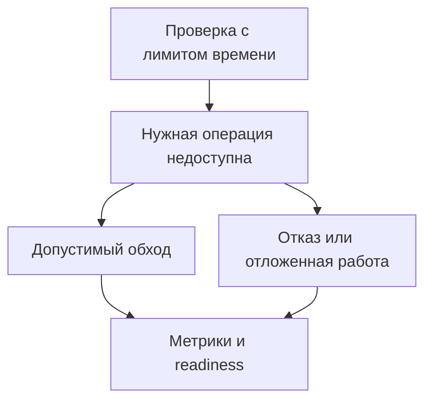

# Redis недоступен: health checks и поведение сервиса {#redis-failures-and-health-checks}

Redis может обслуживать кэш, ограничивать частоту запросов и хранить ключи идемпотентности в одном сервисе. При его отказе этим операциям нужны разные правила. Чтение из базы вместо кэша может сохранить работоспособность, а выполнение платежа без защиты от повторов — изменить результат.

Поэтому настройку клиента, проверку состояния и решение о продолжении работы стоит рассматривать вместе. Health check полезен только тогда, когда понятно, какое действие последует за его результатом.

<!-- more -->

## Сначала ограничить время ожидания {#timeouts}

Пока клиент ждёт Redis, запас времени на обходной путь сокращается. Нужны явные ограничения на подключение и выполнение команд, а также учёт повторных попыток. Таймаут одной попытки не ограничивает всю операцию, если библиотека повторяет её несколько раз.

Параметры по умолчанию зависят от версии клиента. Их лучше проверить на установленной версии и протестировать не только отказ подключения, но и зависший сервер: соединение установлено, ответа нет. В измерение должны входить ожидание свободного соединения, повторы и паузы между ними.

## Продолжать работу или отказать {#failure-policy}

*Fail open* означает разрешить операцию без недоступной проверки или зависимости; *fail closed* — отказать в ней. Выбор принадлежит месту использования Redis.

| Задача Redis | Что делать при отказе |
|---|---|
| Необязательный кэш | Читать из источника, если он выдержит дополнительную нагрузку |
| Ограничение частоты запросов | Выбрать обход, локальный лимит или отказ в зависимости от стоимости и риска операции |
| Защита от повторного платежа | Не обходить её без другой гарантии идемпотентности |
| Хранилище обязательного состояния | Отказать или отложить работу, если корректного запасного пути нет |

Обход кэша требует запаса мощности базы. Если каждый запрос после короткого таймаута идёт в PostgreSQL, отказ Redis может перегрузить следующую зависимость. Ограничение параллелизма, объединение одинаковых запросов и временный отказ от обращений к недоступному кэшу помогают удержать эту нагрузку.

Для лимитов и идемпотентности универсального разрешения на обход нет. Например, платёжный провайдер может принимать собственный ключ идемпотентности; это отдельная гарантия, которую надо передать и проверить. Повторная отправка письма тоже не всегда безобидна. Подробнее о границах защиты — в [статье об идемпотентности](2026-09-13-idempotency-in-apis-and-background-jobs.md).

## Что на самом деле проверяет PING {#capabilities}

Успешный `PING` подтверждает, что Redis ответил на эту команду. Он не доказывает возможность записи: read-only replica или сервер с исчерпанной памятью и политикой `noeviction` могут отвечать на проверку и отклонять `SET`.

Если сервису необходима запись, можно проверять её отдельным ключом с коротким TTL и выделенным префиксом. Использовать нужно те же права и маршрут подключения, что и у приложения. Проверку выполняют периодически с ограниченным временем, а не перед каждым запросом.

У такого теста остаются границы: маленькая запись не гарантирует успех большой, один ключ в Redis Cluster проверяет конкретный слот, а успешный `SET` не подтверждает доступность всех Lua-скриптов и команд приложения. Нужная глубина проверки следует из реального сценария использования. Семантика базовой команды описана в [документации Redis](https://redis.io/docs/latest/commands/ping/).

<!-- diagram:concept -->
<figure class="bdr-diagram" markdown="1">
<figcaption>ИДЕЯ В СХЕМЕ<strong>Отказ Redis требует решения для каждой операции</strong></figcaption>

Проверка выявляет отказ нужной операции. Приложение выбирает допустимый обход или отказ, а затем отражает это решение в readiness.

</figure>
<!-- /diagram:concept -->

## Как связать результат с Kubernetes {#health}

Отказ внешнего Redis обычно не является основанием для перезапуска исправного процесса. Если включить такую зависимость в liveness, все реплики могут начать перезапускаться, не устраняя причину.

Readiness отвечает на другой вопрос: может ли реплика принимать предназначенный ей трафик? Для необязательного кэша достаточно метрики деградации. Для обязательного состояния отказ может потребовать снятия readiness, но при общей зависимости это уберёт из балансировки все реплики. Такое поведение должно быть осознанным. Если часть API продолжает работать, полезнее отказать на конкретном маршруте, сохранив доступные функции.

Эти решения связаны с общим [жизненным циклом сервиса](2026-09-13-python-service-lifecycle.md), а не только с одним обработчиком health check.

## Проверять отказ и восстановление {#verification}

В тестах нужны недоступный адрес, зависший сервер, отказ записи, исчерпание пула и возвращение Redis в работу. Для каждого сценария проверяются время ответа, выбранный обход, нагрузка на запасной путь и восстановление тем же экземпляром клиента.

В метриках стоит различать ошибку Redis, использование обхода и отказ бизнес-операции. Иначе успешные HTTP-ответы скроют период, когда лимит или защита от повторов фактически не работали.

[redis-client-kit](https://bedrock-python.github.io/redis-client-kit/) предоставляет настройку клиента и проверки состояния. Решение о том, какие операции разрешены без Redis, остаётся в приложении.

## Примеры и лабораторные работы {#labs}

Полные стенды и условия воспроизведения вынесены в отдельные материалы:

- [Практикум: когда при сбое Redis стоит продолжать работу](../lab/2026-09-07-when-should-redis-fail-open/README.md)
- [Практикум: проверка здоровья Redis не ограничивается PING](../lab/2026-09-07-redis-health-checks/README.md)
