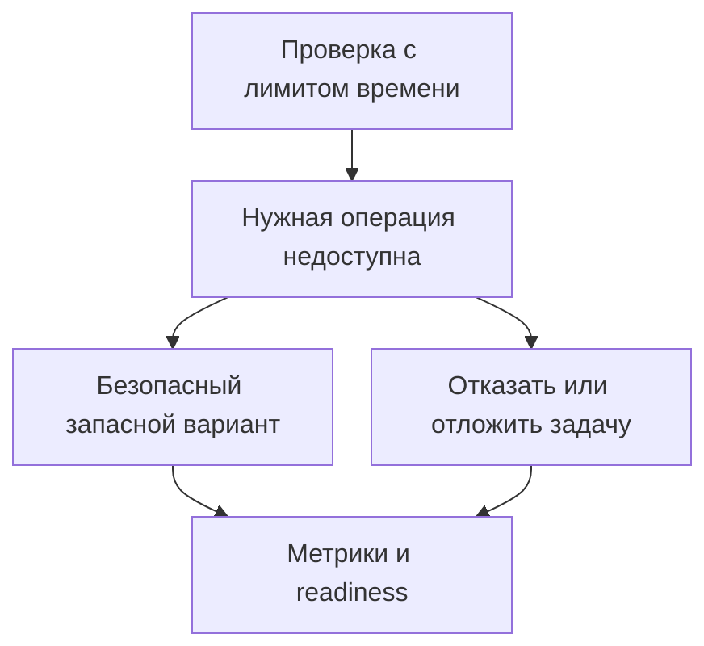

# Redis недоступен: проверки состояния и поведение сервиса {#redis-failures-and-health-checks}

В одном сервисе Redis может хранить кеш, ограничивать частоту запросов и защищать операции от повторов. При его отказе этим задачам нужны разные решения. Данные можно прочитать из БД вместо кеша, а вот платёж без защиты от повторов рискует списать деньги дважды.

Поэтому настройку клиента, проверки состояния и поведение при сбое нужно продумывать вместе. От проверки есть польза, только если понятно, что сервис сделает с её результатом.

<!-- more -->

## Ограничиваем время ожидания {#timeouts}

Пока клиент ждёт Redis, остаётся всё меньше времени на запасной способ выполнить запрос. Нужно явно ограничить подключение и выполнение команд с учётом повторов. Таймаут одной попытки не ограничивает всю операцию, если клиент повторяет её несколько раз.

Параметры по умолчанию зависят от версии клиента. Их лучше проверить на установленной версии и протестировать не только отказ подключения, но и зависший сервер: соединение установлено, ответа нет. В измерение должны входить ожидание свободного соединения, повторы и паузы между ними.

## Когда продолжать работу, а когда возвращать ошибку {#failure-policy}

*Fail open* означает разрешить операцию, даже если нужная проверка или зависимость недоступна. *Fail closed* — отказать в её выполнении. Выбор зависит от того, для чего используется Redis.

| Задача Redis | Что делать при отказе |
|---|---|
| Необязательный кеш | Читать из исходного хранилища, если оно выдержит дополнительную нагрузку |
| Ограничение частоты запросов | В зависимости от риска операции применить локальный лимит, разрешить запрос без проверки или отказать |
| Защита от повторного платежа | Не обходить её без другой гарантии идемпотентности |
| Хранилище необходимого состояния | Отказать или отложить операцию, если безопасного запасного варианта нет |

Чтобы работать без кеша, базе нужен запас мощности. Если после короткого таймаута Redis каждый запрос отправится в PostgreSQL, сбой кеша может перегрузить и БД. Сдерживать нагрузку помогают ограничение параллелизма, объединение одинаковых запросов и временное прекращение попыток обратиться к недоступному кешу.

Ограничения частоты запросов и защиту от повторов нельзя безусловно отключать. Например, у платёжного провайдера может быть собственный механизм идемпотентности — тогда нужно передавать ему ключ и проверить его гарантии. Даже повторная отправка письма не всегда безобидна. Подробнее — в [статье об идемпотентности](2026-09-13-idempotency-in-apis-and-background-jobs.md).

## Что на самом деле проверяет PING {#capabilities}

Успешный `PING` подтверждает только то, что Redis ответил на эту команду. Запись при этом может не работать: реплика в режиме только чтения или сервер с исчерпанной памятью и политикой `noeviction` могут отвечать на `PING`, но отклонять `SET`.

Если сервису необходима запись, можно проверять её отдельным ключом с коротким TTL и выделенным префиксом. Использовать нужно те же права и маршрут подключения, что и у приложения. Проверку выполняют периодически с ограниченным временем, а не перед каждым запросом.

У такой проверки есть ограничения: маленькая запись не гарантирует успех большой, один ключ в Redis Cluster проверяет только конкретный слот, а успешный `SET` не подтверждает работу всех Lua-скриптов и команд приложения. Выбирайте проверку по тому, какие операции нужны сервису. Поведение базовой команды описано в [документации Redis](https://redis.io/docs/latest/commands/ping/).

<!-- diagram:concept -->
<figure class="bdr-diagram" markdown="1">
<figcaption>ИДЕЯ В СХЕМЕ<strong>Отказ Redis требует решения для каждой операции</strong></figcaption>

Проверка показывает, работает ли нужная операция Redis. Приложение выбирает запасной способ обработки или возвращает ошибку и соответственно меняет readiness.

</figure>
<!-- /diagram:concept -->

## Как использовать результат проверки в Kubernetes {#health}

Отказ внешнего Redis обычно не является основанием для перезапуска исправного процесса. Если включить такую зависимость в liveness, все реплики могут начать перезапускаться, не устраняя причину.

Readiness отвечает на другой вопрос: может ли реплика обслуживать предназначенные ей запросы? При сбое необязательного кеша может хватить метрики, показывающей работу без него. Если Redis хранит необходимые данные, сервису может понадобиться выставить readiness в false. Но при общем Redis это исключит из балансировки все реплики. Если часть API остаётся работоспособной, иногда лучше возвращать ошибку только для затронутых методов.

Эти решения относятся ко всему [жизненному циклу сервиса](2026-09-13-python-service-lifecycle.md), а не к одному обработчику проверки состояния.

## Проверяем отказ и восстановление {#verification}

В тестах нужны недоступный адрес, зависший сервер, отказ записи, занятый пул соединений и восстановление Redis. Для каждого случая проверяйте время ответа, поведение запасного способа обработки, дополнительную нагрузку на него и восстановление работы без пересоздания клиента.

В метриках различайте ошибку Redis, выполнение операции без него и отказ самой бизнес-операции. Иначе успешные HTTP-ответы могут скрыть период, когда ограничение запросов или защита от повторов фактически не работали.

[redis-client-kit](https://bedrock-python.github.io/redis-client-kit/) предоставляет настройку клиента и проверки состояния. Решение о том, какие операции разрешены без Redis, остаётся в приложении.

## Примеры и лабораторные работы {#labs}

Запускаемые примеры и инструкции к ним:

- [Практикум: когда при сбое Redis стоит продолжать работу](../lab/2026-09-07-when-should-redis-fail-open/README.md)
- [Практикум: проверка состояния Redis не ограничивается PING](../lab/2026-09-07-redis-health-checks/README.md)
