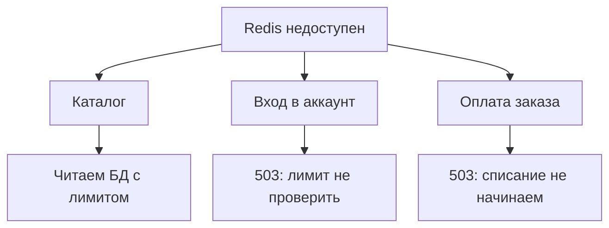

# Redis недоступен: проверки состояния и поведение сервиса {#redis-failures-and-health-checks}

<div class="bdr-post__hero" data-bdr-post="2026-09-13-redis-failures-and-health-checks" role="img" aria-label="Недоступность зависимости одна, а решения для разных сценариев различаются" markdown="0"></div>

Представим интернет-магазин с тремя операциями: просмотр цены, вход в аккаунт и оплата заказа. Redis хранит кеш цен, считает попытки входа и временно ограничивает повторные попытки оплаты. Отключим его и разберём, какие запросы магазин сможет обслужить, а какие должен отклонить.

Для каждого случая напишем код, воспроизведём отказ и проверим результат. Затем настроим проверку состояния так, чтобы она помогала принимать эти решения.

<!-- more -->

## Ограничиваем время ожидания Redis {#timeouts}

Цена хранится в PostgreSQL, поэтому при недоступном кеше её можно прочитать оттуда. Но если почти всё время запроса потратить на ожидание Redis, до базы мы уже не успеем добраться.

Для общего клиента используем нашу библиотеку [redis-client-kit](https://bedrock-python.github.io/redis-client-kit/): она собирает клиент `redis-py` из настроек и предоставляет проверки состояния. Дальше во всех функциях `redis` — один такой клиент, созданный при запуске приложения и закрываемый через `await redis.aclose()` при остановке.

Примеры проверены на Python 3.13, `redis-client-kit[settings]==0.3.0`, `redis==8.1.0` и Redis 7.4.11. Полный код и зависимости есть в [практикуме](../lab/2026-09-07-when-should-redis-fail-open/README.md).

```python
from redis_client_kit import create_async_redis_client
from redis_client_kit.settings import (
    BaseRedisSettings,
    RedisConnectionSettings,
    RedisPoolSettings,
    RedisResponseSettings,
    RedisRetrySettings,
)


def make_redis(host="localhost", port=6379):
    return create_async_redis_client(BaseRedisSettings(
        key_prefix="shop",
        connection=RedisConnectionSettings(host=host, port=port),
        pool=RedisPoolSettings(
            max_connections=10,
            socket_connect_timeout=0.1,
            socket_timeout=0.1,
        ),
        response=RedisResponseSettings(decode_responses=True),
        retry=RedisRetrySettings(enabled=False, max_attempts=0),
        health_check_interval=0,
    ))
```

Здесь явно отключены повторы и заданы таймауты подключения и работы с сокетом. `key_prefix` сам не добавляется к ключам: префикс `shop:` будем указывать в командах. `health_check_interval=0` отключает автоматический `PING` перед командой после простоя; собственную проверку добавим ниже.

Одному обращению к Redis дадим общий лимит времени, включающий получение соединения и выполнение команды:

```python
import asyncio
import logging

from redis.exceptions import RedisError

log = logging.getLogger("shop")
REDIS_FAILURES = (RedisError, TimeoutError)


class ServiceUnavailable(Exception):
    pass


async def redis_call(command):
    async with asyncio.timeout(0.15):
        return await command
```

Если Redis зависнет, `redis_call` ограничит ожидание со стороны приложения. Внешняя отмена задачи при этом продолжит распространяться: `CancelledError` не входит в `REDIS_FAILURES`. Уже отправленная команда всё ещё может выполниться на сервере — таймаут не отменяет её результат.

Все лимиты в примере — учебные настройки. В приложении их нужно согласовать с нагрузкой и [общим дедлайном запроса](2026-09-06-timeouts-are-not-deadlines.md). В практикуме `retry_probe.py` отдельно показывает, как повторы увеличивают ожидание при том же таймауте сокета.

<div id="when-should-redis-fail-open" data-search-exclude></div>
<div id="before-deciding-anything-how-long-does-it-take-to-know" data-search-exclude></div>
<div id="the-cache-open-always" data-search-exclude></div>
<div id="the-rate-limiter-open-and-say-so" data-search-exclude></div>
<div id="the-idempotency-store-it-depends-on-what-repeating-costs" data-search-exclude></div>
<div id="health-what-readiness-should-depend-on" data-search-exclude></div>
<div id="and-then-it-comes-back" data-search-exclude></div>
<div id="the-shape" data-search-exclude></div>

## Три операции — три решения при сбое {#failure-policy}

Продолжать операцию без недоступной проверки называют *fail open*, отказывать в выполнении — *fail closed*. Выберем поведение для каждого маршрута нашего магазина.

### Каталог: читаем цену из базы {#cache-fallback}

Покупатель запрашивает цену товара. Сначала смотрим кеш, при промахе или ошибке читаем PostgreSQL. `load_price(sku)` — асинхронная функция приложения, которая возвращает цену строкой; в практикуме её заменяет счётчик обращений с фиксированным ответом.

```python
db_slots = asyncio.Semaphore(8)


async def product_price(redis, load_price, sku):
    key = f"shop:price:{sku}"
    cache_available = True
    try:
        cached = await redis_call(redis.get(key))
        if cached is not None:
            return cached
    except REDIS_FAILURES:
        cache_available = False
        log.warning("cache_read_failed", exc_info=True)

    try:
        async with asyncio.timeout(0.5):
            async with db_slots:
                price = await load_price(sku)
    except TimeoutError as error:
        raise ServiceUnavailable("Catalog is busy") from error

    if cache_available:
        try:
            await redis_call(redis.set(key, price, ex=60))
        except REDIS_FAILURES:
            log.warning("cache_write_failed", exc_info=True)
    return price
```

При первом запросе функция читает базу и кеширует результат, при втором возвращает его из Redis. Когда Redis недоступен, она сразу переходит к базе и не тратит время на заведомо бесполезное заполнение кеша. Если чтение кеша удалось, а запись нового значения отказала, покупатель всё равно получает цену из БД.

Семафор допускает не больше восьми одновременных чтений через эту функцию в одном процессе. Лимит в полсекунды включает и очередь перед семафором, и чтение. При перегрузке выбрасывается `ServiceUnavailable`; HTTP-обработчик преобразует его в `503`. Так сбой кеша не создаёт бесконечную очередь к БД. Суммарную нагрузку всех реплик и другие обращения к базе нужно учитывать отдельно.

В практикуме две последовательные выдачи цены требуют одного обращения к источнику. После приостановки Redis следующая выдача снова читает источник. Отдельная проверка занимает все слоты семафора и убеждается, что лишний запрос завершается отказом.

### Вход: сохраняем ограничение попыток {#login-rate-limit}

Для входа в аккаунт выберем пять попыток за минутное окно, которое начинается с первой попытки. Если Redis недоступен, возвращаем `503`: в этом сценарии мы не разрешаем вход без проверки лимита. Превышение работающего лимита означает другую ошибку — `429`.

Счётчик должен истекать. Отдельные `INCR` и `EXPIRE` оставляют промежуток, в котором приложение может упасть после увеличения счётчика, но до установки TTL. Объединим действия в Lua-скрипт, как в [примере ограничителя Redis](https://redis.io/docs/latest/commands/incr/).

```python
LOGIN_WINDOW = """
local count = redis.call('INCR', KEYS[1])
if count == 1 then
    redis.call('PEXPIRE', KEYS[1], ARGV[1])
end
return count
"""


class TooManyRequests(Exception):
    pass


async def allow_login(redis, account_id):
    try:
        count = await redis_call(redis.eval(
            LOGIN_WINDOW, 1, f"shop:login:{account_id}", 60_000,
        ))
    except REDIS_FAILURES as error:
        raise ServiceUnavailable("Login protection unavailable") from error
    if count > 5:
        raise TooManyRequests("Login limit reached")
```

`account_id` здесь — стабильный идентификатор, полученный после нормализации введённого логина. Проверка вызывается до проверки пароля. Это один слой защиты: для реального входа также нужны ограничения по источнику запросов и защита от намеренной блокировки чужого аккаунта.

Восемь одновременных вызовов в практикуме пропускают пять попыток и отклоняют три. После истечения ключа новая попытка снова разрешена. Если ответ на `EVAL` потеряется, попытка уже может быть учтена; автоматически повторять такую команду мы не будем.

### Оплата: не начинаем списание при неопределённости {#payment-admission}

Покупатель нажал «Оплатить» дважды. Временный ключ `SET NX` позволит одному обработчику начать попытку, а второму вернёт `PaymentBusy`, который HTTP-слой преобразует в `409`. Если установить ключ не удалось, обработчик вернёт `503` и не вызовет платёжный API.

Теперь важное условие примера: **провайдер поддерживает идемпотентное списание**. Повтор одного ключа с той же суммой, в том числе конкурентный, не создаёт второй платёж. `charge` — адаптер этого API. Идентификатор заказа и сумма берутся из проверенного заказа на сервере; повтор использует тот же ключ и те же параметры.

```python
class PaymentBusy(Exception):
    pass


async def pay_order(redis, charge, order_id, amount_minor):
    try:
        acquired = await redis_call(redis.set(
            f"shop:payment:{order_id}", "pending", nx=True, ex=30,
        ))
    except REDIS_FAILURES as error:
        raise ServiceUnavailable("Payment admission unavailable") from error
    if not acquired:
        raise PaymentBusy("A payment attempt already exists")

    return await charge(
        amount_minor=amount_minor,
        idempotency_key=f"shop:order:{order_id}",
    )
```

Redis здесь лишь временно ограничивает допуск к операции. Ключ истечёт, может быть потерян при сбое или исчезнуть раньше, чем завершится медленный вызов. Поэтому защиту от второго списания обеспечивает контракт платёжного провайдера. Срок хранения ключа у провайдера должен покрывать допустимый период повторов.

После неопределённого результата ключ Redis оставляем до истечения TTL. Даже успешная попытка в этом небольшом примере занимает окно целиком; полноценный API может возвращать сохранённый результат из БД. Если провайдер списал деньги, а ответ потерялся, повтор после TTL передаст прежний `idempotency_key`. Практикум моделирует эту ситуацию и проверяет, что число списаний не увеличилось.

Без такого контракта у провайдера копировать пример нельзя: нужен отдельный процесс учёта и сверки платежей. Варианты хранения результата и обработки повторов разобраны в [статье об идемпотентности](2026-09-13-idempotency-in-apis-and-background-jobs.md).

<div id="redis-health-checks-ping-is-not-the-whole-story" data-search-exclude></div>
<div id="what-ping-answers" data-search-exclude></div>
<div id="liveness-and-readiness-are-different-questions" data-search-exclude></div>
<div id="what-it-costs-and-what-it-does-not-answer" data-search-exclude></div>
<div id="the-rule" data-search-exclude></div>
<div id="the-pieces" data-search-exclude></div>

## Redis отвечает на PING, но отказывает в записи {#capabilities}

Вернём Redis в строй, но подключим магазин к реплике, доступной только для чтения. `PING` пройдёт. Вход и оплата всё равно перестанут работать: им нужны записывающие команды. Аналогичный случай — основной узел, который достиг `maxmemory` при политике `noeviction`.

В `redis-client-kit` проверка с `write_key` выполняет `PING`, затем `SET` с TTL 60 секунд. Добавим к ней уже знакомый общий лимит:

```python
from redis_client_kit import check_async_redis_health


async def redis_health(redis, *, require_write=False):
    try:
        return await redis_call(check_async_redis_health(
            redis,
            write_key="shop:health:write" if require_write else None,
        ))
    except TimeoutError:
        return False
```

`redis_health(redis)` проверяет ответ на `PING`, а `redis_health(redis, require_write=True)` — ещё и пробную запись. В [практикуме проверки состояния](../lab/2026-09-07-redis-health-checks/README.md) реальные серверы дали такие результаты:

| Состояние Redis | `PING` | `PING` + `SET` |
|---|---|---|
| Исправный основной узел | `True` | `True` |
| Достигнут лимит памяти, `noeviction` | `True` | `False` |
| Реплика только для чтения | `True` | `False` |
| Приостановленный процесс | `False` | `False` |
| Работа возобновлена, клиент прежний | `True` | `True` |

Пробный ключ должен иметь отдельное имя, разрешённое правами приложения. Успешный `SET` ещё не проверяет `EVAL`, не гарантирует запись любого объёма и в Redis Cluster проверяет только слот этого ключа. Поэтому обработка ошибок в бизнес-функциях остаётся необходимой: проверка состояния сообщает о проблеме, но не выдаёт гарантию на следующий запрос.

<!-- diagram:concept -->
<figure class="bdr-diagram" markdown="1">
<figcaption><span class="bdr-diagram__eyebrow">ИДЕЯ В СХЕМЕ</span><strong>Один отказ Redis — три маршрута магазина</strong></figcaption>
<div class="bdr-diagram__viewport" markdown="1" data-search-exclude>


```mermaid
---
config:
  theme: default
  look: classic
  flowchart:
    useMaxWidth: false
    wrappingWidth: 150
    padding: 12
    nodeSpacing: 24
    rankSpacing: 32
---
flowchart TD
    accTitle: Один отказ Redis — три маршрута магазина
    accDescr: Когда Redis недоступен, каталог читает базу с ограничением нагрузки и времени. Вход и оплата возвращают 503, потому что обязательные проверки недоступны.
    A["Redis недоступен"]
    B["Каталог"]
    C["Вход в аккаунт"]
    D["Оплата заказа"]
    E["Читаем БД с лимитом"]
    F["503: лимит не проверить"]
    G["503: списание не начинаем"]
    A --> B
    A --> C
    A --> D
    B --> E
    C --> F
    D --> G
```

</div>
<p class="bdr-diagram__caption">Когда Redis недоступен, каталог читает базу с ограничением нагрузки и времени. Вход и оплата возвращают 503, потому что обязательные проверки недоступны.</p>
</figure>
<!-- /diagram:concept -->

## Что делать с readiness и liveness {#health}

Для нашего магазина выберем следующий режим: при отказе Redis каталог продолжает работать через БД, а вход и оплата возвращают ошибки только на своих маршрутах. Пока приложение и PostgreSQL готовы принимать трафик, общий readiness остаётся успешным. Состояние Redis показываем отдельной метрикой деградации.

Если оплату вынести в отдельный сервис, для которого Redis необходим при каждом запросе, его readiness может зависеть от проверки записи. Тогда общий отказ Redis исключит из маршрутизации все реплики этого сервиса. Такое поведение нужно учитывать при проектировании API.

В liveness нашего приложения Redis не включаем: перезапуск исправного процесса не восстановит внешнее хранилище. Именно так различаются назначения [проверок Kubernetes](https://kubernetes.io/docs/concepts/workloads/pods/probes/).

Проверку Redis запускаем периодически в рамках [жизненного цикла приложения](2026-09-13-python-service-lifecycle.md), сохраняем результат и время проверки. Health-обработчик читает это состояние без нового сетевого вызова. Если readiness зависит от результата, задаём срок его актуальности: остановившаяся проверка не должна оставлять сервис «готовым» навсегда.

## Проверяем отказ и восстановление {#verification}

Практикумы запускают собственные контейнеры Redis; PostgreSQL и платёжный API заменены явно обозначенными учебными реализациями. Проверяются не только исключения клиента, но и последствия для операций магазина:

| Сбой | Что проверяет практикум |
|---|---|
| Соединение отклонено, Redis завис или пул занят | Каталог читает источник, вход и оплата отклоняются, списаний нет |
| Redis читает, но отказывает в записи | Цена выдаётся без заполнения кеша, вход и оплата останавливаются |
| Все слоты чтения БД заняты | Ожидание ограничено, дополнительное чтение не начинается |
| Задача запроса отменена | Отмена распространяется, запасное чтение не запускается |
| Ответ провайдера потерян после списания | Повтор использует тот же ключ и возвращает прежний результат |
| Redis снова доступен | Все три операции работают с прежним клиентом |

Успешных HTTP-ответов недостаточно для наблюдения за сбоем. Отдельно учитывайте ошибки Redis, обращения к запасному источнику, `429` от ограничителя и `503` из-за недоступной защиты. В примере ошибки кеша записываются в журнал, остальные доходят до HTTP-слоя через разные исключения.

## Заключение {#conclusion}

Мы рассмотрели три операции одного магазина. Каталог может пережить отказ кеша, пока база выдерживает запасной путь. Вход останавливается, когда невозможно проверить лимит. Оплата не начинается без допуска, а повторное списание предотвращает отдельная гарантия провайдера. Проверки состояния помогают увидеть эти различия и выбрать поведение сервиса.

Используйте [redis-client-kit](https://bedrock-python.github.io/redis-client-kit/), чтобы собрать клиент с явными настройками соединений, таймаутов и повторов, а также добавить `PING` или проверку записи. Поведение маршрутов при отказе задайте в приложении и проверьте на своих сценариях. Начать можно с запуска практикумов ниже и замены учебных адаптеров на свои.

## Примеры и лабораторные работы {#labs}

- [Кеш, ограничитель, платёж и время ожидания Redis](../lab/2026-09-07-when-should-redis-fail-open/README.md)
- [Проверка записи: основной узел, переполненная память и реплика](../lab/2026-09-07-redis-health-checks/README.md)
