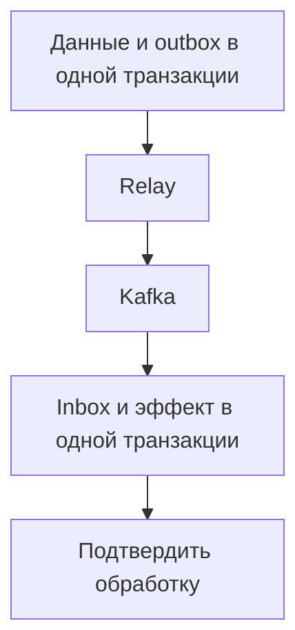

# Надёжная доставка событий: Outbox, Inbox и сбои Kafka {#reliable-events-outbox-inbox-kafka}

Сервис сохранил заказ в PostgreSQL и должен сообщить о нём через Kafka. Между commit и отправкой события процесс может упасть. Если сначала отправить событие, а затем сохранить заказ, появится обратный риск: событие существует, а транзакция откатилась.

Outbox и Inbox позволяют явно организовать эти границы. Они не устраняют повторную доставку; они делают её ожидаемой частью обработки.

<!-- more -->

## Записать намерение вместе с данными {#outbox}

В той же транзакции, где создаётся заказ, записывается строка outbox с устойчивым event id и полезной нагрузкой. У транзакции один результат: обе записи сохранены либо обе отсутствуют. Репозиторий outbox не должен самостоятельно фиксировать чужую транзакцию.

Отдельный relay выбирает неотправленные строки, публикует их и отмечает результат. Если он упадёт после подтверждения Kafka, но до отметки в БД, событие будет опубликовано снова. Поэтому event id сохраняется между попытками, а потребитель должен распознавать повтор.

Параллельные relay требуют протокола захвата работы. Захват, срок владения, повтор после сбоя и отметка завершения должны быть согласованы; одного запроса «выбрать первые N строк» недостаточно.

<!-- diagram:concept -->
<figure class="bdr-diagram" markdown="1">
<figcaption>ИДЕЯ В СХЕМЕ<strong>Атомарность на каждой стороне доставки</strong></figcaption>

Отправитель фиксирует данные и outbox вместе. Потребитель фиксирует inbox и эффект вместе; между ними событие может доставляться повторно.

</figure>
<!-- /diagram:concept -->

## Зафиксировать обработку вместе с эффектом {#inbox}

Потребитель начинает транзакцию, пытается записать идентификатор сообщения в inbox, выполняет бизнес-изменение и фиксирует оба результата вместе. Уникальное ограничение отличает новую доставку от уже обработанной.

Подтверждение брокеру идёт после commit. Если процесс упадёт между ними, повторная доставка встретит существующий inbox и не повторит транзакционный эффект. Если обработчик упадёт до commit, откатятся и эффект, и отметка.

Идентификатор должен учитывать логического получателя: два независимых обработчика одного события не обязаны делить одну запись дедупликации. Срок хранения inbox согласуется с возможными replay, а не только с обычной задержкой доставки.

## Явно назвать предел гарантии {#boundaries}

Inbox защищает изменения, которые входят в его транзакцию. Отправленное письмо или внешний платёж откатом PostgreSQL не отменяется. Для таких действий нужен собственный [контракт идемпотентности](2026-09-13-idempotency-in-apis-and-background-jobs.md).

Kafka поддерживает транзакционные сценарии внутри своей экосистемы, но их гарантии нельзя автоматически переносить на произвольную внешнюю БД. Границы описаны в разделе о [семантике доставки Kafka](https://kafka.apache.org/41/design/design/#message-delivery-semantics).

Поэтому полезнее описать конкретное свойство системы: повтор события с данным id не создаёт вторую запись счёта в этой БД. Формулировка «всё exactly-once» скрывает условия, которые придётся проверять при сбое.

## Недоступный брокер превращает отправку в очередь {#outage}

Пока Kafka недоступна, приложение может продолжать фиксировать данные и outbox, если это разрешено продуктовым контрактом и хватает места в БД. Событие сохранено, но ещё не доставлено. Пользовательский интерфейс не должен выдавать незавершённый внешний процесс за завершённый.

Размер очереди растёт примерно как скорость поступления событий, умноженная на время простоя. Для освобождения backlog после восстановления скорость relay должна превышать поступление новой работы. Ограничивайте повторные попытки и следите за возрастом самого старого события, размером очереди и неисправимыми сообщениями.

Порядок событий тоже требует решения. Несколько relay и повторные отправки могут изменить порядок наблюдения. Для сущностей, которым он важен, нужны подходящий partition key и проверяемый протокол версий или последовательности.

## Проверять каждый разрыв {#verification}

Тестируйте падение до commit, после commit перед отправкой, после отправки перед отметкой, после эффекта потребителя перед подтверждением. Проверьте длительный простой, восстановление backlog и повтор старого события после очистки inbox.

[omni-box](https://bedrock-python.github.io/omni-box/) предоставляет компоненты outbox и inbox. Их интеграция начинается с транзакционных границ приложения: где хранится намерение, где фиксируется эффект и что именно означает подтверждение.

## Примеры и лабораторные работы {#labs}

Полные стенды и условия воспроизведения вынесены в отдельные материалы:

- [Практикум: однократные эффекты](../lab/2026-09-07-exactly-once-effects/README.md)
- [Практикум: транзакционный inbox](../lab/2026-09-07-transactional-inbox/README.md)
- [Практикум: что происходит, когда Kafka недоступна целый час](../lab/2026-09-07-when-kafka-is-down/README.md)
