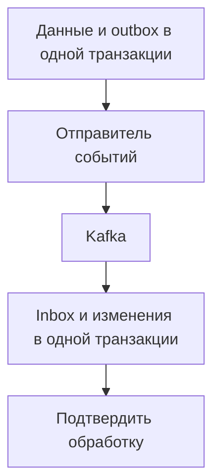

# Надёжная доставка событий: Outbox, Inbox и сбои Kafka {#reliable-events-outbox-inbox-kafka}

Сервис сохранил заказ в PostgreSQL и должен отправить событие об этом в Kafka. Между commit и отправкой процесс может упасть. Если поменять действия местами, возникает другой риск: событие отправлено, а транзакция с заказом откатилась.

Outbox и Inbox помогают согласовать изменения в БД с доставкой сообщений. Повторная доставка при этом остаётся возможной, но обработчики заранее готовы к ней.

<!-- more -->

## Сохраняем событие вместе с данными {#outbox}

В той же транзакции, где создаётся заказ, в outbox записывается событие: его постоянный идентификатор и содержимое. Обе записи либо сохраняются, либо откатываются. Поэтому репозиторий outbox не должен самостоятельно вызывать commit общей транзакции.

Отдельный отправитель (relay) читает неотправленные строки, публикует события и отмечает результат. Если он упадёт после подтверждения Kafka, но до записи отметки в БД, событие будет опубликовано снова. Идентификатор события должен оставаться тем же, чтобы потребитель мог распознать повтор.

Если отправителей несколько, нужно определить, как каждый резервирует строки для обработки и на какой срок. Эти правила должны учитывать сбои, повторные попытки и запись результата. Просто выбрать первые N строк недостаточно: другой отправитель может выбрать те же строки.

<!-- diagram:concept -->
<figure class="bdr-diagram" markdown="1">
<figcaption>ИДЕЯ В СХЕМЕ<strong>Атомарность на каждой стороне доставки</strong></figcaption>

Отправитель сохраняет данные и outbox одной транзакцией. Потребитель так же сохраняет изменения и отметку в inbox. Между этими шагами событие может доставляться повторно.

</figure>
<!-- /diagram:concept -->

## Сохраняем изменения вместе с отметкой об обработке {#inbox}

Потребитель открывает транзакцию, пытается записать идентификатор сообщения в inbox, выполняет изменения в БД и фиксирует всё вместе. Уникальное ограничение в inbox позволяет определить, было ли событие уже обработано.

Подтверждение брокеру отправляется после commit. Если процесс упадёт между этими шагами, повтор встретит готовую запись в inbox, и обработчик не выполнит изменения заново. При ошибке до commit откатятся и данные, и отметка об обработке.

В ключе записи нужно учитывать, какой обработчик получил сообщение: два независимых обработчика одного события должны иметь возможность выполнить каждый свою работу. Срок хранения inbox должен покрывать возможное повторное чтение истории событий, а не только обычные задержки доставки.

## Какие действия защищает Inbox {#boundaries}

Inbox защищает только изменения в своей транзакции. Откат PostgreSQL не отменит отправленное письмо или внешний платёж. Для них нужны собственные [гарантии идемпотентности](2026-09-13-idempotency-in-apis-and-background-jobs.md).

Kafka поддерживает транзакционные сценарии внутри своей экосистемы, но их гарантии нельзя автоматически переносить на произвольную внешнюю БД. Границы описаны в разделе о [семантике доставки Kafka](https://kafka.apache.org/41/design/design/#message-delivery-semantics).

Поэтому гарантию лучше формулировать конкретно: повтор события с этим id не создаст второй счёт в данной БД. Обещание «всё exactly-once» не объясняет, на какие действия распространяется защита и что нужно проверить при сбое.

## Когда Kafka недоступна, события накапливаются {#outage}

Пока Kafka недоступна, приложение может продолжать сохранять данные и события в outbox, если это допускают требования продукта и хватает места в БД. Но сохранённое событие ещё не доставлено. Интерфейс не должен показывать внешнюю операцию завершённой, пока этого не произошло.

За время простоя очередь вырастет примерно на число новых событий в секунду, умноженное на длительность простоя. Чтобы разобрать накопившуюся очередь после восстановления, отправитель должен работать быстрее, чем поступают новые события. Ограничивайте повторы и отслеживайте размер очереди, возраст самого старого события и сообщения, которые не удаётся обработать.

Порядок доставки тоже нужно продумать: параллельные отправители и повторы могут его изменить. Если для сущности важна последовательность событий, выберите подходящий ключ партиции и проверяйте версии или порядковые номера событий.

## Проверяем сбой между каждым из шагов {#verification}

Имитируйте падение до commit, после commit до отправки, после отправки до записи результата и после изменений у потребителя до подтверждения брокеру. Проверьте также долгий простой, обработку накопившейся очереди и повтор старого события после очистки inbox.

[omni-box](https://bedrock-python.github.io/omni-box/) предоставляет компоненты outbox и inbox. Для их подключения сначала определите границы транзакций: где сохраняется событие, какие изменения входят в транзакцию обработчика и что подтверждается брокеру.

## Примеры и лабораторные работы {#labs}

Запускаемые примеры и инструкции к ним:

- [Практикум: как избежать повторного выполнения операции](../lab/2026-09-07-exactly-once-effects/README.md)
- [Практикум: транзакционный inbox](../lab/2026-09-07-transactional-inbox/README.md)
- [Практикум: что происходит, когда Kafka недоступна целый час](../lab/2026-09-07-when-kafka-is-down/README.md)
