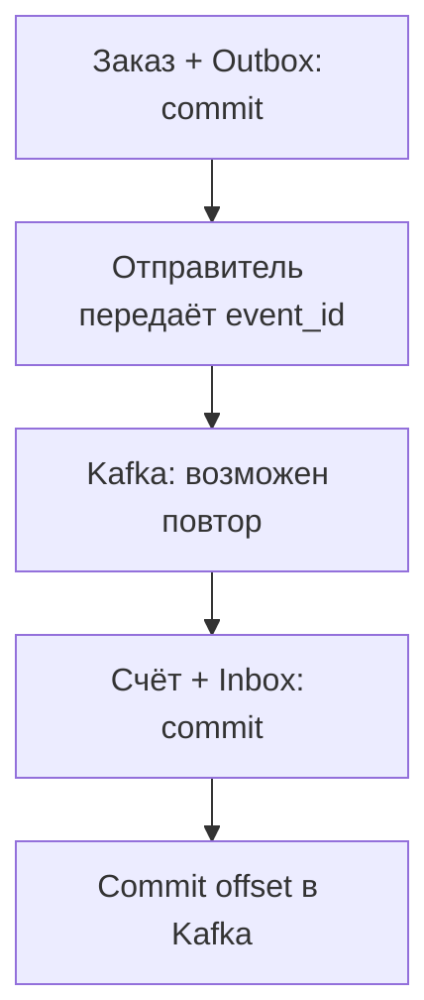

# Надёжная доставка событий: Outbox, Inbox и сбои Kafka {#reliable-events-outbox-inbox-kafka}

<div class="bdr-post__hero" data-bdr-post="2026-09-13-reliable-events-outbox-inbox-kafka" role="img" aria-label="Заказ и событие сохраняются вместе; сервис расчётов распознаёт повторную доставку" markdown="0"></div>

Представим интернет-магазин из двух сервисов. Сервис заказов сохраняет покупку в PostgreSQL и публикует `order.created` в Kafka. Сервис расчётов читает событие и создаёт счёт. Перезапуск любого из сервисов не должен приводить к потере события или появлению второго счёта.

Прервём этот процесс на границах БД и брокера, а затем добавим Outbox и Inbox, чтобы после сбоя можно было продолжить работу.

<!-- more -->

<div id="the-transactional-outbox-pattern-in-python-omni-box" data-search-exclude></div>
<div id="the-dual-write-problem" data-search-exclude></div>
<div id="the-outbox-pattern" data-search-exclude></div>
<div id="using-omni-box" data-search-exclude></div>
<div id="the-inbox-side" data-search-exclude></div>
<div id="why-a-library" data-search-exclude></div>

## Заказ сохранился, а событие потерялось {#outbox}

Начнём с очевидного решения: сделать commit заказа, затем вызвать `producer.send_and_wait()`. Если процесс упадёт между этими действиями, заказ останется в БД, а сервис расчётов о нём не узнает. Отправка события до commit создаёт другую проблему:

| Порядок действий и сбой | Заказов в PostgreSQL | Записей в Kafka |
| --- | --- | --- |
| Сохранили заказ; упали до отправки | 1 | 0 |
| Отправили событие; откатили транзакцию заказа | 0 | 1 |

Эти результаты проверяются в [практикуме по доставке](../lab/2026-09-07-exactly-once-effects/README.md). Перестановка двух независимых commit не превращает их в одну атомарную операцию.

Сохраним заказ и запись о его событии **в одной транзакции PostgreSQL**. Таблица таких записей называется Outbox. Возьмём [omni-box](https://bedrock-python.github.io/omni-box/): библиотека предоставляет модели событий, репозитории и компоненты доставки, а решение о commit остаётся в приложении.

В `models.py` практикума определены `Order`, `Invoice`, `OutboxEventDB` и `InboxEventDB`. Последние две модели наследуют ORM-классы omni-box. Фрагменты Python ниже собираются в один файл `event_flow.py`. Здесь `sessions` — фабрика SQLAlchemy `async_sessionmaker` для базы заказов, а в примерах обработчика — для базы сервиса расчётов. В практикуме для простоты используется одна БД.

```python
from uuid import UUID

from sqlalchemy.ext.asyncio import AsyncSession, async_sessionmaker

from omni_box import OmniBoxDomainService
from omni_box.infra.storage.postgres import PostgresOutboxRepository

from models import Order, OutboxEventDB


async def record_order(session: AsyncSession, order_id: UUID) -> UUID:
    session.add(Order(id=order_id))
    event = OmniBoxDomainService().create_outbox_event(
        aggregate_type="order",
        aggregate_id=order_id,
        event_type="order.created",
        topic="orders.created",
        partition_key=str(order_id),
        payload={"order_id": str(order_id)},
    )
    repo = PostgresOutboxRepository(session, model_class=OutboxEventDB)
    await repo.create(event)
    return event.id


async def place_order(sessions: async_sessionmaker, order_id: UUID) -> UUID:
    async with sessions.begin() as session:
        return await record_order(session, order_id)
```

`record_order()` добавляет обе записи без commit. Транзакцией управляет `place_order()`: успешный выход из контекста сохраняет обе строки, исключение откатывает обе. После возврата заказ принят, а событие ожидает отправки. Подключаться к Kafka при обработке этого запроса не нужно.

### Отправляем сохранённые события {#relay}

Outbox читает отдельный воркер — **отправитель событий**, или relay. При запуске он создаёт producer — клиент для отправки сообщений в Kafka. Контекстный менеджер управляет его подключением:

```python
from contextlib import asynccontextmanager

from aiokafka import AIOKafkaProducer

from omni_box.core.converters import EnvelopeEventConverter
from omni_box.infra.brokers.kafka import KafkaEventPublisher


@asynccontextmanager
async def kafka_publisher(bootstrap: str):
    producer = AIOKafkaProducer(
        bootstrap_servers=bootstrap, enable_idempotence=True, acks="all",
    )
    try:
        await producer.start()
        yield KafkaEventPublisher(producer, EnvelopeEventConverter())
    finally:
        await producer.stop()
```

`bootstrap` — адрес подключения приложения к Kafka. `EnvelopeEventConverter` сериализует тело события, а `KafkaEventPublisher` передаёт идентификатор сохранённого события в заголовке `event_id`. При новой попытке отправить ту же строку идентификатор остаётся прежним.

Внутри этого контекста воркер периодически вызывает `relay_once(sessions, broker)`:

```python
from omni_box import OutboxPublisher


async def relay_batch(session: AsyncSession, broker: KafkaEventPublisher):
    repo = PostgresOutboxRepository(session, model_class=OutboxEventDB)
    return await OutboxPublisher(repo, broker, publish_timeout=2).publish_batch(
        worker_id="relay-1", batch_size=20,
    )


async def relay_once(sessions: async_sessionmaker, broker: KafkaEventPublisher):
    async with sessions.begin() as session:
        return await relay_batch(session, broker)
```

В этой версии репозиторий PostgreSQL выбирает ожидающие строки с `FOR UPDATE SKIP LOCKED`. Пока пачка отправляется, общая транзакция удерживает соединение и блокировки строк. Две секунды — лимит **одной отправки**, а не всей пачки. Размер пачки и паузу между попытками нужно выбирать с учётом нагрузки на БД.

Теперь прервём отправитель после подтверждения Kafka, но до commit в PostgreSQL. Отметка об успешной отправке откатится. Следующий цикл отправит строку ещё раз:

```text
Первый цикл прерван:  записей в Kafka=1, outbox=pending
Второй цикл завершён: записей в Kafka=2, разных event_id=1
```

`enable_idempotence=True` защищает от повторов на уровне producer. Две явные отправки одной строки Outbox со стороны приложения эта настройка не объединяет. Сервис расчётов всё равно должен распознать повтор события. Подробнее — в [документации aiokafka producer](https://aiokafka.readthedocs.io/en/stable/producer.html#idempotent-produce).

<!-- diagram:concept -->
<figure class="bdr-diagram" markdown="1">
<figcaption><span class="bdr-diagram__eyebrow">ИДЕЯ В СХЕМЕ</span><strong>От заказа к одному счёту</strong></figcaption>
<div class="bdr-diagram__viewport" markdown="1" data-search-exclude>


```mermaid
---
config:
  theme: default
  look: classic
  flowchart:
    useMaxWidth: false
    wrappingWidth: 150
    padding: 12
    nodeSpacing: 24
    rankSpacing: 32
---
flowchart TD
    accTitle: От заказа к одному счёту
    accDescr: Заказ и событие сохраняются вместе. Счёт и Inbox тоже сохраняются вместе. Доставка через Kafka между ними может повторяться.
    A["Заказ + Outbox: commit"]
    B["Отправитель передаёт event_id"]
    C["Kafka: возможен повтор"]
    D["Счёт + Inbox: commit"]
    E["Commit offset в Kafka"]
    A --> B --> C --> D --> E
```

</div>
<p class="bdr-diagram__caption">Заказ и событие сохраняются вместе. Счёт и Inbox тоже сохраняются вместе. Доставка через Kafka между ними может повторяться.</p>
</figure>
<!-- /diagram:concept -->

<div id="transactional-inbox-the-other-half-of-the-outbox-pattern" data-search-exclude></div>
<div id="the-consumers-two-problems" data-search-exclude></div>
<div id="the-inbox-row" data-search-exclude></div>
<div id="measured-the-handler-fails-halfway" data-search-exclude></div>
<div id="what-the-inbox-does-not-do" data-search-exclude></div>
<div id="the-pair" data-search-exclude></div>

## Две доставки — один счёт {#inbox}

Рядом со счётом сервис расчётов сохраняет строку **Inbox**: какое событие эта группа потребителей уже обработала. Обе записи должны использовать одну сессию и транзакцию. Передадим эту границу в omni-box:

```python
from omni_box.infra.storage.postgres import PostgresInboxRepository

from models import InboxEventDB


class InboxTransaction:
    def __init__(self, sessions: async_sessionmaker):
        self.sessions = sessions

    @asynccontextmanager
    async def transaction(self):
        async with self.sessions.begin() as session:
            yield PostgresInboxRepository(session, model_class=InboxEventDB)
```

Обработчик создаёт счёт через сессию репозитория:

```python
from sqlalchemy import insert

from omni_box import InboxEvent

from models import Invoice


async def create_invoice(event: InboxEvent, repo: PostgresInboxRepository):
    await repo.session.execute(
        insert(Invoice).values(order_id=UUID(str(event.payload["order_id"])))
    )
```

В практикуме у `Invoice.order_id` намеренно нет уникального ограничения: случайный второй INSERT должен быть виден, чтобы проверка доказывала работу Inbox. В рабочей схеме правило «один счёт на заказ» стоит дополнительно закрепить ограничением БД: разные события тоже могут относиться к одному заказу.

Подключим обработчик к топику `orders.created`. Автоматический commit offset отключён; выбранная стратегия подтверждает offset после успешной транзакции Inbox:

```python
from aiokafka import AIOKafkaConsumer

from omni_box import AckStrategy, InboxConsumerRunner
from omni_box.infra.brokers.kafka import KafkaEventConsumer


def billing_runner(sessions, bootstrap, *, topic="orders.created",
                   group="billing", handler=create_invoice):
    consumer = AIOKafkaConsumer(
        topic, bootstrap_servers=bootstrap, group_id=group,
        auto_offset_reset="earliest", enable_auto_commit=False,
    )
    return InboxConsumerRunner(
        consumer=KafkaEventConsumer(consumer),
        transaction_provider=InboxTransaction(sessions),
        handler=handler,
        worker_id="billing-1", consumer_group=group,
        ack_strategy=AckStrategy.EXACTLY_ONCE_INBOX,
        exactly_once_commit_on_failed=False,
    )
```

Передадим `InboxConsumerRunner` две записи, которые оставил прерванный отправитель:

```text
Доставка 1: processed=True,  duplicate=False, committed=True, счетов=1
Доставка 2: processed=False, duplicate=True,  committed=True, счетов=1
```

Уникальный ключ Inbox — `(message_id, consumer_group)`. В нашей связке адаптеров `message_id` берётся из заголовка `event_id`. Если отправитель задал отдельный заголовок `message_id`, он имеет приоритет и тоже должен сохраняться при повторах.

### Обработчик упал: что делать воркеру? {#consumer-restart}

Допустим, `create_invoice()` выбросил исключение после INSERT. Транзакция откатит и счёт, и строку Inbox. В этой конфигурации `process_one()` вернёт результат с `committed=False`: исключение обработчика не обязательно выйдет из этого метода наружу.

При таком результате остановим воркер:

```python
async def run_billing(runner: InboxConsumerRunner):
    try:
        await runner.start()
        while True:
            result = await runner.process_one()
            if not result.committed:
                raise RuntimeError(f"Retry message {result.message_id}")
    finally:
        await runner.stop()
```

Приложение запускает `run_billing(billing_runner(sessions, bootstrap))`. После сбоя менеджер процессов может перезапустить его с паузой и **той же группой**. Для события, которое стабильно ломает обработчик, нужен отдельный порядок исправления или переноса в очередь ошибок, иначе перезапуски будут бесконечными.

Почему нельзя просто читать дальше? Текущая позиция Kafka сдвигается при получении записи. Если обработка offset 0 упала, а следующая запись с offset 1 привела к commit offset 2, после перезапуска первая запись будет пропущена. Наш последовательный цикл останавливается раньше. Разница между текущей позицией и подтверждённым offset описана в [документации aiokafka consumer](https://aiokafka.readthedocs.io/en/stable/consumer.html#manual-vs-automatic-committing).

Возможен и другой сбой: PostgreSQL уже сохранил счёт, а commit offset не удался. После перезапуска та же запись встретит готовую строку Inbox. Обработчик будет пропущен, offset — подтверждён. [Практикум про Inbox](../lab/2026-09-07-transactional-inbox/README.md) проверяет оба случая с настоящими offset Kafka.

<div id="exactly-once-is-a-lie-exactly-once-effects-are-not" data-search-exclude></div>
<div id="messages-versus-effects" data-search-exclude></div>
<div id="every-window-measured" data-search-exclude></div>
<div id="the-outbox-closes-the-producer-side" data-search-exclude></div>
<div id="the-inbox-closes-the-consumer-side" data-search-exclude></div>
<div id="the-http-edge" data-search-exclude></div>
<div id="the-whole-path" data-search-exclude></div>
<div id="why-the-library-must-not-own-the-transaction" data-search-exclude></div>
<div id="what-it-looks-like" data-search-exclude></div>

## Где заканчивается защита {#boundaries}

В том же практикуме по очереди меняем условия:

| Что изменили | Что получилось |
| --- | --- |
| Отправили две копии без `event_id` и `message_id` | Идентификатором стал `topic:partition:offset`; создались два счёта |
| Прочитали событие другой группой потребителей | Для Inbox это другой получатель; обработчик выполнился снова |
| Удалили готовую строку Inbox и повторили событие | Отметки о прошлом результате больше нет; обработчик выполнился снова |

Сохраняйте идентификатор события на всём пути, не меняйте имя группы для того же логического обработчика и храните Inbox весь срок возможного повторного чтения. В практикуме запись удаляется явно, чтобы воспроизвести последний случай; это не рекомендация по сроку хранения.

Внешние действия — ещё одна граница. Если обработчик отправил письмо, а затем его транзакция откатилась, PostgreSQL уже не отменит отправку. Сохраните намерение отправить уведомление в той же транзакции, а для внешней операции предусмотрите отдельные [гарантии идемпотентности](2026-09-13-idempotency-in-apis-and-background-jobs.md). Транзакция Kafka тоже не включает произвольную транзакцию PostgreSQL автоматически; границы описаны в разделе о [семантике доставки Kafka](https://kafka.apache.org/41/design/design/#message-delivery-semantics).

<div id="what-happens-when-kafka-is-down-for-an-hour" data-search-exclude></div>
<div id="publishing-from-the-request-path" data-search-exclude></div>
<div id="the-outbox-during-the-outage" data-search-exclude></div>
<div id="what-an-hour-actually-costs-you" data-search-exclude></div>
<div id="what-it-does-not-solve" data-search-exclude></div>
<div id="the-pieces" data-search-exclude></div>

## Kafka недоступна, а заказы продолжают поступать {#outage}

Приостановим брокер после подключения producer и создадим ещё три заказа. Сервис заказов сохранит их вместе со строками Outbox, пока сервис расчётов ждёт события. В интерфейсе это должно означать «заказ принят, счёт готовится». Можно ли продолжать принимать заказы в таком режиме — решение продукта с учётом доступного места в БД.

В [практикуме про сбой Kafka](../lab/2026-09-07-when-kafka-is-down/README.md) отправитель выполняет три цикла при недоступном брокере. После каждого запускается запрос:

```sql
SELECT status, count(*) AS events, max(attempts_made) AS attempts
FROM outbox_events
WHERE status <> 'completed'
GROUP BY status;
```

```text
status  | events | attempts
pending | 3      | 0
```

В omni-box 0.3.0 таймаут публикации и `TransientError` откладывают работу, не расходуя лимит попыток события. После первого такого сбоя оставшиеся строки пачки тоже откладываются. Другие ошибки публикации могут расходовать попытки и в итоге потребовать разбора причины; автоматически возвращать все ошибочные строки в очередь не стоит.

После возобновления работы Kafka все три события доходят до брокера, ожидающих строк становится ноль. Отправка, завершившаяся таймаутом, всё ещё может дойти до Kafka. Поэтому практикум проверяет набор доставленных `event_id`, а не обещает ровно три записи в топике.

Для длительного простоя отдельно посчитаем объём. При 100 событиях в секунду за час накопится около **360 000 событий**. Если после восстановления отправитель передаёт 300 событий в секунду, а новые продолжают поступать со скоростью 100, очередь опустеет примерно за **30 минут**. Это пример расчёта, а не результат часового прогона. Следите за длиной очереди, возрастом самого старого события и ошибочными строками; учитывайте размер payload, индексы и нагрузку на БД.

Порядок доставки требует отдельного решения. `partition_key=order_id` направляет события заказа в одну партицию, но параллельные отправители могут сначала опубликовать более позднее событие. Если сервис расчётов должен применить `created` раньше `cancelled`, передавайте версию заказа и определите, как обрабатывать пропуски и устаревшие версии.

## Что проверяют запускаемые примеры {#verification}

Практикумы проверяют оба неудачных порядка записи, общий откат заказа и Outbox, повторную публикацию с тем же ID, откат обработчика, сбой перед commit offset, повтор после очистки Inbox и восстановление после паузы брокера. Сбои на границах транзакций воспроизводятся исключениями, недоступность Kafka — паузой контейнера. Так проверяются сценарии восстановления с одним брокером; переключение реплик в кластере сюда не входит.

Проверено с Python 3.13, omni-box 0.3.0, aiokafka 0.14.0, SQLAlchemy 2.0.54 и asyncpg 0.31.0. Зависимости практикумов закреплены; для PostgreSQL используется `postgres:17-alpine`, для Kafka — `confluentinc/cp-kafka:7.6.0` в режиме KRaft.

## Применяем оба паттерна {#conclusion}

Мы провели заказ через потерянную отправку, повторную доставку, сбой обработчика и недоступность брокера. **Outbox сохраняет событие вместе с заказом, Inbox — результат обработки вместе со счётом.** Эти две границы связывают постоянный ID события и commit offset после commit в БД.

Используйте нашу библиотеку [omni-box](https://bedrock-python.github.io/omni-box/), если вашему сервису нужна такая связка PostgreSQL и Kafka. Она даёт показанные здесь репозитории, отправитель и `InboxConsumerRunner`. Начните с запускаемого примера, затем выберите границы транзакций, срок хранения Inbox и обработку ошибок для своей операции.

## Примеры и практикумы {#labs}

- [Практикум: заказ, событие и повторная доставка](../lab/2026-09-07-exactly-once-effects/README.md)
- [Практикум: сбой обработчика и границы Inbox](../lab/2026-09-07-transactional-inbox/README.md)
- [Практикум: недоступность Kafka и разбор очереди](../lab/2026-09-07-when-kafka-is-down/README.md)
