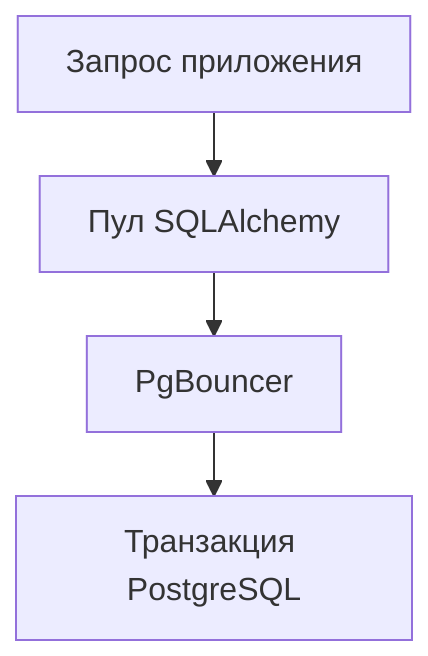

# SQLAlchemy и PgBouncer: настройка и диагностика пула соединений {#sqlalchemy-pgbouncer-pools}

Пул соединений полностью занят, но приложение отвечает быстро. После замедления БД тот же график показывает те же занятые соединения, а запросы уже завершаются по таймауту. Число подключений описывает ёмкость; для диагностики важнее, сколько времени работа ждёт и как долго удерживает ресурс.

PgBouncer добавляет ещё один уровень управления соединениями. Настройки приложения и пулера нужно рассматривать вместе.

<!-- more -->

## Определить, какое соединение переиспользуется {#pooling}

В transaction pooling серверное соединение PostgreSQL закрепляется за клиентом на время транзакции. Следующая транзакция может попасть на другое соединение. Поэтому нельзя полагаться на произвольное состояние серверной сессии между транзакциями: временные объекты, настройки и блокировки требуют проверки совместимости. Ограничения перечислены в [документации PgBouncer](https://www.pgbouncer.org/features.html).

У prepared statements нет одного совета для всех версий и драйверов. Поддержка протокольных prepared statements зависит от версии и конфигурации PgBouncer. Рецепт, подходивший старой установке, может быть лишним для новой. Проверять нужно конкретное сочетание PgBouncer, asyncpg или psycopg и SQLAlchemy.

## Согласовать два пула {#capacity}

У приложения есть предел числа соединений, overflow и время ожидания. У PgBouncer — лимиты клиентских и серверных подключений, зависящие от его конфигурации. Если каждый pod настроен отдельно без учёта числа реплик и процессов, суммарная потребность легко превышает возможности БД.

Сначала оцените, сколько транзакций база обслуживает с допустимой задержкой. Затем распределите доступную ёмкость между приложениями и их репликами. Увеличение пула не делает медленный запрос быстрее; оно может лишь добавить одновременно выполняющуюся работу.

`NullPool` иногда полезен при внешнем пулере, но не является универсальным требованием. Выбор зависит от цены подключения, драйвера и того, где должна находиться очередь. Важно измерить выбранный вариант под нагрузкой.

<!-- diagram:concept -->
<figure class="bdr-diagram" markdown="1">
<figcaption>ИДЕЯ В СХЕМЕ<strong>Две очереди перед запросом</strong></figcaption>

Запрос может ждать соединение приложения и серверное соединение PgBouncer. Время SQL не объясняет всю задержку.

</figure>
<!-- /diagram:concept -->

## Разделить ожидание и работу {#metrics}

| Показатель | На какой вопрос отвечает |
|---|---|
| Время получения соединения | Сколько запрос ждёт свободный ресурс? |
| Время удержания | Почему соединение долго не возвращается? |
| Таймауты ожидания | Какая доля работы уже теряется? |
| Занятые соединения и overflow | Как используется настроенная ёмкость? |
| Частота выдачи соединений | Сколько работы проходит через пул? |

Если удержание выросло вместе с длительностью SQL, ищите причину в запросах, блокировках и БД. Если SQL короткий, а соединение занято долго, проверьте транзакционные границы и ожидание внешних сервисов внутри них. Сессии и Unit of Work разобраны [отдельно](2026-09-13-sqlalchemy-sessions-and-transactions.md).

Метрики самого PgBouncer нужны, чтобы увидеть вторую очередь. Измерение checkout в приложении не всегда отражает ожидание серверного соединения, которое возникнет позже при выполнении запроса.

## Проверять конфигурацию на реальном пути {#verification}

Тест подключения напрямую к PostgreSQL не проверяет совместимость с пулером. Прогоните через PgBouncer обычную транзакцию, rollback, повторное использование соединений и запросы с используемыми драйвером prepared statements.

Для нагрузочной проверки достаточно начать с фиксированного числа worker и управляемого замедления SQL. Сравнивайте ожидание, удержание и ошибки до и после замедления. Числа из стенда нужны для понимания зависимости, а не для копирования в production.

При остановке приложения сначала завершите принятую работу и её транзакции, затем освобождайте engine. Это часть общего lifecycle, а не отдельная оптимизация пула.

Обвязка [sqlalchemy-foundation-kit](https://bedrock-python.github.io/sqlalchemy-foundation-kit/) помогает единообразно создавать пул и собирать метрики. Решение о размерах остаётся за владельцем сервиса, который видит нагрузку и ограничения PostgreSQL.

## Примеры и лабораторные работы {#labs}

Полные стенды и условия воспроизведения вынесены в отдельные материалы:

- [Практикум: транзакционный режим PgBouncer и асинхронный SQLAlchemy](../lab/2026-09-07-pgbouncer-async-sqlalchemy/README.md)
- [Практикум: метрики пула соединений SQLAlchemy](../lab/2026-09-07-sqlalchemy-pool-metrics/README.md)
