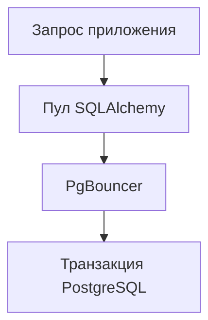

# SQLAlchemy и PgBouncer: настройка и диагностика пула соединений {#sqlalchemy-pgbouncer-pools}

Все соединения в пуле заняты, но приложение отвечает быстро. Затем БД замедляется: график занятых соединений выглядит так же, а запросы уже завершаются по таймауту. Одного числа подключений недостаточно для диагностики. Нужно знать, сколько запрос ждёт соединение и как долго использует его.

PgBouncer добавляет ещё один пул соединений, поэтому его настройки нужно рассматривать вместе с настройками приложения.

<!-- more -->

## Какое соединение получает транзакция {#pooling}

В режиме transaction pooling PgBouncer выделяет клиенту соединение с PostgreSQL только на время транзакции. Следующая транзакция может получить другое соединение. Поэтому нельзя без проверки рассчитывать на сохранение состояния сессии PostgreSQL: временных объектов, настроек или блокировок между транзакциями. Ограничения перечислены в [документации PgBouncer](https://www.pgbouncer.org/features.html).

Для подготовленных запросов (prepared statements) нет настройки, подходящей всем версиям и драйверам. Поддержка запросов, подготовленных на уровне протокола, зависит от версии и конфигурации PgBouncer. Рецепт для старой установки может быть не нужен в новой. Проверяйте конкретное сочетание PgBouncer, драйвера asyncpg или psycopg и SQLAlchemy.

## Как согласовать размеры двух пулов {#capacity}

Приложение задаёт размер пула, число временных дополнительных соединений (overflow) и таймаут ожидания. PgBouncer отдельно ограничивает подключения от клиентов и соединения с PostgreSQL. Если настроить каждый pod без учёта числа реплик и процессов, общая потребность легко превысит возможности БД.

Сначала оцените, сколько одновременных транзакций база может обслуживать с допустимой задержкой. Затем распределите этот лимит между приложениями и репликами. Увеличение пула не ускоряет медленный запрос, но может добавить БД ещё больше одновременной работы.

`NullPool` иногда полезен при работе через PgBouncer, но включать его автоматически не стоит. Выбор зависит от затрат на установку соединения, драйвера и того, на каком уровне запросы должны ждать свободное соединение. Проверьте выбранный вариант под нагрузкой.

<!-- diagram:concept -->
<figure class="bdr-diagram" markdown="1">
<figcaption>ИДЕЯ В СХЕМЕ<strong>Две очереди перед выполнением SQL</strong></figcaption>

Сначала запрос может ждать соединение из пула приложения, затем — соединение с PostgreSQL в PgBouncer. Эти задержки нужно учитывать отдельно от времени выполнения SQL.

</figure>
<!-- /diagram:concept -->

## Измеряем ожидание и использование соединения отдельно {#metrics}

| Показатель | На какой вопрос отвечает |
|---|---|
| Время получения соединения | Сколько запрос ждёт свободное соединение? |
| Время использования соединения | Почему оно долго не возвращается в пул? |
| Таймауты ожидания | Сколько запросов не смогли получить соединение вовремя? |
| Занятые соединения и overflow | Насколько загружен пул и используются ли дополнительные соединения? |
| Частота выдачи соединений | Сколько раз за единицу времени пул выдаёт соединение? |

Если соединения заняты дольше из-за увеличения времени SQL-запросов, ищите причину в запросах, блокировках и БД. Если SQL выполняется быстро, проверьте границы транзакций и ожидание внешних сервисов внутри них. Сессии и Unit of Work разобраны [отдельно](2026-09-13-sqlalchemy-sessions-and-transactions.md).

Метрики PgBouncer позволяют увидеть вторую очередь. Время получения соединения из пула приложения (checkout) не всегда включает ожидание соединения с PostgreSQL: оно может начаться позже, при выполнении SQL-запроса.

## Проверяем работу через PgBouncer {#verification}

Успешный тест с прямым подключением к PostgreSQL не подтверждает совместимость с PgBouncer. Проверьте через него обычную транзакцию, откат, повторное использование соединений и подготовленные запросы вашего драйвера.

Нагрузочный тест можно начать с фиксированного числа воркеров и управляемого замедления SQL. Сравните время ожидания соединений, длительность их использования и число ошибок до и после замедления. Результаты показывают поведение системы, но не дают готовых настроек для продакшена.

При остановке приложения сначала завершите текущие операции и их транзакции, затем освобождайте ресурсы движка БД (engine). Это часть общего жизненного цикла приложения.

[sqlalchemy-foundation-kit](https://bedrock-python.github.io/sqlalchemy-foundation-kit/) помогает единообразно создавать пул и собирать метрики. Его размер выбирает команда сервиса с учётом нагрузки и ограничений PostgreSQL.

## Примеры и лабораторные работы {#labs}

Запускаемые примеры и инструкции к ним:

- [Практикум: транзакционный режим PgBouncer и асинхронный SQLAlchemy](../lab/2026-09-07-pgbouncer-async-sqlalchemy/README.md)
- [Практикум: метрики пула соединений SQLAlchemy](../lab/2026-09-07-sqlalchemy-pool-metrics/README.md)
