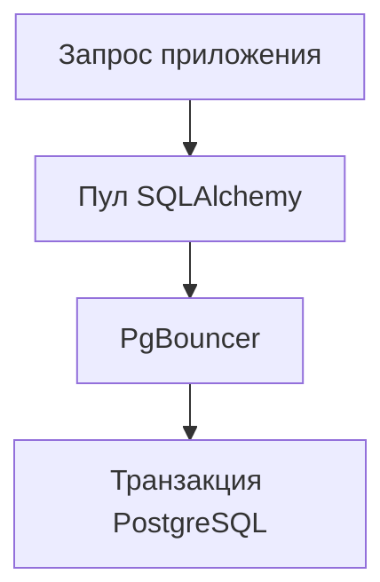

# SQLAlchemy и PgBouncer: настройка и диагностика пула соединений {#sqlalchemy-pgbouncer-pools}

<div class="bdr-post__hero" data-bdr-post="2026-09-13-sqlalchemy-pgbouncer-pools" role="img" aria-label="При каждой транзакции соединение назначается заново, а состояние сессии больше не принадлежит клиенту" markdown="0"></div>

Представим сервис заказов: `GET /orders/42` читает заказ из PostgreSQL и запрашивает стоимость доставки у другого сервиса. SQLAlchemy хранит клиентские соединения, а PgBouncer выделяет им соединения с PostgreSQL на время транзакции. Медленный ответ может означать ожидание в любом из двух пулов, долгий SQL-запрос или открытую транзакцию, которая ждёт расчёта доставки.

Воспроизведём каждый случай. Для настройки пула приложения и сбора метрик возьмём `sqlalchemy-foundation-kit`. В практикуме используются PostgreSQL 17, PgBouncer 1.25.2, SQLAlchemy 2.0.54, asyncpg 0.31.0 и версия библиотеки 0.4.0.

<!-- more -->

<div id="pgbouncer-transaction-mode-and-async-sqlalchemy-the-production-setup-nobody-documents-enough" data-search-exclude></div>
<div id="what-transaction-mode-takes-away" data-search-exclude></div>
<div id="the-prepared-statement-error-and-when-it-stopped-happening" data-search-exclude></div>
<div id="the-setting-that-actually-breaks-the-connection" data-search-exclude></div>
<div id="pool-sizing-when-there-is-a-pool-in-front-of-your-pool" data-search-exclude></div>
<div id="what-to-monitor" data-search-exclude></div>
<div id="closing-pools-during-a-rollout" data-search-exclude></div>
<div id="the-configuration" data-search-exclude></div>

## Читаем заказ через PgBouncer {#pooling}

Практикум создаёт таблицу `app.orders` с заказом `42`: его сумма `total` равна `1999` в минимальных единицах валюты. В конфигурации PgBouncer есть такой раздел; адрес БД и параметры аутентификации добавляет скрипт практикума:

```ini
[pgbouncer]
pool_mode = transaction
default_pool_size = 2
max_client_conn = 50
max_prepared_statements = 200
```

В режиме transaction pooling PgBouncer освобождает соединение с PostgreSQL после commit или rollback. Следующая транзакция может получить другое соединение, поэтому нельзя рассчитывать, что произвольное состояние сессии сохранится. Ограничения перечислены в [таблице совместимости](https://www.pgbouncer.org/features.html).

Приложение подключается к **хосту и порту PgBouncer**. Настроим не больше двух клиентских соединений на менеджер и ожидание свободного места в локальном пуле до 200 мс:

```python
from pydantic import SecretStr
from sqlalchemy_foundation_kit import create_async_session_manager
from sqlalchemy_foundation_kit.contrib.settings import (
    BasePostgresConfig, ConnectionSettings, PoolSettings, QuerySettings,
)


def database_config(host, port, user, password, database):
    return BasePostgresConfig(
        connection=ConnectionSettings(
            host=host, port=port, user=user,
            password=SecretStr(password), database=database,
        ),
        application_name="orders-api",
        db_schema="app",
        jit=None,
        use_orjson_serialization=False,
        pool=PoolSettings(size=2, max_overflow=0, timeout=0.2),
        query=QuerySettings(
            statement_cache_size=100,
            prepared_statement_cache_size=100,
        ),
    )
```

Создаём менеджер через `create_async_session_manager(config)`, передав в `config` результат `database_config(...)`. Один менеджер живёт всё время работы приложения. Заказ читаем внутри явной транзакции:

```python
from sqlalchemy import text


async def get_order(manager, order_id):
    async with manager.get_transaction() as session:
        row = (await session.execute(
            text("SELECT id, total FROM orders WHERE id = :id"),
            {"id": order_id},
        )).mappings().one()
        return dict(row)
```

`get_order(manager, 42)` возвращает `{"id": 42, "total": 1999}`. При выходе из `get_transaction()` библиотека выполняет commit или, при исключении, rollback. Затем возвращает соединение в пул. Полученным словарём можно пользоваться после закрытия сессии.

### Prepared statements: проверяем смену соединения с PostgreSQL {#prepared-statements}

Мы явно включили два кэша: `statement_cache_size` у asyncpg и `prepared_statement_cache_size` у диалекта SQLAlchemy для asyncpg. В библиотеке оба по умолчанию равны `0`; здесь мы задаём другие значения. Отключение кэшей не прекращает подготовку запросов самим диалектом. Подробности есть в [документации SQLAlchemy](https://docs.sqlalchemy.org/en/20/dialects/postgresql.html#prepared-statement-cache).

Ненулевой [`max_prepared_statements`](https://www.pgbouncer.org/config.html#max_prepared_statements) включает в PgBouncer отслеживание именованных запросов, подготовленных на уровне протокола. Практикум намеренно меняет серверное соединение: клиент A подготавливает запрос, клиент B занимает освободившееся соединение A, а следующая транзакция A попадает на другой backend PostgreSQL.

| Настройка | Результат после смены backend |
|---|---|
| Отслеживание включено, `max_prepared_statements=200` | Тот же подготовленный запрос возвращает `42` |
| Отслеживание выключено, `max_prepared_statements=0` | Повторное выполнение этого запроса завершается с SQLSTATE `26000` |

Отдельно проверяем уникальные имена запросов, которые создаёт библиотека, и два отключённых кэша: такая конфигурация проходит сценарий с SQLAlchemy при выключенном отслеживании. Это проверенное сочетание настроек, а не повод отключать кэширование во всех сервисах.

### Применяем настройки внутри транзакции {#transaction-settings}

Допустим, мы передали `jit=off` и `search_path=app` при установке соединения. PgBouncer из практикума их отклоняет. С `ignore_startup_parameters=jit,search_path` подключение проходит, но **настройки отбрасываются**: PostgreSQL по-прежнему показывает `jit=on` и стандартный путь поиска таблиц. Именно так работает [игнорирование стартовых параметров](https://www.pgbouncer.org/config.html#ignore_startup_parameters).

В нашей конфигурации `jit=None` убирает этот стартовый параметр. А `db_schema="app"` библиотека применяет в начале каждой транзакции, только на время её выполнения. Проверим, какие значения видит PostgreSQL:

```python
async def effective_settings(manager):
    async with manager.get_transaction() as session:
        return {
            name: (await session.execute(text(f"SHOW {name}"))).scalar_one()
            for name in ("jit", "search_path", "application_name")
        }
```

Через PgBouncer из практикума получаем `jit=on`, `search_path=app` и `application_name=orders-api`. После завершения транзакции настройка схемы перестаёт действовать.

Так же можно ограничить время выполнения SQL. Этот диагностический запрос специально работает дольше лимита:

```python
async def slow_query_with_limit(manager):
    async with manager.get_transaction() as session:
        await session.execute(text("SET LOCAL statement_timeout = '100ms'"))
        await session.execute(text("SELECT pg_sleep(1)"))
```

PostgreSQL отменяет `pg_sleep` с SQLSTATE `57014`, а контекст транзакции выполняет rollback. Следующий `get_order` проходит, и `SHOW statement_timeout` возвращает исходное значение `0` из практикума. [`SET LOCAL`](https://www.postgresql.org/docs/17/sql-set.html) действует до commit или rollback. Такой лимит относится к выполнению SQL; таймаут локального пула и общий дедлайн запроса задаются отдельно.

## Считаем соединения во всех процессах {#capacity}

Пусть у сервиса четыре pod, в каждом по два рабочих процесса и одному менеджеру на процесс. Тогда приложение может открыть `4 × 2 × (2 + 0) = 16` соединений с PgBouncer. Слагаемые в `2 + 0` соответствуют `size + max_overflow`.

Для одной пары «БД + пользователь» в нашем практикуме PgBouncer держит до двух соединений с PostgreSQL. `default_pool_size` применяется к каждой такой паре; у каждого экземпляра PgBouncer свои пулы. `max_client_conn=50` ограничивает число входящих клиентов, а не активных транзакций PostgreSQL. Маленькие числа помогают увидеть очередь; рабочие лимиты выбирают по измеренной пропускной способности БД.

<!-- diagram:concept -->
<figure class="bdr-diagram" markdown="1">
<figcaption><span class="bdr-diagram__eyebrow">ИДЕЯ В СХЕМЕ</span><strong>Две очереди перед выполнением SQL</strong></figcaption>
<div class="bdr-diagram__viewport" markdown="1" data-search-exclude>


```mermaid
---
config:
  theme: default
  look: classic
  flowchart:
    useMaxWidth: false
    wrappingWidth: 150
    padding: 12
    nodeSpacing: 24
    rankSpacing: 32
---
flowchart TD
    accTitle: Две очереди перед выполнением SQL
    accDescr: Запрос может ждать сначала в пуле приложения, а затем в PgBouncer, пока не освободится соединение с PostgreSQL. Эти задержки нужно учитывать отдельно от времени выполнения SQL.
    A["Запрос приложения"]
    B["Пул SQLAlchemy"]
    C["PgBouncer"]
    D["Транзакция PostgreSQL"]
    A --> B --> C --> D
```

</div>
<p class="bdr-diagram__caption">Запрос может ждать сначала в пуле приложения, а затем в PgBouncer, пока не освободится соединение с PostgreSQL. Эти задержки нужно учитывать отдельно от времени выполнения SQL.</p>
</figure>
<!-- /diagram:concept -->

Значение `"null"` в настройке типа пула выбирает `NullPool`: клиентские соединения не сохраняются для повторного использования. Вместе с этим исчезают локальная очередь и её ограничение числа соединений. PgBouncer не требует такого режима; в нашем примере остаётся небольшой пул приложения.

<div id="what-to-monitor-in-a-sqlalchemy-connection-pool" data-search-exclude></div>
<div id="the-run" data-search-exclude></div>
<div id="saturation-is-not-an-incident" data-search-exclude></div>
<div id="the-wait-is-the-requests-latency" data-search-exclude></div>
<div id="held-time-is-the-cause" data-search-exclude></div>
<div id="the-timeout-counter-is-your-error-budget" data-search-exclude></div>
<div id="throughput-and-what-it-tells-you-about-capacity" data-search-exclude></div>
<div id="the-six-to-graph" data-search-exclude></div>
<div id="the-pieces" data-search-exclude></div>

## Находим, куда уходит время запроса {#metrics}

Передадим `PostgresMetrics` при создании менеджера. Тогда библиотека измерит и получение соединения, и время от его выдачи до возврата в пул:

```python
from sqlalchemy_foundation_kit.contrib.metrics import PostgresMetrics


def instrumented_manager(config, prefix="orders"):
    metrics = PostgresMetrics(prefix=prefix)
    return create_async_session_manager(config, metrics=metrics)
```

Теперь используем `instrumented_manager(config)` вместо вызова фабрики выше. Создаём его один раз при запуске: метрики попадают в стандартный реестр Prometheus, поэтому повторное создание с тем же префиксом приведёт к ошибке регистрации.

К именам метрик ниже добавляется префикс `orders_postgres_db_`:

| Суффикс | Что показывает |
|---|---|
| `connection_checkout_wait_seconds` | Время получения локального соединения, включая его установку или pre-ping, когда они нужны |
| `connection_held_duration_seconds` | Время от выдачи соединения до возврата в пул |
| `connection_timeouts_total` | Число таймаутов получения локального соединения |
| `pool_size`, `pool_checked_out`, `pool_overflow` | Размер и использование пула |

Устаревшее имя `connection_checkout_duration_seconds` обозначает **время удержания соединения**, а не ожидания его выдачи.

### Сценарий 1: пул приложения занят {#local-pool-wait}

В практикуме уменьшаем пул приложения до одного соединения и держим транзакцию открытой. Второй `get_order` не получает соединение за 200 мс: SQLAlchemy выбрасывает `TimeoutError`, а `connection_timeouts_total` увеличивается на единицу. После завершения первой транзакции следующий запрос снова проходит.

### Сценарий 2: SQL быстрый, а доставка считается долго {#held-connection}

`shipping.quote(order_id)` обращается к сервису доставки. В этой версии мы ждём его ответа с открытой транзакцией БД:

```python
async def order_with_quote_inside(manager, order_id, shipping):
    async with manager.get_transaction() as session:
        row = (await session.execute(
            text("SELECT id, total FROM orders WHERE id = :id"),
            {"id": order_id},
        )).mappings().one()
        quote = await shipping.quote(order_id)
        return {**dict(row), "shipping": quote}
```

Пока доставка рассчитывается, практикум видит одно выданное соединение, хотя SQL уже завершился. Для такого ответа без записи в БД сначала закончим работу с заказом:

```python
async def order_with_quote_after(manager, order_id, shipping):
    order = await get_order(manager, order_id)
    quote = await shipping.quote(order_id)
    return {**order, "shipping": quote}
```

Теперь во время того же ожидания доставки занятых соединений нет. Обе функции возвращают `{"id": 42, "total": 1999, "shipping": 350}`. В ответе мы объединяем прочитанное состояние заказа и рассчитанную позже стоимость доставки; транзакция БД не охватывает внешний вызов. Операции с записью разобраны в статье о [сессиях и границах транзакций](2026-09-13-sqlalchemy-sessions-and-transactions.md).

Для сравнения выполняем `SELECT pg_sleep(0.2)`: гистограмма времени удержания получает наблюдение примерно от 200 мс. Долгое удержание может быть связано и с SQL, и с кодом приложения. Сопоставляйте его с длительностью запросов к БД.

### Сценарий 3: соединение выдано, но очередь в PgBouncer {#pgbouncer-wait}

В последнем сценарии у SQLAlchemy два соединения с PgBouncer, а у PgBouncer одно соединение с PostgreSQL. Оба клиентских соединения уже открыты. Для этого измерения отключаем pre-ping и автоматическую установку схемы, чтобы они не отправляли SQL до исследуемого запроса.

Первая транзакция занимает серверное соединение. Второй запрос получает соединение из SQLAlchemy, затем отправляет `SELECT 42` и ждёт. В **административной БД PgBouncer** выполняем:

```sql
SHOW POOLS;
SHOW STATS;
```

В `SHOW POOLS` для нашей БД появляется `cl_waiting=1`, а счётчик таймаутов локального пула остаётся нулевым. Когда первая транзакция завершается, второй запрос возвращает `42`. Быстрая выдача соединения в приложении ещё не означает, что SQL сразу начал выполняться. Практикум обращается к [административной консоли PgBouncer](https://www.pgbouncer.org/usage.html) через `psql`: консоль требует simple-query protocol.

## Воспроизводим поведение перед настройкой {#verification}

Три скрипта проверяют результаты на временных контейнерах PostgreSQL и PgBouncer:

| Скрипт | Что проверяет |
|---|---|
| `pgbouncer_lab.py` | Четыре воркера выполняют 40 параметризованных запросов на конфигурацию; смена backend, rollback, область действия схемы и отмена запроса |
| `jit_probe.py` | Отклонение стартовых параметров, игнорирование настроек и схема внутри транзакции |
| `pool_metrics_lab.py` | Таймаут локального пула и восстановление, медленный SQL, доставка внутри и вне транзакции, очередь PgBouncer |

Ожиданием управляют события: тест освобождает занятое соединение после того, как проверит конкурирующий запрос. Сервис доставки заменён локальной тестовой реализацией; PostgreSQL и PgBouncer работают в настоящих контейнерах. Это проверка поведения, не замер максимальной производительности.

При остановке сначала завершаем принятые операции и их транзакции, затем вызываем `await manager.aclose()`. Освобождение ресурсов engine не завершает работу, которая ещё держит соединения. Этот порядок относится к [жизненному циклу сервиса](2026-09-13-python-service-lifecycle.md).

## Что применить в своём сервисе {#conclusion}

Мы воспроизвели ошибку повторного использования prepared statement, игнорирование стартовых настроек, занятый пул приложения, лишнюю открытую транзакцию и очередь внутри PgBouncer. Исправления разные: согласовать настройки драйвера и PgBouncer, применить параметры внутри транзакции, сократить её границы или пересмотреть лимиты соединений.

Используйте [sqlalchemy-foundation-kit](https://bedrock-python.github.io/sqlalchemy-foundation-kit/) для общей конфигурации пула, управления транзакциями и метрик ожидания и удержания соединений. Рядом собирайте метрики очереди PgBouncer. Вместе они покажут, где менять код приложения, исследовать SQL или настраивать размер пула.

## Примеры и лабораторные работы {#labs}

- [Практикум: транзакционный режим PgBouncer и асинхронный SQLAlchemy](../lab/2026-09-07-pgbouncer-async-sqlalchemy/README.md)
- [Практикум: метрики пула соединений SQLAlchemy](../lab/2026-09-07-sqlalchemy-pool-metrics/README.md)
