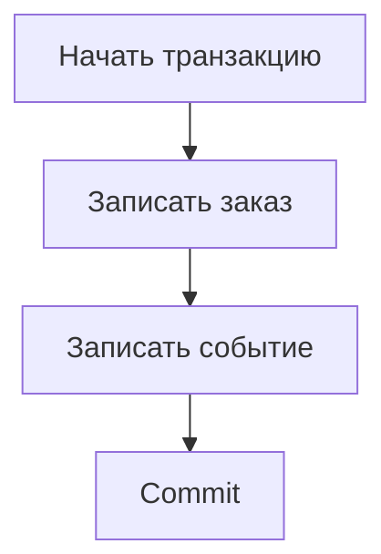

# Сессии и транзакции в SQLAlchemy: кто владеет commit {#sqlalchemy-sessions-and-transactions}

<div class="bdr-post__hero" data-bdr-post="2026-09-13-sqlalchemy-sessions-and-transactions" role="img" aria-label="Граница транзакции принадлежит сценарию использования, фиксация происходит один раз" markdown="0"></div>

Заказ и событие о его создании должны появиться вместе. Если каждый репозиторий самостоятельно вызывает `commit()`, ошибка записи события оставляет заказ без события. Передача одного объекта session через все функции сама по себе эту проблему не решает: важно, кто управляет транзакцией.

Удобная граница — бизнес-сценарий. Он определяет, какие изменения составляют одну операцию, а репозитории выполняют запросы внутри этой границы.

<!-- more -->

<div id="stop-passing-asyncsession-everywhere" data-search-exclude></div>
<div id="what-the-parameter-is-hiding" data-search-exclude></div>
<div id="what-the-same-session-is-worth" data-search-exclude></div>
<div id="what-it-costs-the-pool" data-search-exclude></div>
<div id="one-session-one-task" data-search-exclude></div>
<div id="what-leaves-the-block" data-search-exclude></div>
<div id="what-it-looks-like-when-the-session-has-an-owner" data-search-exclude></div>
<div id="the-pieces" data-search-exclude></div>

## Развести сроки жизни ресурсов {#ownership}

Engine и фабрика сессий обычно принадлежат приложению. Session принадлежит одной последовательности работы с БД; транзакция — конкретной атомарной операции. Создание session не обязательно сразу занимает соединение: оно потребуется при обращении к базе.

Session также содержит identity map и состояние ORM-объектов. Поэтому её нельзя считать просто удобным параметром подключения или безопасно использовать одновременно в нескольких asyncio-задачах. Для независимой параллельной работы нужны отдельные сессии. Эти границы описаны в [документации SQLAlchemy](https://docs.sqlalchemy.org/en/20/orm/session_basics.html).

<div id="the-unit-of-work-pattern-in-sqlalchemy-2" data-search-exclude></div>
<div id="before-repositories-that-commit" data-search-exclude></div>
<div id="after-the-use-case-owns-the-boundary" data-search-exclude></div>
<div id="read-only-means-read-only" data-search-exclude></div>
<div id="savepoints-one-failed-step-not-one-failed-transaction" data-search-exclude></div>
<div id="the-use-case-under-test" data-search-exclude></div>
<div id="who-owns-the-transaction" data-search-exclude></div>

## Фиксация принадлежит сценарию {#transaction}

В примере `orders` и `events` — репозитории приложения. Их методы используют переданную session и не фиксируют транзакцию:

```python
from sqlalchemy.ext.asyncio import async_sessionmaker

async def place_order(sessions: async_sessionmaker, orders, events, command):
    async with sessions.begin() as session:
        order = await orders.add(session, command)
        await session.flush()
        await events.add(session, order_id=order.id)
        result = {"order_id": order.id}
    return result
```

`flush()` отправляет накопленные изменения в БД и позволяет получить сгенерированный идентификатор. Это ещё не commit. Если запись события выбросит исключение, контекст откатит транзакцию; после успешного выхода обе записи зафиксированы.

Unit of Work оформляет ту же границу отдельным объектом, который предоставляет репозитории и управляет завершением операции. Его польза в явном контракте. Добавление класса с таким названием без изменения владельца commit ничего не исправляет.

<!-- diagram:concept -->
<figure class="bdr-diagram" markdown="1">
<figcaption><span class="bdr-diagram__eyebrow">ИДЕЯ В СХЕМЕ</span><strong>Один сценарий — одна граница фиксации</strong></figcaption>
<div class="bdr-diagram__viewport" markdown="1" data-search-exclude>



</div>
<p class="bdr-diagram__caption">Изменение заказа и запись события используют одну транзакцию. Ошибка до commit откатывает обе записи.</p>
</figure>
<!-- /diagram:concept -->

## Не удерживать транзакцию во время чужой работы {#lifetime}

Открытая транзакция может удерживать соединение и блокировки. Если после первого SQL-запроса сценарий ждёт медленный HTTP API, это время тоже оплачивает пул БД. По возможности внешние вычисления выполняются до короткого транзакционного блока, а нужные данные повторно проверяются внутри него.

Если внешний эффект должен последовать за commit, его нельзя сделать атомарным простым переносом HTTP-вызова внутрь транзакции. Для доставки намерения подходит [outbox](2026-09-13-reliable-events-outbox-inbox-kafka.md); для повторов внешнего действия нужен его собственный контракт идемпотентности.

## Savepoint и чтение требуют явных правил {#savepoints}

Savepoint позволяет откатить часть работы и продолжить внешнюю транзакцию. Это подходит, например, для ожидаемого конфликта отдельного шага. Исключение следует обработать за пределами вложенного блока, когда откат savepoint уже выполнен.

Режим «только чтение» тоже должен быть определён. Название метода `read_only` не запрещает запись в БД. Если запрет важен, его обеспечивают настройками транзакции, правами или проверяемой обвязкой.

После закрытия session возвращаемый ORM-объект может попытаться лениво загрузить данные и завершиться ошибкой. Загружайте нужные поля заранее или формируйте результат сценария внутри блока, как в примере.

## Проверять атомарность отказом {#verification}

Основной тест намеренно ломает вторую запись и проверяет отсутствие первой. Дополнительно нужны успешный commit, rollback savepoint и независимые параллельные операции. Mock репозитория полезен для логики сценария, но не доказывает свойства транзакции PostgreSQL.

[sqlalchemy-foundation-kit](https://bedrock-python.github.io/sqlalchemy-foundation-kit/) предоставляет обвязку сессий и Unit of Work. При её использовании правило остаётся тем же: сценарий определяет атомарность, репозитории не завершают чужую транзакцию.

## Примеры и лабораторные работы {#labs}

Полные стенды и условия воспроизведения вынесены в отдельные материалы:

- [Практикум: Unit of Work в SQLAlchemy 2](../lab/2026-09-07-unit-of-work-sqlalchemy-2/README.md)
- [Практикум: кто владеет сессией](../lab/2026-09-07-stop-passing-asyncsession-everywhere/README.md)
