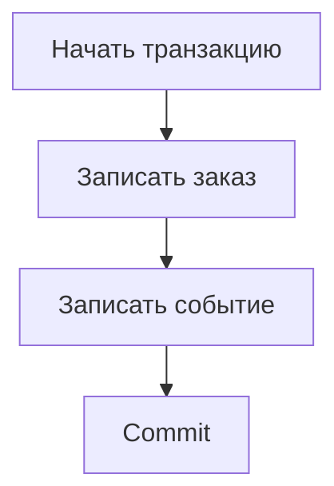

# Сессии и транзакции в SQLAlchemy: кто отвечает за commit {#sqlalchemy-sessions-and-transactions}

<div class="bdr-post__hero" data-bdr-post="2026-09-13-sqlalchemy-sessions-and-transactions" role="img" aria-label="Граница транзакции принадлежит сценарию использования, фиксация происходит один раз" markdown="0"></div>

Заказ и событие о его создании должны сохраняться вместе. Если каждый репозиторий самостоятельно вызывает `commit()`, ошибка при записи события оставит заказ без события. Передавать одну сессию через все функции недостаточно — важно, кто решает, когда фиксировать транзакцию.

Удобно принимать это решение на уровне бизнес-операции. Она определяет, какие изменения должны сохраниться вместе, а репозитории выполняют запросы внутри общей транзакции.

<!-- more -->

<div id="stop-passing-asyncsession-everywhere" data-search-exclude></div>
<div id="what-the-parameter-is-hiding" data-search-exclude></div>
<div id="what-the-same-session-is-worth" data-search-exclude></div>
<div id="what-it-costs-the-pool" data-search-exclude></div>
<div id="one-session-one-task" data-search-exclude></div>
<div id="what-leaves-the-block" data-search-exclude></div>
<div id="what-it-looks-like-when-the-session-has-an-owner" data-search-exclude></div>
<div id="the-pieces" data-search-exclude></div>

## У ресурсов разное время жизни {#ownership}

Engine и фабрика сессий обычно создаются на время работы приложения. Сессия (Session) нужна для отдельной последовательности обращений к БД, а транзакция объединяет изменения, которые должны выполниться атомарно. Создание сессии не обязательно сразу занимает соединение: оно потребуется при обращении к базе.

Сессия также хранит ORM-объекты в identity map и отслеживает их состояние. Поэтому это не просто набор параметров подключения: одну сессию нельзя безопасно использовать одновременно в нескольких asyncio-задачах. Для независимых параллельных операций нужны отдельные сессии. Подробнее — в [документации SQLAlchemy](https://docs.sqlalchemy.org/en/20/orm/session_basics.html).

<div id="the-unit-of-work-pattern-in-sqlalchemy-2" data-search-exclude></div>
<div id="before-repositories-that-commit" data-search-exclude></div>
<div id="after-the-use-case-owns-the-boundary" data-search-exclude></div>
<div id="read-only-means-read-only" data-search-exclude></div>
<div id="savepoints-one-failed-step-not-one-failed-transaction" data-search-exclude></div>
<div id="the-use-case-under-test" data-search-exclude></div>
<div id="who-owns-the-transaction" data-search-exclude></div>

## Транзакцию фиксирует бизнес-операция {#transaction}

В примере `orders` и `events` — репозитории приложения. Их методы используют переданную сессию, но не вызывают commit:

```python
from sqlalchemy.ext.asyncio import async_sessionmaker

async def place_order(sessions: async_sessionmaker, orders, events, command):
    async with sessions.begin() as session:
        order = await orders.add(session, command)
        await session.flush()
        await events.add(session, order_id=order.id)
        result = {"order_id": order.id}
    return result
```

`flush()` отправляет накопленные изменения в БД и позволяет получить сгенерированный идентификатор, но ещё не фиксирует транзакцию. Если запись события выбросит исключение, контекстный менеджер откатит обе записи. При успешном выходе они сохранятся вместе.

Unit of Work оформляет управление такой операцией в отдельный объект: он предоставляет репозитории и отвечает за commit или rollback. Это делает границу транзакции явной. Само добавление класса с таким названием ничего не исправит, если репозитории продолжат вызывать commit самостоятельно.

<!-- diagram:concept -->
<figure class="bdr-diagram" markdown="1">
<figcaption><span class="bdr-diagram__eyebrow">ИДЕЯ В СХЕМЕ</span><strong>Заказ и событие сохраняются вместе</strong></figcaption>
<div class="bdr-diagram__viewport" markdown="1" data-search-exclude>



</div>
<p class="bdr-diagram__caption">Изменение заказа и запись события используют одну транзакцию. Ошибка до commit откатывает обе записи.</p>
</figure>
<!-- /diagram:concept -->

## Закрываем транзакцию до долгого ожидания внешних сервисов {#lifetime}

Открытая транзакция может удерживать соединение и блокировки. Если после первого SQL-запроса обработчик ждёт медленный HTTP API, соединение с БД всё это время остаётся занятым. По возможности выполняйте внешние вызовы и вычисления до короткой транзакции, а внутри неё повторно проверяйте данные, которые могли измениться.

Если после commit нужно выполнить внешнюю операцию, перенос HTTP-вызова внутрь транзакции не сделает их атомарными. Чтобы надёжно передать задачу на выполнение, подходит [outbox](2026-09-13-reliable-events-outbox-inbox-kafka.md). Защиту от повторного выполнения внешней операции нужно обеспечить отдельно.

## Как работать с savepoint и чтением данных {#savepoints}

Savepoint позволяет откатить часть работы и продолжить внешнюю транзакцию. Это подходит, например, для ожидаемого конфликта отдельного шага. Исключение следует обработать за пределами вложенного блока, когда откат savepoint уже выполнен.

Поведение режима «только чтение» тоже нужно определить явно. Название метода `read_only` само по себе не запрещает запись в БД. Если запрет важен, его обеспечивают настройки транзакции, права доступа или проверенный код библиотеки.

После закрытия сессии обращение к ORM-объекту может потребовать ленивой загрузки данных и завершиться ошибкой. Загружайте нужные поля заранее или формируйте результат внутри блока сессии, как в примере.

## Проверяем атомарность с помощью намеренной ошибки {#verification}

Основной тест намеренно вызывает ошибку при второй записи и проверяет, что первая тоже не сохранилась. Дополнительно нужны проверки успешного commit, отката savepoint и независимых параллельных операций. Мок репозитория помогает проверить логику, но не подтверждает поведение транзакций PostgreSQL.

[sqlalchemy-foundation-kit](https://bedrock-python.github.io/sqlalchemy-foundation-kit/) предоставляет средства для работы с сессиями и Unit of Work. Правило остаётся тем же: бизнес-операция определяет, какие изменения сохранить вместе, а репозитории не завершают её транзакцию самостоятельно.

## Примеры и лабораторные работы {#labs}

Запускаемые примеры и инструкции к ним:

- [Практикум: Unit of Work в SQLAlchemy 2](../lab/2026-09-07-unit-of-work-sqlalchemy-2/README.md)
- [Практикум: кто управляет сессией](../lab/2026-09-07-stop-passing-asyncsession-everywhere/README.md)
