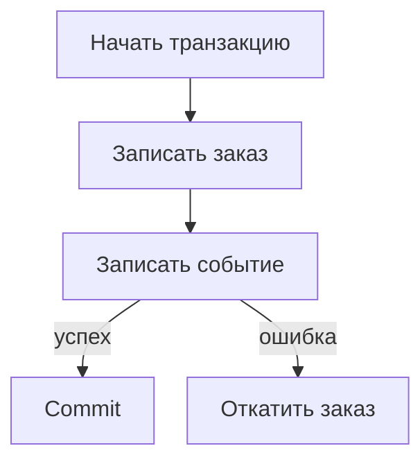

# Сессии и транзакции в SQLAlchemy: кто отвечает за commit {#sqlalchemy-sessions-and-transactions}

<div class="bdr-post__hero" data-bdr-post="2026-09-13-sqlalchemy-sessions-and-transactions" role="img" aria-label="Граница транзакции принадлежит сценарию использования, фиксация происходит один раз" markdown="0"></div>

Представим сервис оформления заказов: он сохраняет заказ и событие `created`, по которому другие сервисы узнают о покупке. Если запись события упадёт, заказ тоже должен откатиться. Проверим, почему одна общая сессия ещё не обеспечивает это условие и где нужно завершать транзакцию.

Затем добавим расчёт доставки через внешний API, необязательную подписку и чтение заказа. Каждый новый сценарий покажет отдельную задачу управления сессией.

<!-- more -->

<div id="stop-passing-asyncsession-everywhere" data-search-exclude></div>
<div id="what-the-parameter-is-hiding" data-search-exclude></div>
<div id="what-the-same-session-is-worth" data-search-exclude></div>
<div id="what-it-costs-the-pool" data-search-exclude></div>
<div id="one-session-one-task" data-search-exclude></div>
<div id="what-leaves-the-block" data-search-exclude></div>
<div id="what-it-looks-like-when-the-session-has-an-owner" data-search-exclude></div>
<div id="the-pieces" data-search-exclude></div>

## Готовим сервис и определяем время жизни ресурсов {#ownership}

В примере две основные ORM-модели: `Order` для таблицы `orders` и `OrderEvent` для `order_events`. У события есть внешний ключ на заказ и ограничение `CHECK (kind <> '')`. Пустой тип события даст воспроизводимую ошибку PostgreSQL. Событие здесь — строка в той же БД; отправку в брокер разберём отдельно в [статье про outbox](2026-09-13-reliable-events-outbox-inbox-kafka.md).

Определения моделей находятся в `models.py` [практикума](../lab/2026-09-07-unit-of-work-sqlalchemy-2/README.md). Фрагменты ниже используют этот файл и складываются в один модуль. Проверенные версии: Python 3.13, SQLAlchemy 2.0.54, asyncpg 0.31.0, sqlalchemy-foundation-kit 0.4.0 и PostgreSQL 17.11.

При запуске сервиса создаём engine с пулом соединений и фабрику сессий:

```python
from sqlalchemy.ext.asyncio import async_sessionmaker, create_async_engine


def open_database(url):
    engine = create_async_engine(
        url, pool_size=2, max_overflow=0, pool_timeout=0.5,
    )
    sessions = async_sessionmaker(engine, expire_on_commit=False)
    return engine, sessions
```

`url` — строка подключения вида `postgresql+asyncpg://…`. `open_database(url)` вызывается один раз при старте приложения, `await engine.dispose()` — при остановке. Пул из двух соединений и короткое ожидание нужны для эксперимента ниже; рабочие значения выбираются по нагрузке.

Каждая операция создаёт собственную сессию через `sessions()`. В этом примере создание сессии ещё не занимает соединение: оно понадобится при первом SQL-запросе. Сессия хранит загруженные ORM-объекты и изменения в них, а транзакция определяет, какие записи сохранятся вместе.

<div id="the-unit-of-work-pattern-in-sqlalchemy-2" data-search-exclude></div>
<div id="before-repositories-that-commit" data-search-exclude></div>
<div id="after-the-use-case-owns-the-boundary" data-search-exclude></div>
<div id="read-only-means-read-only" data-search-exclude></div>
<div id="savepoints-one-failed-step-not-one-failed-transaction" data-search-exclude></div>
<div id="the-use-case-under-test" data-search-exclude></div>
<div id="who-owns-the-transaction" data-search-exclude></div>

## Два commit оставляют половину заказа {#partial-commit}

Допустим, репозиторий заказа делает commit, чтобы получить `id`, а репозиторий событий фиксирует свою запись отдельно. Если убрать обёртки репозиториев, получится такая последовательность:

```python
from models import Order, OrderEvent


async def place_order_broken(sessions, sku, *, event_kind="created"):
    async with sessions() as session:
        order = Order(sku=sku, delivery_cents=0)
        session.add(order)
        await session.commit()

        session.add(OrderEvent(order_id=order.id, kind=event_kind))
        await session.commit()
        return {"order_id": order.id}
```

Вызов `place_order_broken(sessions, "sku-1", event_kind="")` сохранит заказ, затем завершится `IntegrityError`: PostgreSQL отклонит пустой тип события. Сессия одна, но транзакций две. Откат второй уже не затрагивает первую. Практикум проверяет оставшиеся строки отдельной сессией:

```text
two commits + rejected event: orders=1, events=0
```

## Фиксируем заказ и событие одной транзакцией {#transaction}

Перенесём решение о commit на уровень всей операции. В SQLAlchemy для этого достаточно `sessions.begin()`:

```python
async def place_order_native(sessions, sku, *, event_kind="created"):
    async with sessions.begin() as session:
        order = Order(sku=sku, delivery_cents=0)
        session.add(order)
        await session.flush()
        session.add(OrderEvent(order_id=order.id, kind=event_kind))
        result = {"order_id": order.id}
    return result
```

`flush()` отправляет `INSERT` заказа и позволяет получить его `id`, сохраняя транзакцию открытой. На выходе из блока SQLAlchemy отправит оставшиеся изменения и выполнит commit. Если вставка события нарушит ограничение, заказ откатится вместе с ней. Результат возвращаем после успешного выхода из контекстного менеджера.

В практикуме та же ошибка теперь оставляет `orders=0, events=0`. Ещё одна проверка читает БД из другой сессии между `flush()` и commit: идентификатор уже получен, но незавершённая запись ей не видна. Это полезное различие при отладке: полученный `id` не доказывает, что заказ сохранён.

<!-- diagram:concept -->
<figure class="bdr-diagram" markdown="1">
<figcaption><span class="bdr-diagram__eyebrow">ИДЕЯ В СХЕМЕ</span><strong>Заказ и событие сохраняются вместе</strong></figcaption>
<div class="bdr-diagram__viewport" markdown="1" data-search-exclude>


```mermaid
---
config:
  theme: default
  look: classic
  flowchart:
    useMaxWidth: false
    wrappingWidth: 150
    padding: 12
    nodeSpacing: 24
    rankSpacing: 32
---
flowchart TD
    accTitle: Заказ и событие сохраняются вместе
    accDescr: Ошибка записи события откатывает заказ. При успешном завершении транзакции обе записи сохраняются вместе.
    A["Начать транзакцию"]
    B["Записать заказ"]
    C["Записать событие"]
    D["Commit"]
    E["Откатить заказ"]
    A --> B --> C
    C -->|успех| D
    C -->|ошибка| E
```

</div>
<p class="bdr-diagram__caption">Ошибка записи события откатывает заказ. При успешном завершении транзакции обе записи сохраняются вместе.</p>
</figure>
<!-- /diagram:concept -->

## Собираем репозитории в Unit of Work {#unit-of-work}

Теперь вынесем запросы в репозитории. Для каждого заказа им нужна одна сессия, а вызывающему коду — понятный блок «сохранить всё вместе». Здесь используем нашу библиотеку [sqlalchemy-foundation-kit](https://bedrock-python.github.io/sqlalchemy-foundation-kit/), в которой есть `AsyncSQLAlchemyUnitOfWork` и объект транзакции с доступом к репозиториям.

Сначала сами репозитории. Они добавляют объекты и вызывают `flush()`, но не завершают транзакцию:

```python
class OrderRepository:
    def __init__(self, session):
        self.session = session

    async def add(self, sku, delivery_cents=0):
        order = Order(sku=sku, delivery_cents=delivery_cents)
        self.session.add(order)
        await self.session.flush()
        return order


class EventRepository:
    def __init__(self, session):
        self.session = session

    async def add(self, order_id, kind="created"):
        self.session.add(OrderEvent(order_id=order_id, kind=kind))
        await self.session.flush()
```

`OrderTransaction` передаёт обоим репозиториям одну сессию. `make_uow(sessions)` вызываем при сборке приложения и передаём полученный `uow` в бизнес-операции:

```python
from sqlalchemy_foundation_kit import (
    AsyncSQLAlchemyUnitOfWork,
    AsyncSQLAlchemyUowTransaction,
)


class OrderTransaction(AsyncSQLAlchemyUowTransaction):
    @property
    def orders(self):
        return OrderRepository(self.session)

    @property
    def events(self):
        return EventRepository(self.session)


def make_uow(sessions):
    return AsyncSQLAlchemyUnitOfWork(
        sessions, transaction_factory=OrderTransaction,
    )


async def place_order(uow, sku, *, delivery_cents=0, event_kind="created"):
    async with uow.transaction() as tx:
        order = await tx.orders.add(sku, delivery_cents)
        await tx.events.add(order.id, event_kind)
        result = {"order_id": order.id}
    return result
```

Каждый вход в `uow.transaction()` создаёт свою сессию. Нормальный выход фиксирует изменения, исключение приводит к откату. Условие сохранения заказа осталось прежним; теперь оно оформлено одинаково для операций, работающих с несколькими репозиториями. Вызов commit внутри репозитория нарушил бы эту договорённость — само наличие класса Unit of Work не исправит такой код.

## Рассчитываем доставку до открытия транзакции {#lifetime}

Добавим HTTP-сервис расчёта доставки. Если сначала записать заказ, а затем ждать ответ, соединение с PostgreSQL останется занятым всё время ожидания. В практикуме два таких запроса занимают весь пул; третья операция получает таймаут при попытке взять соединение.

В нашем сценарии расчёту доставки достаточно артикула товара. Выполним его заранее:

```python
async def place_order_after_quote(uow, quote_shipping, sku):
    delivery_cents = await quote_shipping(sku)
    return await place_order(uow, sku, delivery_cents=delivery_cents)
```

`quote_shipping(sku)` — асинхронный адаптер внешнего API, возвращающий стоимость в минимальных денежных единицах. В практикуме его заменяет управляемое ожидание: можно проверить состояние пула, пока ответ ещё не пришёл. При таком порядке ни один из двух ожидающих запросов не удерживает соединение, и третий запрос успешно читает БД.

Если расчёт зависит от изменяемых данных заказа, внутри транзакции нужно проверить их актуальность и срок действия предложения. А если внешний вызов списывает деньги или отправляет письмо, транзакция PostgreSQL не сможет отменить это действие. Для надёжной передачи задачи после commit подходит [outbox](2026-09-13-reliable-events-outbox-inbox-kafka.md), с отдельной защитой внешней операции от повторов.

### Для независимых заказов создаём независимые сессии {#concurrent-orders}

Несколько заказов можно оформлять параллельно. Один объект `uow` используется всеми задачами, но каждая вызывает `place_order()`, а значит открывает собственный блок транзакции:

```python
import asyncio


async def place_independent_orders(uow, skus):
    async with asyncio.TaskGroup() as group:
        tasks = [group.create_task(place_order(uow, sku)) for sku in skus]
    return [task.result() for task in tasks]
```

Практикум проверяет, что шесть операций получили шесть разных сессий и сохранили шесть пар «заказ — событие». Одну `AsyncSession` разделять между параллельными задачами нельзя: это изменяемое состояние одной операции, как объясняет [документация SQLAlchemy](https://docs.sqlalchemy.org/en/20/orm/extensions/asyncio.html#using-asyncsession-with-concurrent-tasks).

У каждого заказа здесь свой commit. Если одна задача завершится ошибкой, отмена соседних задач через `TaskGroup` не откатит уже сохранённые заказы. Для требования «вся пачка или ничего» нужен один последовательный сценарий внутри общей транзакции.

## Savepoint: заказ сохраняется, подписка уже существует {#savepoints}

При оформлении заказа покупатель также согласился получать рассылку. Адрес хранится в `newsletter_subscriptions` как первичный ключ. Если он уже подписан, новый заказ всё равно должен сохраниться.

Обернём только эту необязательную вставку в savepoint — точку частичного отката внутри транзакции:

```python
from sqlalchemy.exc import IntegrityError

from models import NewsletterSubscription


async def place_order_with_subscription(uow, sku, email):
    async with uow.transaction() as tx:
        order = await tx.orders.add(sku)
        await tx.events.add(order.id)
        try:
            async with tx.savepoint():
                tx.session.add(NewsletterSubscription(email=email))
                await tx.session.flush()
        except IntegrityError as error:
            if getattr(error.orig, "sqlstate", None) != "23505":
                raise
        result = {"order_id": order.id}
    return result
```

В этой таблице единственное ограничение уникальности — ключ `email`; код `23505` означает повтор этого адреса. Остальные ошибки продолжают распространяться. Если в схеме появятся другие ограничения уникальности, обработчик потребуется уточнить по имени ограничения.

Исключение перехватывается после выхода из `tx.savepoint()`, когда частичный откат уже завершён. Поэтому внешняя транзакция остаётся работоспособной. Практикум создаёт два заказа с одной подпиской: сохраняются оба заказа, оба события и одна строка подписки. Ошибка другого типа откатывает всю операцию.

Обязательное событие остаётся за пределами этого блока: его потеря должна отменять заказ. Также `begin_nested()`, который используется внутри `savepoint()`, сначала сбрасывает уже накопленные изменения через flush. Объекты, которые должны участвовать в частичном откате, добавляйте внутри блока. Подробности — в [документации SAVEPOINT](https://docs.sqlalchemy.org/en/20/orm/session_transaction.html#using-savepoint).

## Читаем заказ и явно запрещаем запись {#read-only}

Покупатель открывает страницу заказа. Для этой операции используем `uow.query()`, который закрывает сессию без автоматического commit. В версии 0.4.0 это соглашение о назначении блока: PostgreSQL не получает от него запрета на запись.

Чтобы БД действительно отклонила случайный `INSERT` в обычную таблицу, зададим `READ ONLY` первым SQL-оператором транзакции:

```python
from sqlalchemy import text


async def read_order(uow, order_id):
    async with uow.query() as tx:
        await tx.session.execute(text("SET TRANSACTION READ ONLY"))
        order = await tx.session.get(Order, order_id)
        if order is None:
            raise LookupError(order_id)
        return {
            "order_id": order.id,
            "sku": order.sku,
            "delivery_cents": order.delivery_cents,
        }
```

Практикум проверяет разницу: запись внутри обычного `query()` без commit не сохраняется, но явный commit возможен. После `SET TRANSACTION READ ONLY` сама вставка отклоняется с кодом `25006`. Это поведение определяет [PostgreSQL](https://www.postgresql.org/docs/17/sql-set-transaction.html).

Функция возвращает готовый словарь. Все нужные поля прочитаны, пока сессия открыта, поэтому сериализация ответа не потребует неожиданного обращения к БД. `expire_on_commit=False` в настройках сохраняет уже загруженные поля после commit, но не загружает ленивые связи автоматически.

## Проверяем откат по данным в PostgreSQL {#verification}

Вызов `rollback()` на моке не показывает, что осталось в базе. Основная проверка намеренно ломает вторую запись и читает обе таблицы через новую сессию:

```python
from sqlalchemy import func, select


async def verify_rollback(uow, sessions):
    # Run against an empty lab database.
    try:
        await place_order(uow, "sku-1", event_kind="")
    except IntegrityError as error:
        assert error.orig.sqlstate == "23514"
    else:
        raise AssertionError("The CHECK constraint should reject the event")

    async with sessions() as observer:
        assert await observer.scalar(select(func.count()).select_from(Order)) == 0
        assert await observer.scalar(select(func.count()).select_from(OrderEvent)) == 0
```

Этот тест выполняется на пустой БД практикума. Первый `INSERT` действительно доходит до PostgreSQL, второй нарушает `CHECK`, после чего обе таблицы остаются пустыми. Дополнительно практикумы проверяют успешный commit, частичный откат подписки, запрет записи, отмену задачи до commit и возврат соединений в пул.

При потере ответа на сам `COMMIT` результат может остаться неизвестным приложению: сервер мог успеть сохранить изменения. Безопасный повтор такой бизнес-операции требует [идемпотентности](2026-09-13-idempotency-in-apis-and-background-jobs.md).

## Заключение {#conclusion}

Мы прошли путь от двух независимых commit до операции, которая сохраняет заказ и событие вместе. Затем вынесли ожидание внешнего API за транзакцию, разделили сессии параллельных задач, разрешили частичный откат необязательного шага и проверили режим чтения на стороне БД.

Используйте [sqlalchemy-foundation-kit](https://bedrock-python.github.io/sqlalchemy-foundation-kit/), когда хотите одинаково оформлять такие операции через `transaction()`, `query()` и `savepoint()`, собирая репозитории вокруг одной сессии. Начните с практикумов ниже: замените модели своими и проверьте, что при ошибке обязательного шага в базе не остаётся половины операции.

## Примеры и лабораторные работы {#labs}

- [Commit, rollback, savepoint и READ ONLY на PostgreSQL](../lab/2026-09-07-unit-of-work-sqlalchemy-2/README.md)
- [Ожидание внешнего API, пул соединений и параллельные задачи](../lab/2026-09-07-stop-passing-asyncsession-everywhere/README.md)
