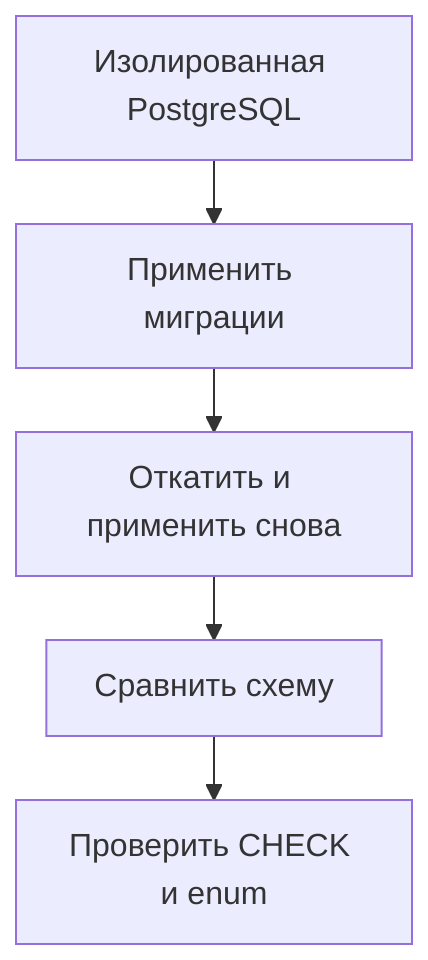

# Как проверять миграции Alembic в CI {#testing-alembic-migrations-in-ci}

<div class="bdr-post__hero" data-bdr-post="2026-09-13-testing-alembic-migrations-in-ci" role="img" aria-label="История ревизий проходит вперёд, назад и снова вперёд; по пути выполняются пять проверок" markdown="0"></div>

Успешный `alembic upgrade head` проверяет только один путь: применение истории к выбранному исходному состоянию. Он не доказывает, что downgrade работает, модели соответствуют БД, а ограничение, добавленное вручную, вообще существует.

Нужен небольшой набор проверок с разными задачами. Его можно запускать против временной PostgreSQL в том же CI, где проверяется приложение.

<!-- more -->

<div id="the-five-migration-tests-every-python-project-should-run-in-ci" data-search-exclude></div>
<div id="the-test-most-pipelines-have" data-search-exclude></div>
<div id="five-bugs-one-file-each" data-search-exclude></div>
<div id="five-tests-by-hand" data-search-exclude></div>
<div id="what-each-test-caught" data-search-exclude></div>
<div id="the-thing-the-naming-test-taught-me" data-search-exclude></div>
<div id="running-it-in-ci" data-search-exclude></div>
<div id="the-contract-with-envpy" data-search-exclude></div>
<div id="the-five-tests-as-one-import" data-search-exclude></div>

## Каждая проверка закрывает свой класс ошибок {#checks}

| Проверка | Что обнаруживает |
|---|---|
| Одна ожидаемая head-ревизия | Непреднамеренное разветвление истории |
| Полный upgrade | Ошибки применения миграций |
| Шаг назад и снова вперёд | Неработающий downgrade и повторное применение |
| Полный downgrade, если он поддерживается | Ошибки очистки объектов в обратном порядке |
| Сравнение схемы и моделей | Забытые изменения таблиц, колонок и части ограничений |
| Явные проверки CHECK и enum | Объекты, которые сравнение может не охватывать |
| Проверка данных | Потерю или неверное преобразование существующих строк |

Политика отката должна соответствовать проекту. Необратимая миграция данных может быть осознанным решением, но тогда тест и план восстановления должны отражать это явно. Зелёный тест на пустой таблице не проверяет сохранность production-данных.

<div id="testing-database-migrations-with-testcontainers-up-down-and-up-again" data-search-exclude></div>
<div id="step-1-a-database-that-exists-only-for-the-test-session" data-search-exclude></div>
<div id="step-2-pytest-configuration" data-search-exclude></div>
<div id="step-3-the-contract-with-envpy" data-search-exclude></div>
<div id="step-4-the-test-file" data-search-exclude></div>
<div id="step-5-ci" data-search-exclude></div>
<div id="what-it-costs" data-search-exclude></div>

## Дать тестам собственную БД {#isolation}

Testcontainers позволяет поднять PostgreSQL для тестовой сессии. Версия образа должна быть зафиксирована и соответствовать целевой среде. Изолируйте тесты отдельной БД или схемой и гарантируйте очистку после ошибки.

Alembic должен работать через соединение, которым управляет тест. Для этого `env.py` принимает переданный connection через `config.attributes`, а не незаметно открывает другой engine. Если используется отдельная schema, согласуйте `search_path`, расположение version table и отражение объектов.

Полная настройка контейнера, pytest и `env.py` сохранена в лабораторных работах ниже. Её лучше подключить один раз и переиспользовать во всех проверках.

<!-- diagram:concept -->
<figure class="bdr-diagram" markdown="1">
<figcaption><span class="bdr-diagram__eyebrow">ИДЕЯ В СХЕМЕ</span><strong>Миграции проверяются в обе стороны</strong></figcaption>
<div class="bdr-diagram__viewport" markdown="1" data-search-exclude>



</div>
<p class="bdr-diagram__caption">Тестовая БД проходит историю миграций, возврат и повторное применение. Затем схема сравнивается с моделями и отдельными ограничениями.</p>
</figure>
<!-- /diagram:concept -->

<div id="your-models-and-your-schema-have-drifted-would-ci-notice" data-search-exclude></div>
<div id="where-drift-comes-from" data-search-exclude></div>
<div id="the-six-drifts" data-search-exclude></div>
<div id="the-check-that-catches-half-of-them" data-search-exclude></div>
<div id="the-one-it-will-not-look-at-unless-you-ask" data-search-exclude></div>
<div id="the-two-it-will-never-look-at" data-search-exclude></div>
<div id="what-to-run-in-ci" data-search-exclude></div>
<div id="the-pieces" data-search-exclude></div>

## Сравнение схемы имеет границы {#schema-drift}

Этот фрагмент предполагает две фикстуры: `migrated_connection` подключён к изолированной БД после применения миграций, а `metadata` содержит модели приложения.

```python
from alembic.autogenerate import compare_metadata
from alembic.migration import MigrationContext

def test_schema_matches_models(migrated_connection, metadata):
    context = MigrationContext.configure(
        migrated_connection,
        opts={"compare_type": True, "compare_server_default": True},
    )
    assert compare_metadata(context, metadata) == []
```

Для проверки server defaults настройка включена явно. Но отсутствие diff не означает равенство всех объектов PostgreSQL. Ограничения autogenerate, включая неполное обнаружение некоторых constraints, перечислены в [документации Alembic](https://alembic.sqlalchemy.org/en/latest/autogenerate.html).

Значимые CHECK, набор значений enum, триггеры и функции нужно проверять отдельно через каталог БД или ожидаемое поведение. Например, вставка отрицательной суммы должна завершаться отказом, если это инвариант схемы.

## Проверять историю с данными {#data}

Для миграции, которая меняет представление данных, создайте строки в предыдущей версии схемы, примените новую ревизию и проверьте результат. Полезны граничные значения, NULL и записи, созданные прежними версиями приложения.

Быстрый набор тестов не заменяет репетицию тяжёлого DDL. На большой таблице важны длительность блокировок, конкурирующие записи и способ восстановления. Такие сценарии запускаются отдельно на репрезентативном объёме.

## Включить проверки в обычный CI {#ci}

Тесты миграций должны выполняться при изменении моделей и истории Alembic, а не только перед релизом. При падении нужны имя ревизии, SQL-ошибка и обнаруженный diff. Нельзя превращать недоступность контейнера в успешный пропуск обязательной проверки.

В [alembic-gauntlet](https://bedrock-python.github.io/alembic-gauntlet/) повторяемая обвязка собрана в готовые проверки. Независимо от инструмента, сначала определите ожидаемые свойства схемы и данных; после этого выбирайте, какие тесты их доказывают.

## Примеры и лабораторные работы {#labs}

Полные стенды и условия воспроизведения вынесены в отдельные материалы:

- [Практикум: пять тестов миграций](../lab/2026-09-07-five-alembic-migration-tests/README.md)
