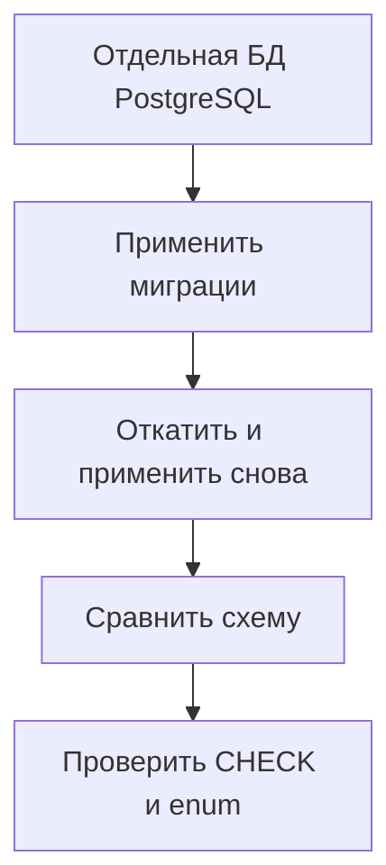

# Как проверять миграции Alembic в CI {#testing-alembic-migrations-in-ci}

<div class="bdr-post__hero" data-bdr-post="2026-09-13-testing-alembic-migrations-in-ci" role="img" aria-label="История ревизий проходит вперёд, назад и снова вперёд; по пути выполняются пять проверок" markdown="0"></div>

Успешный `alembic upgrade head` показывает, что миграции применяются к выбранному начальному состоянию БД. Но он не проверяет откат, соответствие схемы моделям или наличие ограничения, которое добавили вручную.

Поэтому нужен набор проверок, каждая со своей задачей. Их можно запускать на временном экземпляре PostgreSQL в том же CI, где тестируется приложение.

<!-- more -->

<div id="the-five-migration-tests-every-python-project-should-run-in-ci" data-search-exclude></div>
<div id="the-test-most-pipelines-have" data-search-exclude></div>
<div id="five-bugs-one-file-each" data-search-exclude></div>
<div id="five-tests-by-hand" data-search-exclude></div>
<div id="what-each-test-caught" data-search-exclude></div>
<div id="the-thing-the-naming-test-taught-me" data-search-exclude></div>
<div id="running-it-in-ci" data-search-exclude></div>
<div id="the-contract-with-envpy" data-search-exclude></div>
<div id="the-five-tests-as-one-import" data-search-exclude></div>

## Каждая проверка находит свой тип ошибок {#checks}

| Проверка | Что обнаруживает |
|---|---|
| Одна ожидаемая head-ревизия | Непреднамеренное разветвление истории |
| Полный upgrade | Ошибки применения миграций |
| Шаг назад и снова вперёд | Ошибки отката одной миграции и её повторного применения |
| Полный downgrade, если он поддерживается | Ошибки очистки объектов в обратном порядке |
| Сравнение схемы и моделей | Забытые изменения таблиц, колонок и части ограничений |
| Явные проверки CHECK и enum | Объекты, которые сравнение может не охватывать |
| Проверка данных | Потерю или неверное преобразование существующих строк |

Правила отката зависят от проекта. Миграцию данных можно сознательно сделать необратимой, но это должно быть явно отражено в тестах и плане восстановления. Успешный тест на пустой таблице не подтверждает сохранность данных из рабочей БД.

<div id="testing-database-migrations-with-testcontainers-up-down-and-up-again" data-search-exclude></div>
<div id="step-1-a-database-that-exists-only-for-the-test-session" data-search-exclude></div>
<div id="step-2-pytest-configuration" data-search-exclude></div>
<div id="step-3-the-contract-with-envpy" data-search-exclude></div>
<div id="step-4-the-test-file" data-search-exclude></div>
<div id="step-5-ci" data-search-exclude></div>
<div id="what-it-costs" data-search-exclude></div>

## Выделяем тестам собственную БД {#isolation}

Testcontainers позволяет поднять PostgreSQL для тестовой сессии. Версия образа должна быть зафиксирована и соответствовать целевой среде. Изолируйте тесты отдельной БД или схемой и гарантируйте очистку после ошибки.

Alembic должен использовать соединение, которым управляет тест. Для этого `env.py` принимает его через `config.attributes` вместо создания другого движка БД. Если тесты работают в отдельной схеме, нужно согласовать `search_path`, расположение таблицы версий Alembic и схему, в которой читаются сведения об объектах БД.

Полная настройка контейнера, pytest и `env.py` сохранена в лабораторных работах ниже. Её лучше подключить один раз и переиспользовать во всех проверках.

<!-- diagram:concept -->
<figure class="bdr-diagram" markdown="1">
<figcaption><span class="bdr-diagram__eyebrow">ИДЕЯ В СХЕМЕ</span><strong>Миграции проверяются в обе стороны</strong></figcaption>
<div class="bdr-diagram__viewport" markdown="1" data-search-exclude>



</div>
<p class="bdr-diagram__caption">В тестовой БД миграции применяются, откатываются и применяются снова. Затем проверяются соответствие схемы моделям и наличие нужных ограничений.</p>
</figure>
<!-- /diagram:concept -->

<div id="your-models-and-your-schema-have-drifted-would-ci-notice" data-search-exclude></div>
<div id="where-drift-comes-from" data-search-exclude></div>
<div id="the-six-drifts" data-search-exclude></div>
<div id="the-check-that-catches-half-of-them" data-search-exclude></div>
<div id="the-one-it-will-not-look-at-unless-you-ask" data-search-exclude></div>
<div id="the-two-it-will-never-look-at" data-search-exclude></div>
<div id="what-to-run-in-ci" data-search-exclude></div>
<div id="the-pieces" data-search-exclude></div>

## Что не обнаружит сравнение схемы с моделями {#schema-drift}

Пример использует две фикстуры: `migrated_connection` — соединение с изолированной БД после применения миграций, а `metadata` — описание моделей приложения.

```python
from alembic.autogenerate import compare_metadata
from alembic.migration import MigrationContext

def test_schema_matches_models(migrated_connection, metadata):
    context = MigrationContext.configure(
        migrated_connection,
        opts={"compare_type": True, "compare_server_default": True},
    )
    assert compare_metadata(context, metadata) == []
```

Проверка значений по умолчанию на стороне БД (server defaults) включена явно. Но отсутствие различий в отчёте ещё не означает, что совпали все объекты PostgreSQL. Возможности autogenerate ограничены: в частности, он обнаруживает не все изменения ограничений. Подробности перечислены в [документации Alembic](https://alembic.sqlalchemy.org/en/latest/autogenerate.html).

Важные CHECK-ограничения, значения enum, триггеры и функции нужно проверять отдельно: через системный каталог БД или их поведение. Например, если схема запрещает отрицательную сумму, попытка вставить её должна завершаться ошибкой.

## Проверяем миграции на данных {#data}

Для миграции, которая меняет представление данных, создайте строки в предыдущей версии схемы, примените новую ревизию и проверьте результат. Полезны граничные значения, NULL и записи, созданные прежними версиями приложения.

Быстрые тесты не заменяют пробный запуск тяжёлого DDL. На большой таблице важны длительность блокировок, одновременные записи и способ восстановления после ошибки. Такие сценарии проверяют отдельно, на объёме данных, близком к рабочему.

## Добавляем проверки в обычный CI {#ci}

Тесты миграций должны запускаться при изменении моделей и ревизий Alembic, а не только перед релизом. При ошибке в отчёте нужны имя ревизии, сообщение БД и обнаруженные различия. Если обязательный тест не смог запустить контейнер, это ошибка проверки, а не повод отметить её успешной.

[alembic-gauntlet](https://bedrock-python.github.io/alembic-gauntlet/) предоставляет готовые проверки и избавляет от повторяющегося кода их настройки. Сначала определите, какие свойства схемы и данных нужно сохранить, затем выберите тесты, которые это проверяют.

## Примеры и лабораторные работы {#labs}

Запускаемые примеры и инструкции к ним:

- [Практикум: пять тестов миграций](../lab/2026-09-07-five-alembic-migration-tests/README.md)
