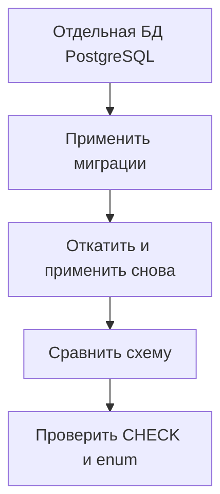

# Как проверять миграции Alembic в CI {#testing-alembic-migrations-in-ci}

<div class="bdr-post__hero" data-bdr-post="2026-09-13-testing-alembic-migrations-in-ci" role="img" aria-label="История ревизий проходит вперёд, назад и снова вперёд; по пути выполняются пять проверок" markdown="0"></div>

Представим магазин с пользователями и заказами. Новый релиз добавляет `users.is_active`; предыдущие миграции создали перечисление статусов заказа и запретили неположительную сумму. CI выполняет `alembic upgrade head` на пустой PostgreSQL и проходит. Но получится ли откатить релиз? Отклонит ли БД заказ на нулевую сумму? Сохранятся ли старые заказы?

Проверим это запускаемыми тестами, а повторяющиеся проверки схемы подключим через `alembic-gauntlet`. В практикуме используются PostgreSQL 17, Alembic 1.20.0, SQLAlchemy 2.0.54, asyncpg 0.31.0 и alembic-gauntlet 0.3.0.

<!-- more -->

<div id="the-five-migration-tests-every-python-project-should-run-in-ci" data-search-exclude></div>
<div id="the-test-most-pipelines-have" data-search-exclude></div>
<div id="five-bugs-one-file-each" data-search-exclude></div>
<div id="five-tests-by-hand" data-search-exclude></div>
<div id="what-each-test-caught" data-search-exclude></div>
<div id="the-thing-the-naming-test-taught-me" data-search-exclude></div>
<div id="running-it-in-ci" data-search-exclude></div>
<div id="the-contract-with-envpy" data-search-exclude></div>
<div id="the-five-tests-as-one-import" data-search-exclude></div>

## Четыре ревизии и несколько способов их сломать {#checks}

У магазина линейная история миграций:

| Ревизия | Изменение |
|---|---|
| `0001` | Создаёт `users` с уникальным email |
| `0002` | Создаёт `orders`, внешний ключ, индекс и enum `order_status`: `new`, `paid`, `shipped` |
| `0003` | Требует `orders.amount > 0` |
| `0004` | Добавляет `users.is_active`: NOT NULL, серверное значение по умолчанию `true` |

Например, ревизия `0003` создаёт и удаляет одно и то же CHECK-ограничение:

```python
"""orders amount must be positive

Revision ID: 0003
Revises: 0002
"""

from alembic import op

revision = "0003"
down_revision = "0002"


def upgrade() -> None:
    # The metadata's convention turns "amount_positive" into chk_orders_amount_positive.
    op.create_check_constraint("amount_positive", "orders", "amount > 0")


def downgrade() -> None:
    op.drop_constraint("amount_positive", "orders", type_="check")
```

Соглашение об именовании из моделей превращает `amount_positive` в `chk_orders_amount_positive`. Если в downgrade написать `positive_amount`, применение миграции пройдёт, но откат попытается удалить несуществующее ограничение.

В практикуме есть исправная история и тринадцать вариантов с намеренными ошибками. В каждом изменён один файл миграции. Сначала выделим тестам отдельную БД, затем посмотрим, какие ошибки они обнаружат.

<div id="testing-database-migrations-with-testcontainers-up-down-and-up-again" data-search-exclude></div>
<div id="step-1-a-database-that-exists-only-for-the-test-session" data-search-exclude></div>
<div id="step-2-pytest-configuration" data-search-exclude></div>
<div id="step-3-the-contract-with-envpy" data-search-exclude></div>
<div id="step-4-the-test-file" data-search-exclude></div>
<div id="step-5-ci" data-search-exclude></div>
<div id="what-it-costs" data-search-exclude></div>

## Подключаем Alembic к тестовой БД {#isolation}

В `tests/conftest.py` запускаем один контейнер PostgreSQL на сессию pytest и выбираем историю миграций. По умолчанию `VARIANT` равен `clean`. Необязательный `MIGRATION_TEST_URL` позволяет скрипту перебора вариантов использовать свой временный контейнер:

```python
"""One PostgreSQL container per session, and the migration history variant under test."""

import os

import pytest
from alembic.config import Config
from testcontainers.community.postgres import PostgresContainer

VARIANT = os.getenv("VARIANT", "clean")


@pytest.fixture(scope="session")
def migration_db_url():
    if url := os.getenv("MIGRATION_TEST_URL"):
        yield url
        return
    with PostgresContainer("postgres:17-alpine", driver="asyncpg") as postgres:
        yield postgres.get_connection_url()


@pytest.fixture
def alembic_config() -> Config:
    config = Config("alembic.ini")
    config.set_main_option("version_locations", f"migrations/versions/{VARIANT}")
    return config
```

После установки alembic-gauntlet его плагин pytest регистрирует фикстуру `migration_engine`. Она берёт адрес из `migration_db_url` и создаёт асинхронный engine. Написанные вручную тесты получают отдельную схему через `fresh_schema`; базовый класс библиотеки создаёт собственную схему для каждой проверки. После теста схема удаляется. Для примеров используется выделенная тестовая БД.

В `pytest.ini` включаем `asyncio_mode = auto`; в практикуме также задано `asyncio_default_fixture_loop_scope = function`. Фикстура `orm_metadata`, которую добавим ниже, передаст библиотеке модели приложения.

Файл Alembic `env.py` должен принять соединение и схему от теста. Вот полный вариант из практикума:

```python
"""Alembic environment. The part that matters for testing is the injected connection and schema."""

import asyncio
import os

from alembic import context
from sqlalchemy import text
from sqlalchemy.engine import Connection
from sqlalchemy.ext.asyncio import create_async_engine
from sqlalchemy.pool import NullPool
from sqlalchemy.schema import CreateSchema

from shop.models import Base

config = context.config
target_metadata = Base.metadata

# The test runner injects the schema it created for this test; production gets "public".
target_schema = config.attributes.get("target_schema") or os.getenv("MIGRATION_SCHEMA", "public")


def do_run_migrations(connection: Connection) -> None:
    connection.execute(CreateSchema(target_schema, if_not_exists=True))
    quoted_schema = connection.dialect.identifier_preparer.quote_schema(target_schema)
    connection.execute(
        text("SELECT set_config('search_path', :schema, true)"),
        {"schema": quoted_schema},
    )
    context.configure(
        connection=connection,
        target_metadata=target_metadata,
        version_table_schema=target_schema,
    )
    with context.begin_transaction():
        context.run_migrations()


async def run_migrations_online() -> None:
    engine = create_async_engine(config.get_main_option("sqlalchemy.url"), poolclass=NullPool)
    try:
        async with engine.begin() as connection:
            await connection.run_sync(do_run_migrations)
    finally:
        await engine.dispose()


if context.is_offline_mode():
    raise SystemExit("offline mode is not used in this project")

injected = config.attributes.get("connection")
if injected is not None:
    do_run_migrations(injected)  # the test runner owns the connection and the transaction
else:
    asyncio.run(run_migrations_online())
```

`version_table_schema` размещает `alembic_version` рядом с таблицами приложения. Локальный для транзакции `search_path` направляет обращения без имени схемы в нужное место. При переданном соединении транзакцией управляет тест; при самостоятельном запуске `engine.begin()` фиксирует и настройку схемы, и миграции. В [рецептах Alembic](https://alembic.sqlalchemy.org/en/latest/cookbook.html#using-asyncio-with-alembic) описаны передача соединения и вызов синхронного кода через `run_sync`.

Самостоятельный запуск дополнительно проверяем в отдельном процессе: после него новым соединением читаем номер ревизии и список таблиц. Если всегда передавать готовое соединение из теста, можно не заметить ошибку запуска через командную строку.

<!-- diagram:concept -->
<figure class="bdr-diagram" markdown="1">
<figcaption><span class="bdr-diagram__eyebrow">ИДЕЯ В СХЕМЕ</span><strong>Миграции проверяются в обе стороны</strong></figcaption>
<div class="bdr-diagram__viewport" markdown="1" data-search-exclude>


```mermaid
---
config:
  theme: default
  look: classic
  flowchart:
    useMaxWidth: false
    wrappingWidth: 150
    padding: 12
    nodeSpacing: 24
    rankSpacing: 32
---
flowchart TD
    accTitle: Миграции проверяются в обе стороны
    accDescr: В тестовой БД миграции применяются, откатываются и применяются снова. Затем проверяются соответствие схемы моделям и наличие нужных ограничений.
    A["Отдельная БД PostgreSQL"]
    B["Применить миграции"]
    C["Откатить и применить снова"]
    D["Сравнить схему"]
    E["Проверить CHECK и enum"]
    A --> B --> C --> D --> E
```

</div>
<p class="bdr-diagram__caption">В тестовой БД миграции применяются, откатываются и применяются снова. Затем проверяются соответствие схемы моделям и наличие нужных ограничений.</p>
</figure>
<!-- /diagram:concept -->

### Успешный откат ещё не гарантирует повторное применение {#round-trip}

Уберём `order_status.drop(op.get_bind())` из downgrade ревизии `0002`. Таблица `orders` удалится, но её enum-тип останется в PostgreSQL. При повторном применении `0002` создание типа завершится ошибкой: он уже существует.

Напишем тест, который применяет каждую ревизию, откатывает её на шаг и применяет снова, включая последнюю:

```python
async def test_every_revision_up_down_up(migration_engine: AsyncEngine, alembic_config: Config) -> None:
    """The stairway: each revision applied, rolled back one step, applied again."""
    revisions = revisions_base_to_head(alembic_config)
    async with fresh_schema(migration_engine) as schema:
        for i, revision in enumerate(revisions):
            await migrate(migration_engine, alembic_config, schema, command.upgrade, revision)
            assert await current_revision(migration_engine, schema) == revision
            await migrate(migration_engine, alembic_config, schema, command.downgrade, revisions[i - 1] if i else "base")
            await migrate(migration_engine, alembic_config, schema, command.upgrade, revision)
```

Здесь `revisions_base_to_head` читает историю Alembic; `migrate` выполняет команду в транзакции и передаёт соединение со схемой в `env.py`; `current_revision` читает таблицу версий. Все три функции находятся в `tests/helpers.py`.

Тест обнаруживает и забытый enum, и неправильное имя ограничения. В нашем магазине откат этих четырёх ревизий поддерживается. Если в проекте есть намеренно необратимые миграции, проверять нужно предусмотренный для них способ восстановления.

<div id="your-models-and-your-schema-have-drifted-would-ci-notice" data-search-exclude></div>
<div id="where-drift-comes-from" data-search-exclude></div>
<div id="the-six-drifts" data-search-exclude></div>
<div id="the-check-that-catches-half-of-them" data-search-exclude></div>
<div id="the-one-it-will-not-look-at-unless-you-ask" data-search-exclude></div>
<div id="the-two-it-will-never-look-at" data-search-exclude></div>
<div id="what-to-run-in-ci" data-search-exclude></div>
<div id="the-pieces" data-search-exclude></div>

## Сравниваем БД с моделями {#schema-drift}

Допустим, разработчик разрешил NULL для `is_active` в миграции, а модель по-прежнему требует значение. Или указал серверный default `false`, хотя в модели стоит `true`. Обе истории успешно применятся к пустым таблицам.

Повторяющиеся проверки возьмём из `alembic-gauntlet`. Это весь класс из `tests/test_gauntlet.py`:

```python
import pytest
from alembic_gauntlet import MigrationTestBase
from sqlalchemy import MetaData

from shop.models import Base


@pytest.mark.integration
class TestMigrations(MigrationTestBase):
    migration_diff_compare_server_default = True

    @pytest.fixture
    def orm_metadata(self) -> MetaData:
        return Base.metadata
```

В версии 0.3.0 pytest собирает **семь унаследованных тестов**: шаги по истории, соответствие схемы моделям, одну head-ревизию, полный откат, соглашения об именовании, имена CHECK-ограничений и значения enum. Флаг `migration_diff_compare_server_default = True` явно включает сравнение серверных значений по умолчанию. Без него они не сравниваются. Наш тест выше также проверяет повторное применение последней ревизии: проверка шагов из базового класса этой версии заканчивается её откатом.

Вот часть результатов практикума. Обычный upgrade проходит во всех строках, кроме истории с двумя head-ревизиями:

| Намеренная ошибка | Какая проверка падает |
|---|---|
| И `0003`, и `0004` ссылаются на `0002` | Одна head-ревизия; для `upgrade head` цель тоже неоднозначна |
| Неверный nullable, тип или default, забытый индекс, лишняя колонка | Сравнение схемы и моделей |
| Нет `chk_orders_amount_positive` | Сравнение имён CHECK-ограничений |
| В `order_status` отсутствует `shipped` | Сравнение значений enum |
| Ограничению дали имя не по соглашению | Проверка имён |

В Alembic 1.20 добавление и удаление именованных CHECK можно проверять плагином `alembic.ext.checkconstraint_byname`, включив его вместе со стандартными плагинами autogenerate. По умолчанию он выключен и сравнивает имена, а не выражения. Ограничения описаны в [документации autogenerate](https://alembic.sqlalchemy.org/en/latest/autogenerate.html#detecting-check-constraints). Используемая здесь проверка gauntlet тоже сравнивает CHECK по именам.

### Правильное имя не гарантирует правильное условие {#constraint-behavior}

Заменим `amount > 0` на `amount >= 0`, сохранив имя ограничения. Все семь унаследованных проверок по-прежнему проходят. Но БД уже принимает заказ на нулевую сумму. Добавим проверку поведения:

```python
@pytest.mark.parametrize("amount", [0, -1])
async def test_order_amount_must_be_positive(migrated_connection, amount):
    await migrated_connection.execute(
        text("INSERT INTO users (id, email) VALUES (1, 'buyer@example.test')")
    )
    with pytest.raises(IntegrityError) as raised:
        async with migrated_connection.begin_nested():
            await migrated_connection.execute(
                text("INSERT INTO orders (id, user_id, amount, status) "
                     "VALUES (42, 1, :amount, 'new')"),
                {"amount": amount},
            )
    assert raised.value.orig.sqlstate == "23514"
```

Фикстура практикума `migrated_connection` применяет `head`, открывает транзакцию в тестовой схеме и передаёт соединение тесту. Сначала создаём существующего пользователя: нарушение внешнего ключа не должно подменить ожидаемую ошибку CHECK. Неудачную вставку откатываем до savepoint, а SQLSTATE `23514` подтверждает нарушение CHECK-ограничения.

Исправная история отклоняет и `0`, и `-1`. Изменённое условие пропускает `0`, поэтому этот случай падает с `DID NOT RAISE`. Теперь мы проверяем само правило, а не только наличие ограничения.

## Обновляем БД, в которой уже есть заказы {#data}

Ревизия `0004` должна добавить флаг, не меняя пользователей и заказы. Вставим в её upgrade `DELETE FROM orders`: схема всё ещё совпадает с моделями, а все семь унаследованных проверок проходят на пустых таблицах.

Создадим заказ на ревизии `0003`, применим новую миграцию и проверим строки. Тест использует `Decimal`, `text` из SQLAlchemy, `command` из Alembic и те же функции `fresh_schema` и `migrate`:

```python
async def test_existing_orders_survive(migration_engine, alembic_config):
    async with fresh_schema(migration_engine) as schema:
        await migrate(migration_engine, alembic_config, schema, command.upgrade, "0003")
        async with migration_engine.begin() as connection:
            await connection.execute(text(f'SET LOCAL search_path TO "{schema}"'))
            await connection.execute(text(
                "INSERT INTO users (id, email) VALUES (1, 'buyer@example.test')"
            ))
            await connection.execute(text(
                "INSERT INTO orders (id, user_id, amount, status) "
                "VALUES (42, 1, 19.99, 'paid')"
            ))

        await migrate(migration_engine, alembic_config, schema, command.upgrade, "0004")
        async with migration_engine.connect() as connection:
            await connection.execute(text(f'SET LOCAL search_path TO "{schema}"'))
            users = (await connection.execute(
                text("SELECT id, email, is_active FROM users ORDER BY id")
            )).all()
            orders = (await connection.execute(
                text("SELECT id, user_id, amount, status FROM orders ORDER BY id")
            )).all()
        assert users == [(1, "buyer@example.test", True)]
        assert orders == [(42, 1, Decimal("19.99"), "paid")]
```

В исправном варианте пользователь `1` получает `is_active=True`, а заказ `42` по-прежнему принадлежит ему, стоит `19.99` и имеет статус `paid`. Вариант с удалением падает: список заказов оказывается пустым. По одной схеме нельзя определить, какие данные миграция обязана сохранить.

Если миграция преобразует существующие значения, дополните этот тест граничными случаями и ожидаемыми результатами. Длительность блокировок и одновременные записи в больших таблицах проверяйте отдельным прогоном на объёме, близком к рабочему.

## Запускаем те же проверки в CI {#ci}

Для запуска из каталога практикума достаточно Docker и `uv`:

```bash
uv run --no-project --python 3.13 --with-requirements requirements.txt python -m pytest -q
uv run --no-project --python 3.13 --with-requirements requirements.txt python run_matrix.py
```

Первая команда проверяет исправную историю: **20 passed**. Вторая перебирает все четырнадцать историй. Она проходит, только если исправный вариант успешен, каждый сломанный вариант обнаружен нужным тестом, а ошибки настройки и пропущенные проверки не скрывают проблему. Недоступный Docker приводит к ошибке запуска.

Для GitHub Actions в `ci-example.yml` есть задача, которая выполняет первую команду из каталога практикума в этом репозитории:

```yaml
name: Migration checks
on:
  pull_request:
  push:
    branches: [master]
permissions:
  contents: read
jobs:
  migrations:
    runs-on: ubuntu-24.04
    timeout-minutes: 10
    defaults:
      run:
        working-directory: docs/blog/lab/2026-09-07-five-alembic-migration-tests
    steps:
      - uses: actions/checkout@v7
      - uses: astral-sh/setup-uv@v10
      - run: uv run --no-project --python 3.13 --with-requirements requirements.txt python -m pytest -q
```

В примере используются [actions/checkout](https://github.com/actions/checkout) и [setup-uv](https://github.com/astral-sh/setup-uv). В своём сервисе укажите в `working-directory` каталог тестов миграций и подключите свой файл зависимостей. Команда проверена локально на PostgreSQL; workflow приведён как шаблон, его запуск в GitHub Actions здесь не выполнялся.

## Что перенести в свой проект {#conclusion}

Мы нашли сломанный откат, забытый enum, расхождение схемы с моделями, ослабленный CHECK и потерянные заказы. Для каждого случая понадобилась проверка конкретного результата; один успешный upgrade пропустил бы большинство этих ошибок.

Используйте [alembic-gauntlet](https://bedrock-python.github.io/alembic-gauntlet/) для изоляции схем и повторяющихся проверок истории, имён и моделей. Дополните его небольшими тестами правил БД и строк, созданных до новой ревизии. Тогда при ревью миграции будет понятно, какое именно требование нарушено.

## Примеры и лабораторные работы {#labs}

- [Практикум: пять тестов миграций](../lab/2026-09-07-five-alembic-migration-tests/README.md): название осталось прежним, но теперь в практикуме двадцать тестов и четырнадцать историй миграций.
