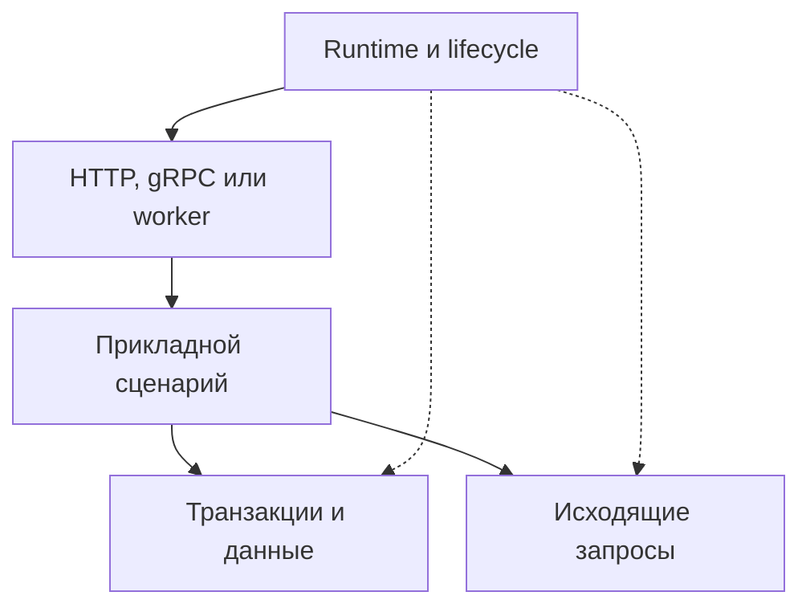

# Зачем я выделяю инфраструктуру Python-сервисов в библиотеки {#why-bedrock-python-libraries}

В Python-сервисах на одном стеке я снова и снова собирал похожую инфраструктуру: сессии SQLAlchemy, клиентов Redis и Kafka, запуск и остановку ресурсов, повторные запросы, метрики и проверки миграций. Код переходил из проекта в проект, а исправления расходились между копиями.

Bedrock Python появился из желания сопровождать эти решения как отдельные библиотеки. Сервис выбирает нужные компоненты, а я могу исправить общую механику в одном пакете и выпустить версию, которую потребители обновят явно.

<!-- more -->

## Что имеет смысл выносить {#boundaries}

Хороший кандидат — повторяющаяся задача с понятной границей ответственности. Например, клиенту нужен управляемый пул соединений, транзакции — определённый владелец, а процессу — порядок закрытия ресурсов. Эти механизмы встречаются в разных предметных областях.

При этом последствия ошибок зависят от продукта. Библиотека может ограничить время запроса, но не решить за сервис, допустимо ли повторить платёж. Она может предоставить Outbox, но не выбрать, какие события составляют публичный контракт заказа.

| Общая механика | Решение конкретного сервиса |
|---|---|
| Lifecycle и закрытие ресурсов | Что обязательно для готовности |
| Таймауты, backoff и circuit breaker | Бюджет запроса и безопасность повторов |
| Управление сессией и транзакцией | Что должно измениться атомарно |
| Outbox и дедупликация | Смысл события и допустимость повторного эффекта |

Вынос полезен, когда такую границу удаётся описать и проверить. Если для подключения пакета приходится объяснять ему всю предметную область, сначала стоит пересмотреть абстракцию.

## Почему отдельные пакеты {#composition}

Крупный внутренний framework может быть оправдан, если команда сознательно принимает единый стек и общий цикл обновления. Для Bedrock Python я выбрал более независимые части: проекту может понадобиться только управление deadline или тестирование миграций.

Это накладывает ограничения на API. Интеграция должна принимать необходимые возможности объекта, не требуя чужой иерархии классов без причины. Владение ресурсами нужно обозначить явно: кто создаёт клиент, кто его закрывает и можно ли передать уже существующий экземпляр.

Внутри библиотеки важно отделять основную логику от интеграций. Подход и его издержки разобраны в [статье о ядрах без зависимостей](2026-09-07-zero-dependency-cores.md). Это принцип проектирования, а не обещание, что работа с PostgreSQL или HTTP обойдётся без соответствующего драйвера.

<!-- diagram:concept -->
<figure class="bdr-diagram" markdown="1">
<figcaption>ИДЕЯ В СХЕМЕ<strong>Приложение собирает нужные части</strong></figcaption>

Runtime управляет временем жизни ресурсов. Прикладной сценарий использует нужные клиенты и хранилища, сохраняя бизнес-правила в сервисе.

</figure>
<!-- /diagram:concept -->

## Как части соединяются в сервисе {#example}

Рассмотрим API заказов: обработчик читает заказ из PostgreSQL и запрашивает остатки у соседнего сервиса. На уровне процесса нужны общий пул базы и HTTP-клиент. На уровне операции — сессия, оставшийся запас времени и прикладные правила.

[servicewright](https://bedrock-python.github.io/servicewright/) может координировать запуск и остановку. [sqlalchemy-foundation-kit](https://bedrock-python.github.io/sqlalchemy-foundation-kit/) предоставляет средства для работы с сессиями, а [clientwright](https://bedrock-python.github.io/clientwright/) — политики исходящих HTTP-вызовов. Конкретное приложение связывает их и решает, как отвечать при недоступных остатках.

Важна последовательность: ресурсы создаются до готовности, запрос получает свою область работы, исходящие операции учитывают оставшееся время, а при остановке активная работа завершается до закрытия общих клиентов. Подробности находятся в статьях о [lifecycle](2026-09-13-python-service-lifecycle.md), [транзакциях](2026-09-13-sqlalchemy-sessions-and-transactions.md) и [HTTP- и gRPC-клиентах](2026-09-13-production-http-grpc-clients.md). Полный пример API вынесен в лабораторную работу.

## Цена самостоятельных библиотек {#tradeoffs}

Отдельный пакет требует публичного API, документации, совместимых обновлений и проверки на реальных потребителях. Дублирование нескольких строк иногда дешевле сопровождения новой зависимости.

Есть и стоимость композиции: две библиотеки могут работать по отдельности и расходиться в ожиданиях о владении ресурсами, отмене или ошибках. Поэтому нужны интеграционные примеры, а общие правила сборки и выпуска должны помогать переносить исправления между репозиториями. Этому посвящён материал [от шаблона до релиза](2026-09-13-python-library-from-template-to-release.md).

Для меня критерий выделения — повторяющаяся потребность и граница, которая остаётся полезной вне первого сервиса. Сначала стоит доказать это использованием, затем расширять API.

## О чём этот блог {#verification}

Здесь я разбираю решения вокруг Python backend: где заканчивается гарантия транзакции, когда повтор запроса опасен, что проверяет readiness и как тестировать отказ зависимости. Библиотеки служат конкретными примерами; сами вопросы возникают и в проектах, которые ими не пользуются.

[Каталог библиотек](../../libraries/index.md) помогает найти компонент по задаче. Статьи объясняют поведение и ограничения, которые стоит понять перед его подключением.

## Примеры и лабораторные работы {#labs}

Полные стенды и условия воспроизведения вынесены в отдельные материалы:

- [Практикум: что заново реализует каждый Python-микросервис](../lab/2026-09-07-what-every-microservice-reimplements/README.md)
