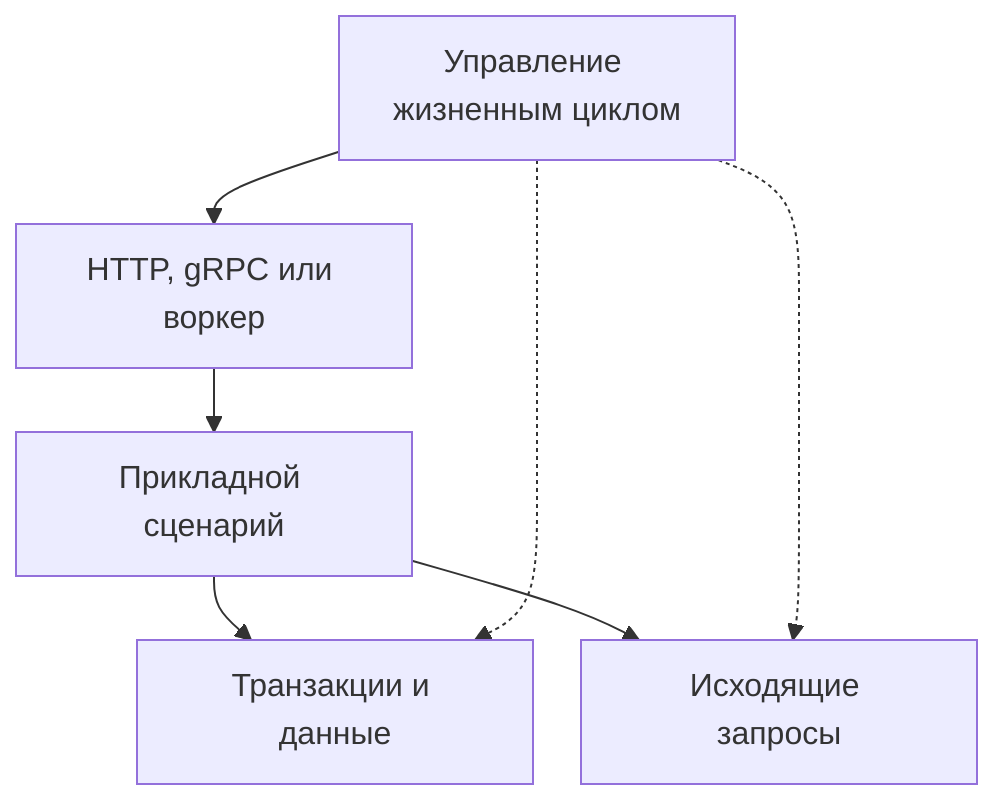

# Зачем я выделяю инфраструктуру Python-сервисов в библиотеки {#why-bedrock-python-libraries}

В Python-сервисах на одном стеке я снова и снова собирал похожую инфраструктуру: сессии SQLAlchemy, клиентов Redis и Kafka, запуск и остановку ресурсов, повторные запросы, метрики и проверки миграций. Код копировался из проекта в проект, но исправления доходили не до всех копий.

Так появился Bedrock Python — набор отдельных библиотек для этих задач. Сервис подключает нужные компоненты, а я могу исправить общую проблему в одном пакете и выпустить новую версию. Каждый проект сам решает, когда на неё перейти.

<!-- more -->

## Что имеет смысл выносить {#boundaries}

В библиотеку стоит выносить повторяющуюся задачу с понятными границами. Например, управление пулом соединений, открытие и завершение транзакций или порядок закрытия ресурсов при остановке процесса. Эти механизмы нужны сервисам из самых разных предметных областей.

При этом последствия ошибок зависят от продукта. Библиотека может ограничить время запроса, но не решить за сервис, допустимо ли повторить платёж. Она может предоставить Outbox, но не выбрать, какие события составляют публичный контракт заказа.

| Общая механика | Решение конкретного сервиса |
|---|---|
| Жизненный цикл и закрытие ресурсов | Без каких компонентов сервис не готов к работе |
| Таймауты, backoff и circuit breaker | Бюджет запроса и безопасность повторов |
| Управление сессией и транзакцией | Что должно измениться атомарно |
| Outbox и защита от дублей | Смысл события и допустимость повторного выполнения операции |

Выделение в библиотеку полезно, когда границу между общим механизмом и логикой сервиса удаётся описать и проверить. Если для подключения пакету нужно передать сведения обо всей предметной области, стоит пересмотреть его интерфейс.

## Почему отдельные пакеты {#composition}

Большой внутренний фреймворк может быть оправдан, если команда сознательно выбирает единый стек и общий график обновлений. Для Bedrock Python я выбрал независимые пакеты: проекту может понадобиться только учёт дедлайнов или тестирование миграций.

Это влияет на API. Если интеграции достаточно нескольких методов объекта, не стоит без причины требовать наследования от определённого класса. Правила работы с ресурсами тоже должны быть явными: кто создаёт клиент, кто его закрывает и можно ли передать готовый экземпляр.

Внутри библиотеки важно отделять основную логику от интеграций. Подход и его издержки разобраны в [статье о ядрах без зависимостей](2026-09-07-zero-dependency-cores.md). Это принцип проектирования, а не обещание, что работа с PostgreSQL или HTTP обойдётся без соответствующего драйвера.

<!-- diagram:concept -->
<figure class="bdr-diagram" markdown="1">
<figcaption>ИДЕЯ В СХЕМЕ<strong>Приложение собирает нужные части</strong></figcaption>

Общий runtime создаёт и закрывает ресурсы. Обработчики используют нужные клиенты и хранилища, а бизнес-правила остаются в сервисе.

</figure>
<!-- /diagram:concept -->

## Как подключить библиотеки к одному сервису {#example}

Рассмотрим API заказов: обработчик читает заказ из PostgreSQL и запрашивает остатки у соседнего сервиса. Процессу нужны общий пул соединений с БД и HTTP-клиент. Каждой операции — отдельная сессия, бюджет времени и свои бизнес-правила.

[servicewright](https://bedrock-python.github.io/servicewright/) может управлять запуском и остановкой. [sqlalchemy-foundation-kit](https://bedrock-python.github.io/sqlalchemy-foundation-kit/) предоставляет средства для работы с сессиями, а [clientwright](https://bedrock-python.github.io/clientwright/) — для настройки исходящих HTTP-вызовов. Приложение соединяет эти части и решает, какой ответ вернуть, если сервис остатков недоступен.

Важен порядок действий: ресурсы создаются до объявления готовности, для каждого запроса открывается своя сессия, исходящие вызовы учитывают остаток времени, а при остановке активные операции завершаются до закрытия общих клиентов. Подробности — в статьях о [жизненном цикле](2026-09-13-python-service-lifecycle.md), [транзакциях](2026-09-13-sqlalchemy-sessions-and-transactions.md) и [HTTP- и gRPC-клиентах](2026-09-13-production-http-grpc-clients.md). Полный пример API есть в лабораторной работе.

## Чего требует поддержка отдельных библиотек {#tradeoffs}

Отдельный пакет требует публичного API, документации, совместимых обновлений и проверки в реальных проектах. Иногда скопировать несколько строк дешевле, чем сопровождать новую зависимость.

Совместное использование библиотек тоже нужно проверять. По отдельности они могут работать, но по-разному обрабатывать отмену, ошибки или закрытие общих ресурсов. Поэтому нужны интеграционные примеры. Общие правила сборки и выпуска помогают переносить исправления между репозиториями; им посвящён материал [от шаблона до релиза](2026-09-13-python-library-from-template-to-release.md).

Я выделяю библиотеку, когда задача повторяется и выбранный интерфейс полезен за пределами первого сервиса. Сначала проверяю это на практике, затем расширяю API.

## О чём этот блог {#verification}

В этом блоге я разбираю разработку серверных приложений на Python: что гарантирует транзакция, когда опасно повторять запрос, что проверяет readiness и как тестировать сбои внешних сервисов. Библиотеки служат конкретными примерами, но те же вопросы возникают и в проектах, которые ими не пользуются.

[Каталог библиотек](../../libraries/index.md) помогает найти компонент по задаче. Статьи объясняют поведение и ограничения, которые стоит понять перед его подключением.

## Примеры и лабораторные работы {#labs}

Запускаемые примеры и инструкции к ним:

- [Практикум: что заново реализует каждый Python-микросервис](../lab/2026-09-07-what-every-microservice-reimplements/README.md)
