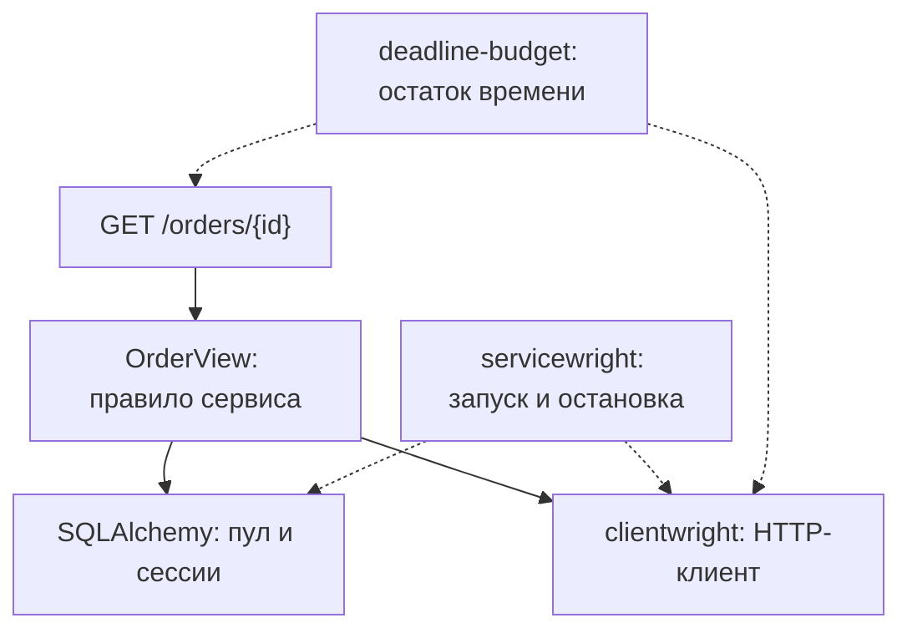

# Зачем я выделяю инфраструктуру Python-сервисов в библиотеки {#why-bedrock-python-libraries}

<div class="bdr-post__hero" data-bdr-post="2026-09-13-why-bedrock-python-libraries" role="img" aria-label="API заказов объединяет сессию БД, HTTP-клиент, дедлайн и закрытие ресурсов" markdown="0"></div>

Представим API заказов: прочитать заказ из PostgreSQL, запросить остаток на складе и вернуть, хватит ли товара. Позже те же данные понадобятся фоновому заданию. Прикладное правило небольшое, но в обоих случаях нужны пулы соединений, ограничения времени, обработка сбоев и корректная остановка.

Bedrock Python появился из попытки вынести эти повторяющиеся механизмы в отдельные библиотеки. На конкретном примере разберём, что они берут на себя, какие решения остаются за сервисом и как проверить их совместную работу.

<!-- more -->

<div id="welcome-to-the-bedrock-python-blog" data-search-exclude></div>
<div id="why-this-exists" data-search-exclude></div>
<div id="the-decision" data-search-exclude></div>
<div id="what-to-expect-from-this-blog" data-search-exclude></div>

## Начинаем с решения, которое принимает сервис {#boundaries}

Для неизвестного заказа наше API возвращает `404`. Для известного — сравнивает остаток с заказанным количеством. Если склад недоступен, возвращает ошибку, а не выдуманный нулевой остаток.

В `orders.py` описаны два небольших Python-протокола: `OrderStore.find()` возвращает заказ или `None`, а `StockReader.available()` — количество товара. Прикладной сценарий не импортирует FastAPI и инфраструктурные библиотеки:

```python
class OrderView:
    def __init__(self, store: OrderStore, stock: StockReader):
        self.store, self.stock = store, stock

    async def get(self, order_id: int) -> dict:
        order = await self.store.find(order_id)
        if order is None:
            raise OrderMissing(order_id)
        available = await self.stock.available(order.sku)
        return {
            "order_id": order.id,
            "available": available,
            "can_fulfill": available >= order.quantity,
        }
```

Практикум проверяет этот класс и с обычными объектами в памяти, и с настоящими адаптерами. Библиотеки могут дать соединения и повторные запросы; сравнение количества и правило для неизвестного заказа остаются здесь.

Это **просмотр остатка**, а не резервирование. Чтение БД и ответ склада не образуют одну транзакцию; остаток может измениться сразу после ответа. Операции покупки нужны собственные правила согласованности.

<div id="what-every-production-python-microservice-reimplements" data-search-exclude></div>
<div id="the-list" data-search-exclude></div>
<div id="why-not-a-framework" data-search-exclude></div>
<div id="a-hundred-lines" data-search-exclude></div>
<div id="run" data-search-exclude></div>
<div id="how-the-pieces-stay-apart" data-search-exclude></div>

## Подключаем PostgreSQL и склад {#example}

Сначала реализуем `OrderStore` через [sqlalchemy-foundation-kit](https://github.com/bedrock-python/sqlalchemy-foundation-kit). Его `AsyncSessionManager` владеет движком SQLAlchemy и выдаёт сессии. Наш адаптер определяет запрос и границу сессии:

```python
from sqlalchemy import text
from orders import Order


class SqlOrderStore:
    def __init__(self, db):
        self.db = db

    async def find(self, order_id):
        async with self.db.get_session() as session:
            row = (
                (
                    await session.execute(
                        text("SELECT id, sku, quantity FROM orders WHERE id = :id"),
                        {"id": order_id},
                    )
                )
                .mappings()
                .one_or_none()
            )
            return Order(**row) if row is not None else None
```

Выход из `async with` происходит до обращения `OrderView` к складу. Поэтому медленный HTTP-ответ не удерживает соединение с БД. Здесь мы только читаем данные; `get_session()` не фиксирует изменения приложения. Для записи нужна явно выбранная граница транзакции.

Теперь создадим общий HTTP-клиент через [clientwright](https://github.com/bedrock-python/clientwright). Сервис разрешает до двух попыток для `GET`: запрос остатка не должен менять состояние склада. Общий дедлайн зададим в обработчике:

```python
from clientwright import AdapterDeps, ClientConfig, RetryConfig, TimeoutConfig, build
from clientwright.contrib.deadline import AmbientDeadlineSource


def stock_client(base_url):
    return build(
        "httpx",
        ClientConfig(
            service_name="orders",
            base_url=base_url,
            timeout=TimeoutConfig(total=5),
            retry=RetryConfig(
                max_attempts=2,
                methods=frozenset({"GET"}),
                initial_backoff=0.02,
                jitter=0,
                budget_ratio=1.0,
            ),
            circuit_breaker=None,
            deadline_header="X-Deadline-Ms",
            on_unsupported="strict",
        ),
        AdapterDeps(deadline_source=AmbientDeadlineSource()),
    )
```

В примере бюджет повторов допускает до одной дополнительной попытки на исходный вызов (`budget_ratio=1.0`). Собственное ограничение клиента — пять секунд, но `AmbientDeadlineSource` сокращает его до остатка бюджета текущего запроса. Заголовок `X-Deadline-Ms` передаёт этот остаток складу; принимающий сервис должен сам поддерживать такой договор.

Адаптер также проверяет ответ. Неустранённый повтором `503` и некорректные данные превращаются в прикладную ошибку `StockUnavailable`. Ошибки таймаута остаются различимыми:

```python
import httpx
from orders import StockUnavailable


class HttpStockReader:
    def __init__(self, client):
        self.client = client

    async def available(self, sku):
        try:
            response = await self.client.get(f"/stock/{sku}")
            response.raise_for_status()
            available = response.json()["available"]
            if type(available) is not int or available < 0:
                raise ValueError("Expected a nonnegative stock count")
            return available
        except httpx.TimeoutException:
            raise
        except (httpx.HTTPError, ValueError, KeyError, TypeError) as error:
            raise StockUnavailable(sku) from error
```

Эти настройки выбраны для чтения остатка. Из них не следует, что можно повторять платёж или любой другой запрос с побочным эффектом. Безопасность повторов и ограничение дополнительного трафика разобраны в [статье об HTTP- и gRPC-клиентах](2026-09-13-production-http-grpc-clients.md).

## Ограничиваем время всей операции {#deadline}

Часть времени может уйти на PostgreSQL ещё до первой HTTP-попытки. Создадим для операции один контекст [deadline-budget](https://github.com/bedrock-python/deadline-budget), чтобы каждый шаг учитывал оставшееся время:

```python
import asyncio
import httpx
from clientwright.contrib.deadline import use_budget
from deadline_budget import BudgetContext
from fastapi import APIRouter, Header, HTTPException
from servicewright.adapters.fastapi import UnitScopeDep
from orders import OrderMissing, OrderView, StockUnavailable

router = APIRouter()


@router.get("/orders/{order_id}")
async def get_order(
    order_id: int,
    unit: UnitScopeDep,
    x_deadline_ms: int = Header(default=800, ge=50, le=2000),
):
    budget = BudgetContext.create(total_seconds=x_deadline_ms / 1000)
    try:
        with use_budget(budget):
            async with asyncio.timeout(budget.remaining()):
                view = await unit.get(OrderView)
                return await view.get(order_id)
    except OrderMissing as error:
        raise HTTPException(404, "Order not found") from error
    except StockUnavailable as error:
        raise HTTPException(503, "Stock is temporarily unavailable") from error
    except (TimeoutError, httpx.TimeoutException) as error:
        raise HTTPException(504, "Order lookup deadline exceeded") from error
```

Сервис выбирает 800 мс по умолчанию и принимает `X-Deadline-Ms` только в диапазоне от 50 до 2000 мс. `use_budget()` делает этот бюджет доступным clientwright. `asyncio.timeout()` ограничивает время асинхронных операций внутри обработчика, включая чтение БД. По истечении времени эти механизмы запрашивают отмену; уже зафиксированные в другой системе изменения они не откатывают.

`UnitScopeDep` предоставляет FastAPI-адаптер servicewright. Через него обработчик получает настроенный `OrderView` и сам решает, какие ошибки превратить в `404`, `503` или `504`. Некорректный заголовок дедлайна отклоняется с `422`.

## Создаём общие ресурсы один раз и закрываем последними {#composition}

[servicewright](https://github.com/bedrock-python/servicewright) управляет жизненным циклом процесса. В нашем `Container` зависимости живут на двух уровнях: `app_scope()` владеет общими ресурсами приложения, а `unit_scope()` даёт отдельному запросу доступ к прикладному сценарию. Сессия для чтения заказа открывается только внутри `SqlOrderStore.find()`.

Вот метод `Container.app_scope()` из `service.py`. В `self.settings` находятся адреса БД и склада, `Scope` выдаёт `OrderView`, а список `events` нужен практикуму для проверки порядка событий:

```python
@asynccontextmanager
async def app_scope(self):
    try:
        async with AsyncExitStack() as stack:
            self.db = await stack.enter_async_context(
                AsyncSessionManager(
                    self.settings.database_url,
                    poolclass="async_adapted_queue",
                )
            )
            self.http = await stack.enter_async_context(
                stock_client(self.settings.warehouse_url)
            )
            view = OrderView(SqlOrderStore(self.db), HttpStockReader(self.http))
            self.scope = Scope(self.db, view)
            self.events.append("resources:open")
            yield self.scope
    finally:
        self.events.append("resources:closed")
```

`AsyncExitStack` закрывает HTTP-клиент, затем менеджер БД — в том числе если последующий этап запуска завершился ошибкой. Импорты и небольшой класс области зависимостей находятся в практикуме. Пулы не создаются заново на каждый запрос.

Остаётся настроить runtime и точку входа FastAPI:

```python
def build_service(settings, *, port=0):
    container = Container(settings)
    spec = AppSpec(
        service_name="orders",
        create_container=lambda _: container,
        warmers_factory=lambda ctx: [PostgresWarmer(ctx.container.db, timeout=2)],
        drain_delay_seconds=0.2,
        drain_grace_seconds=3,
        cleanup_timeout_seconds=2,
    )

    async def register_health(scope):
        spec.health.add_check(
            "postgres", PostgresHealthCheck(scope.db.session_maker, timeout=1)
        )

    spec.lifecycle.add_pre_start_hook(register_health)
    api = FastApiEntrypoint(
        config=HttpConfig(host="127.0.0.1", port=port, graceful_timeout=2),
        routers=(router,),
    )
    return Service(spec, entrypoints=[api]), api, container
```

До запуска HTTP-сервера проверяем PostgreSQL настоящим запросом. От него же зависит readiness — готовность сервиса принимать запросы. Недоступный склад в этом примере приводит к `503` от `/orders`, но readiness остаётся успешным. При остановке сервис перестаёт сообщать о готовности, даёт активным запросам ограниченное время на завершение и затем закрывает общие ресурсы.

Практикум вызывает `Service.run(..., stop=event)`, чтобы проверить этот путь и на Windows, и на Linux. Отдельный запуск `service.py` использует `run_sync()` — через него подключается обработка сигналов процесса.

<!-- diagram:concept -->
<figure class="bdr-diagram" markdown="1">
<figcaption><span class="bdr-diagram__eyebrow">ИДЕЯ В СХЕМЕ</span><strong>Один сценарий и явные владельцы ресурсов</strong></figcaption>
<div class="bdr-diagram__viewport" markdown="1" data-search-exclude>


```mermaid
---
config:
  theme: default
  look: classic
  flowchart:
    useMaxWidth: false
    wrappingWidth: 150
    padding: 12
    nodeSpacing: 24
    rankSpacing: 32
---
flowchart TD
    accTitle: Один сценарий и явные владельцы ресурсов
    accDescr: servicewright управляет общими ресурсами. OrderView читает заказ и запрашивает остаток; обработчик задаёт бюджет времени и переводит ошибки в HTTP-ответы.
    A["servicewright: запуск и остановка"]
    B["SQLAlchemy: пул и сессии"]
    C["clientwright: HTTP-клиент"]
    D["GET /orders/{id}"]
    E["OrderView: правило сервиса"]
    F["deadline-budget: остаток времени"]
    D --> E
    E --> B
    E --> C
    A -.-> B
    A -.-> C
    F -.-> D
    F -.-> C
```

</div>
<p class="bdr-diagram__caption">servicewright управляет общими ресурсами. OrderView читает заказ и запрашивает остаток; обработчик задаёт бюджет времени и переводит ошибки в HTTP-ответы.</p>
</figure>
<!-- /diagram:concept -->

## Проверяем поведение, а не только импорты {#verification}

Практикум запускает PostgreSQL 17 в Docker, локальный HTTP-сервис склада и API заказов. Проверяем такие результаты:

| Ситуация | Ожидаемый результат |
|---|---|
| Заказ существует | Чтение по ID, запрос склада по SKU, сравнение количества |
| Заказ неизвестен | `404`, обращений к складу нет |
| Неверный заголовок дедлайна | `422` |
| Склад один раз вернул `503` | Один повтор с меньшим остатком времени |
| Склад недоступен или прислал неверные данные | `503` |
| Склад перестал отвечать | `504` в рамках бюджета операции |
| Остановка во время запроса на склад | Запрос завершается за отведённое время; общие ресурсы закрываются после него |
| PostgreSQL не прошёл проверку при запуске | HTTP-сервер не запущен; открытые ресурсы закрыты |

Пока ответ склада задержан, практикум дополнительно проверяет, что соединение с БД уже вернулось в пул. Отдельно проверены `OrderView` с обычными объектами и HTTP-адаптер без запуска runtime или API.

С работающим Docker и установленным uv выполните из корня репозитория сайта:

```bash
cd docs/blog/lab/2026-09-07-what-every-microservice-reimplements
uv run --no-project --python 3.13 --with-requirements requirements.txt python run_skeleton.py
```

Проверенные версии: `servicewright 0.13.1`, `sqlalchemy-foundation-kit 0.4.0`, `clientwright 0.5.0`, `deadline-budget 0.1.3`, Python 3.13. В requirements зафиксированы библиотеки и основные зависимости практикума. Это пример совместного использования компонентов; TLS, аутентификация, проверки в окружении развёртывания и нагрузочные тесты требуют отдельной настройки.

## Когда отдельная библиотека окупается {#tradeoffs}

Допустим, двум сервисам нужно одинаковое исправление передачи дедлайна. При копировании вспомогательного кода каждую копию придётся найти, изменить и проверить. У общего пакета будет одно исправление и версия; каждый сервис всё равно должен явно обновить и проверить эту версию.

Это полезно, пока у библиотеки остаётся небольшая задача: управление сессиями, правила HTTP-клиента или жизненный цикл ресурсов. Сравнение остатка остаётся в приложении, потому что описывает поведение именно этого сервиса. Несколько локальных строк без второго потребителя могут не стоить отдельного пакета, релизов, документации и поддержки совместимости.

Независимые пакеты нужно проверять и вместе. Наш пример был бы неверным, если бы HTTP-клиент проигнорировал бюджет или закрылся раньше активного запроса, даже при проходящих тестах каждой библиотеки. Интеграционный практикум — часть стоимости такого разделения. [Общие инструменты выпуска](2026-09-13-python-library-from-template-to-release.md) помогают со сборкой, но сами по себе не доказывают совместимость.

## Подключайте нужные сервису части {#conclusion}

Мы собрали просмотр заказа с явными бизнес-правилами, короткими сессиями БД, ограниченными по времени HTTP-запросами и проверенной остановкой. Ради этого я и выделяю инфраструктуру в библиотеки Bedrock: поддерживать повторяющиеся механизмы в одном месте, сохраняя решения о поведении за сервисом.

Начните с нужной части: `clientwright` и `deadline-budget` — для исходящих HTTP-запросов с общим ограничением времени, `sqlalchemy-foundation-kit` — для сессий и транзакций, `servicewright` — для жизненного цикла ресурсов. Объединяйте их, когда это нужно вашему сервису. Дальнейшие решения разобраны в [каталоге библиотек](../../libraries/index.md) и статьях о [жизненном цикле](2026-09-13-python-service-lifecycle.md), [транзакциях](2026-09-13-sqlalchemy-sessions-and-transactions.md) и [необязательных зависимостях](2026-09-07-zero-dependency-cores.md).

## Исходники и запуск {#labs}

В [README практикума](../lab/2026-09-07-what-every-microservice-reimplements/README.md) описаны файлы, проверки и локальное окружение. Код выше взят из этого запускаемого примера.
